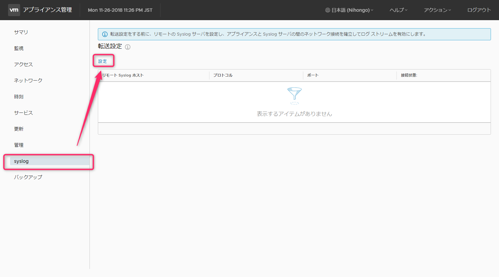
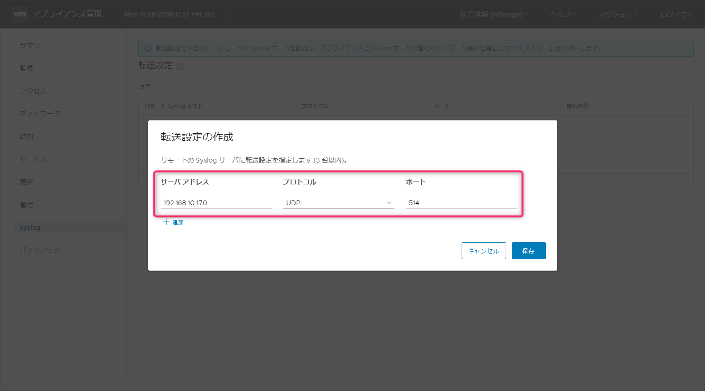
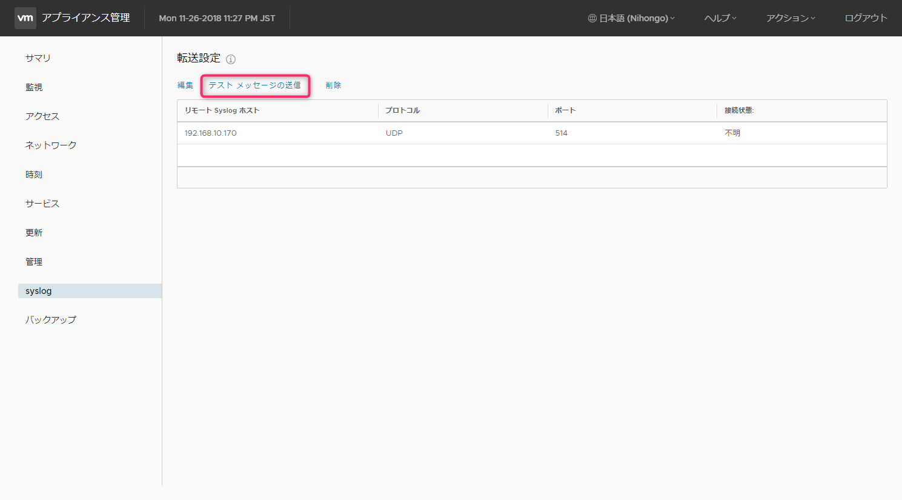
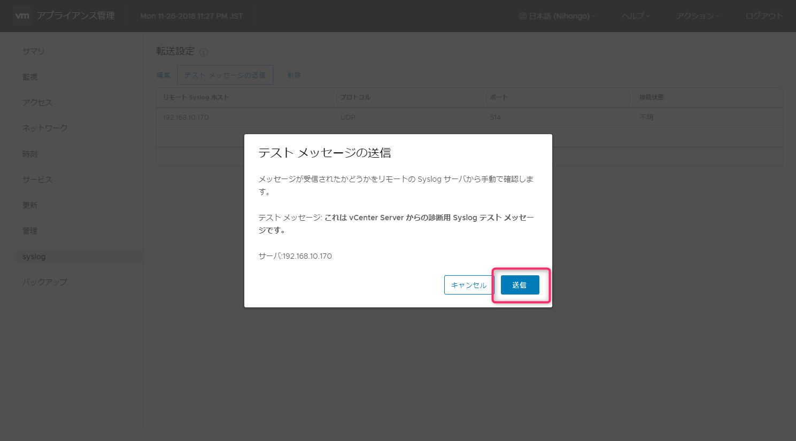
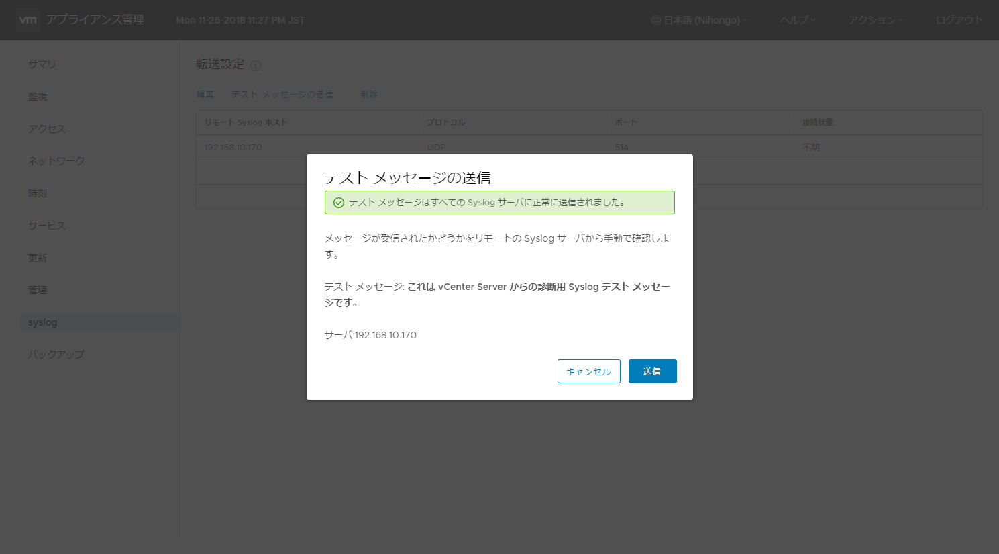

こんにちは、じんないです。

今回はvCenter Server Applianceのsyslogを別のsyslogサーバーへ転送する方法を紹介します。

公式から素敵な手順が公開されていますが、画面つきで分かりやすくメモを残しておきたいと思います。

公式の手順は下記をご参照ください。

[vCenter Server Appliance のログ ファイルを リモート Syslog サーバへ転送](https://docs.vmware.com/jp/VMware-vSphere/6.7/com.vmware.vsphere.vcsa.doc/GUID-9633A961-A5C3-4658-B099-B81E0512DC21.html)


## 想定環境
- vCenter Server: vCenter Server Appliance 6.7
- syslogサーバー： CentOS 7.5(rsyslog)
- ポートと転送プロトコル：514/udp 

syslogサーバーにてsyslogが受信可能であることを前提とします。

## 設定手順

ブラウザから `https://<vCenter Serverのホスト名>:5480/login` にアクセスし、rootアカウントでログインします。

このアカウントはvCenter Server Applianceを構築したときのアカウントです。vSphere Clientで使用するものと異なりますので注意してください。

<a href="images/how-to-transfer-syslog-of-vcenter-server-appliance67-1.png"></a>

左ペインから[syslog] ＞ [設定] の順にクリックします。
<a href="images/how-to-transfer-syslog-of-vcenter-server-appliance67-2.png"></a>

syslogサーバーのアドレス、プロトコル、ポート番号を指定して保存します。
<a href="images/how-to-transfer-syslog-of-vcenter-server-appliance67-3.png"></a>

転送設定が反映されたことを確認し「テストメッセージの送信」をクリックします。
<a href="images/how-to-transfer-syslog-of-vcenter-server-appliance67-4.png"></a>

テストメッセージを送信し、正常に送信されたことを確認します。
<a href="images/how-to-transfer-syslog-of-vcenter-server-appliance67-5.png"></a>

<a href="images/how-to-transfer-syslog-of-vcenter-server-appliance67-6.png"></a>

syslogサーバーでちゃんと受信できているか見てみましょう。

以下の例ではsyslogの出力先を振り分けていますが、何もしなければ`/var/log/messages`に出力されます。

ログの中から`vCenter`を含む文字列をgrepします。
`grep -i vCenter /log/rsyslog/vcsa/201811/messages-20181126`

``` bash
Nov 26 23:39:46 vcsa  This is a diagnostic syslog test message from vCenter Server.
```

vCenter Serverからのテストメッセージを確認できました。これでOKです。

設定によるのかもしれませんが、このようにテストメッセージは英語で出力されるのでgrepする文字列に注意してください。

ではまた。