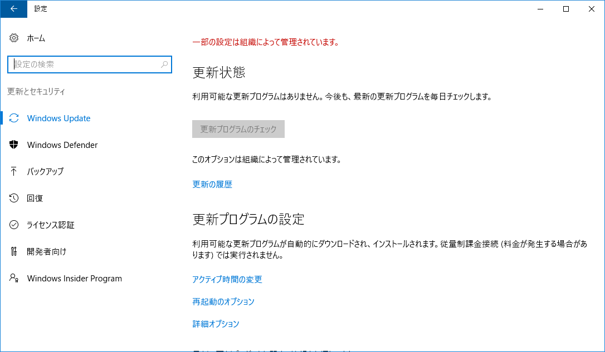
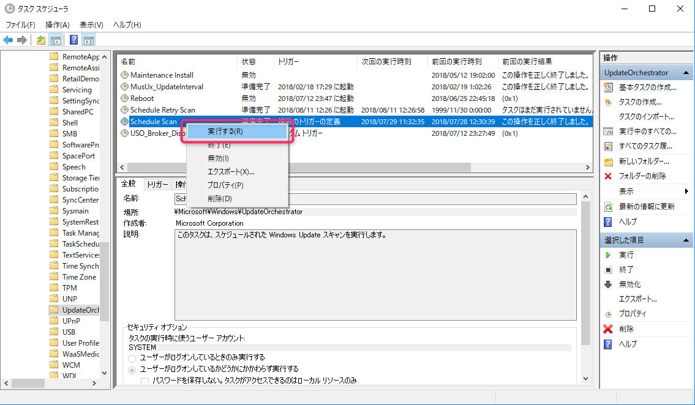
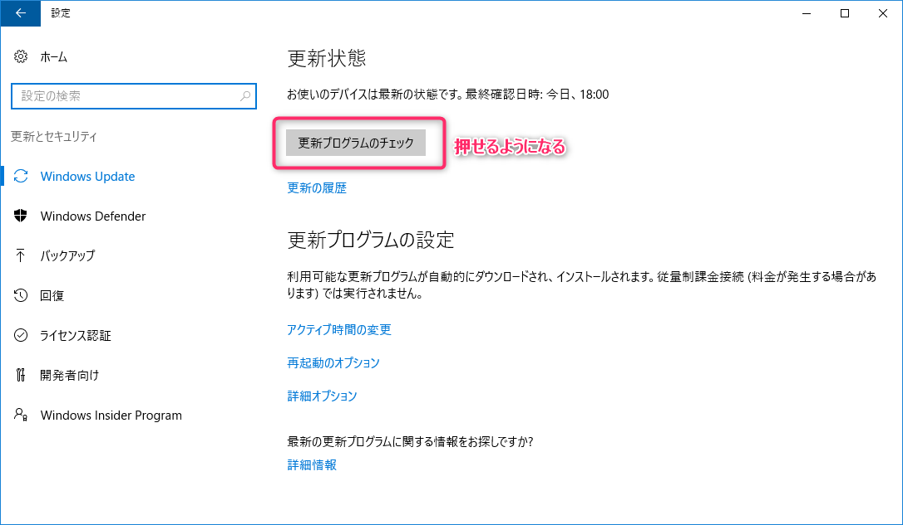

こんにちは、じんないです。

クライアント系などではグループポリシーで自動構成を無効にし、Windows Updateの制限をかけている環境もあるかと思います。

自動構成を無効にすると、以下のように**更新プログラムのチェックがグレーアウト**されてクリックすることができません。

しかし、いざ更新しようとグループポリシーを無効にしても、更新プログラムのチェックボタンがグレーアウトのままで返ってきません。

`gpresult /z ` で確認してもグループポリシーはちゃんと外れているのにです。

今回は、そうなる原因と対処法を紹介します。

## 環境
- Windows 10 LTSB (1607) 

## グレーアウトのままになる原因

どうやら、**設定を変更したあと更新プログラムのチェックをしてやらないとステータスが反転しない仕様**のようです。

なんちゅーめんどくさい仕様やねん。

ざっくり動きを書くとこんな感じです。

- **グレーアウトさせたいとき**
グループポリシーを有効にする（自動構成を無効にする） → 更新プログラムのチェック → グレーアウトされる

- **戻したいとき**
グループポリシーを無効にする → 更新プログラムのチェック → 押せるようになる

## 対処法

上述のとおり、更新プログラムのチェックを1回やってあげないと、更新プログラムのチェックボタンが押せないということはお分かりいただけたかと思います。

一見矛盾しているようですが、コマンドなどから更新プログラムのチェックができます。

以下のいずれかの方法を実施してみてください。

- **コマンドプロンプトから実行する場合**

` C:\Windows\System32\UsoClient.exe StartScan `

- **PowerShellから実行する場合**

` (New-Object -ComObject Microsoft.Update.AutoUpdate).DetectNow() `

- **タスクスケジューラから実行する場合**

GUIじゃないとイヤ！って人はこっちからどうぞ。

` Microsoft > windows > Update Orchestrator > Schedule Scan `

これで更新プログラムのチェックが始まったかと思います。

チェックが完了すると、更新プログラムのチェックボタンが押せるようになっています。

ではまた。