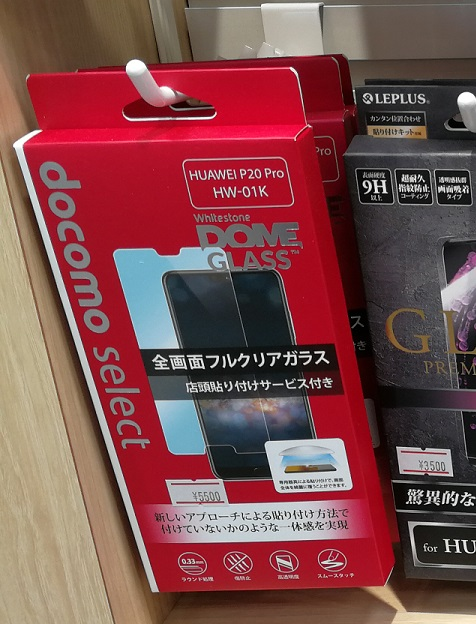
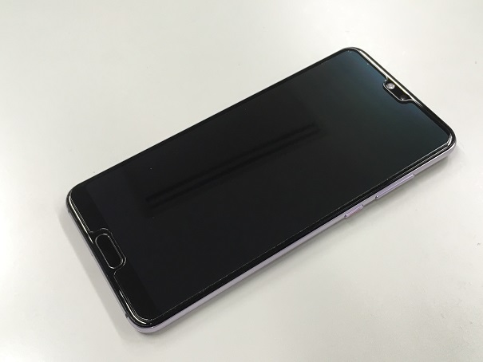
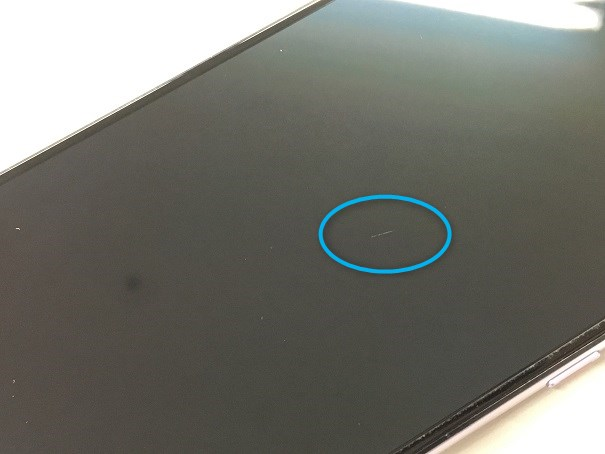
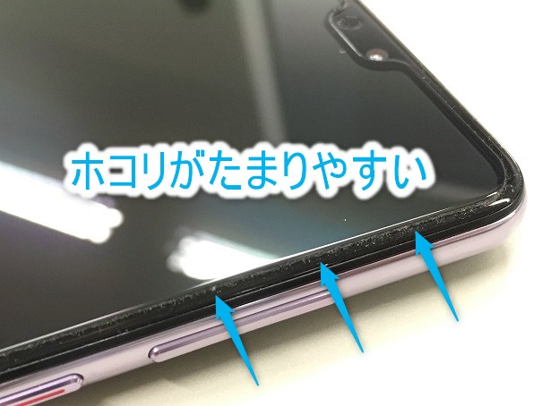
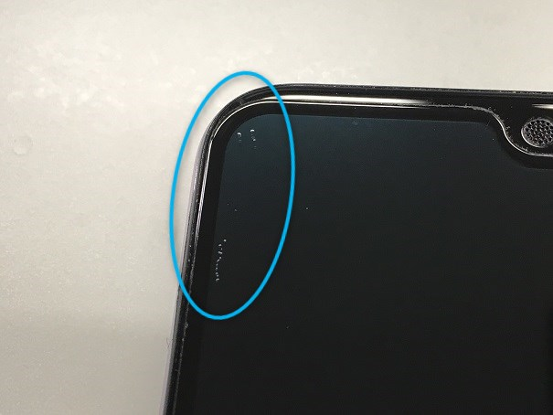

こんにちは。

この夏、脱iPhoneに成功しAndroiderな皆さんの仲間入りを果たしたじんないです。

今やスマホの画面に保護フィルムを貼らない方は少ないのではないでしょうか。

JKのiPhoneのように画面がバキバキに割れているのがトレンドなのかもしれないですが、私は貼って保護するタイプです。

P20 ProやiPhoneの画面の端は丸くなっており、それなりのクオリティのガラスフィルムを買わないと端が浮いてえらい目に遭います。

私も某Amazonで3種類程購入してみたのですが、どれもこれも端が浮きまくりで使えたもんじゃなかったです。

スマホ本体やフィルムの個体差もあり一概には言えないところですが、安物買いのなんとやらってやつかもしれませんね。。。

落胆していたときにメンバーからこんなんあるよと紹介してもらったのが、[ドコモのDOME GLASS](https://www.nttdocomo.co.jp/product/docomo_select/domeglass/)

細かい説明は端折りますが、UV硬化樹脂の上にガラス乗っけて固めるので画面の端が丸くなっていても気泡や浮きがなくなるよという優れものです。

お値段は少し張りますが、工賃込みで端が浮かないのであればいいかなということでやってもらいました。

## いいところ
### もちろん端は浮かない

当たり前ですがピッタリフィットです。

端が浮いたり気泡が入ったりすることはありません。

一番の目的はそこなので、それ以外のいいところは特にありませんでした。あとは店頭で貼ってもらえるぐらいでしょうか。

## ビミョーなところ
### 傷がつきやすい

あくまで主観的で感覚の話ですが、**思ったより小傷がつきやすい**と思います。

日常はポケットではなくカバンに入れることが多いため他のものと当たることもありますが、以前のスマホのガラスフィルムと比較して傷がついやすいなと感じます。

といっても光を当ててみたりよく見ないとわからないので、それほど問題にはならないと思います。

### ホコリがたまりやすい

製品の仕様なのか処理が甘いのか、フィルムの端にUV硬化樹脂が微妙に残るというか見えていて、どうしてもホコリをキャッチしてしまうようです。

そのため画面の端にうっすら白い線が残ります。

あまり攻めすぎて剥がれも嫌なので気になったら軽く掃除するようにしています。

### 衝撃で気泡が入る

打ちどころの問題かもしれませんが、テーブルから床に落ちた際に画面の角に気泡が入りました。

そんなに衝撃は無かったんですがちょっと残念です。

ただ、UV硬化樹脂がゲル状なので頑張って空気を押し出せば意外と復元できたりします。

## 総じて

何より端が浮かないのが一番なので、中途半端な物を買って失敗するよりかは少し値は張ってもDOME GLASSをチョイスする価値はあると思います。

価格面においてはサードパーティ製のものが出てくるようになればもう少し下がってくるのではないでしょうか。

そしてなにより、高いものだと意識することで丁寧に扱うようにもなるのでそのあたりでも良い効果をもたらしてくれそうです。

いつまでも使えることを期待しています！

ではこのへんで。
