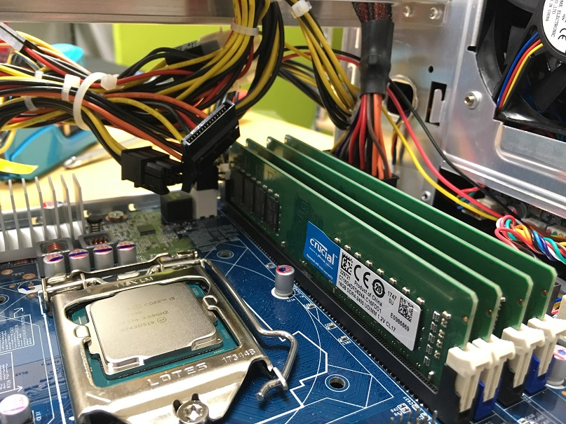
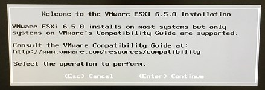

こんにちは、じんないです。

社内の評価環境にVMware vSphere ESXiを使用しています。

現在利用している評価環境の構築から月日が経ち、そろそろ基盤サーバーもソフトウェアもリプレイスしようと考えていました。

当初は[インテルのNUC](https://www.intel.co.jp/content/www/jp/ja/products/boards-kits/nuc.html)にするとか、[ASRock DeskMini 110 Series](https://www.asrock.com/nettop/intel/DeskMini%20110%20Series/index.jp.asp)にするとか色々構想を立てていましたが、64GBメモリーを積める[SZ270R9 Shuttle Japan](http://shuttle-japan.jp/sz270r9/)を採用することにしました。

まだ発売から間もなくESXiに関する情報が少ないのでお役に立てれば幸いです。

気になる方も多いと思うので、先に結論だけ言っておくと**SZ270R9にESXi6.5は難なく入ります**。

**カスタムISOイメージの作成も不要**です。

では、実際の構成や設定ポイントを紹介していきます。

## 構成

* 本体：[SZ270R9 Shuttle Japan](http://shuttle-japan.jp/sz270r9/)
* CPU：[Intel Core i5 7600/(Kaby Lake-S) 4C/4T](https://ark.intel.com/ja/products/97150/Intel-Core-i5-7600-Processor-6M-Cache-up-to-4_10-GHz)
* メモリー：[Q4U2400CM-16G](http://www.cfd.co.jp/product/memory/desk-ddr4/q4u2400cm-16g/release/)(64GB) 
* ブートデバイス：[USBメモリー U3-CPSL(16GB)](http://www.iodata.jp/news/2013/newprod/u3cpsl.htm)または、[USBメモリー RUF3-PS8G | BUFFALO](http://buffalo.jp/product/usb-memory/design/ruf3-ps/)。※2種類試しました。
* NIC(標準)：インテル i211 ×2ポート。

チップセットはIntel Z270でLGA1151系のCPUが搭載可能ですが、**残念ながら第8世代(Coffee Lake)は対応していません**。

ESXiのOSはUSBメモリーにインストールし、仮想マシンを入れておくデータストア領域はNASを接続します。

**本体はディスクレス構成**となります。

USBメモリーは8GB以上にしましょう。OS領域は1GBほどですが、あまりカツカツだとスクラッチパーティションが同居できなくなるようです。

## SZ270R9の組み立て

フロントパネルはガンダムライクで、RGBのLEDが実装されていて綺麗に発色してくれます笑

後述のBIOS設定で輝度調整ができ、好みの色味を表現できるようです。

NICは向かって右側が1番(vmnic0)、左側が2番(vmnic1)です。

モニター出力はDPと見せかけて**デフォルトはHDMI**です。

上から見るとこんな感じです。丸く肉抜きされた金具の上に3.5インチのディスクが4本詰めますが、今回はディスクレスなので空っぽです。

メモリーやCPUの実装の際に邪魔になるので、金具は取り外しておきましょう。上部のネジ4本で簡単にはずれます。

横はこんなんです。

CPUとメモリーを実装します。CPUの放熱グリスは本体に付属されています。

## ESXiインストールの流れ

### インストールメディアの作成

インストールメディアもUSBメモリーを使います。

インストールに使ったUSBメモリーは[RUF3-KS16GA | BUFFALO](http://buffalo.jp/product/usb-memory/value/ruf3-ksa/)です。

VMwareからESXiのインストールメディアをダウンロードし、[Rufus](https://rufus.akeo.ie/?locale=ja_JP)というツールでISOイメージを焼いていきます。

Rufusをダウンロードしたら、exeを実行します。

更新しろとか色々うるさく言われますが、基本は[OK]で大丈夫です。

USBメモリーを接続すると、**デバイス**に自動認識されます。

プルダウンで**ISOイメージ**に変更し、CDのアイコンをクリックしてESXiのISOを選択します。

その他はデフォルトでOKで、[スタート]をクリックししばらくすると完了します。

完了したら、USBメモリーを本体に挿しておきます。

※ここではまだブート用の空のUSBメモリーは挿さない。

### BIOS設定

PCの電源を入れたら、弾丸で**DELキー**を連打します。

モニターの出力の遅延の問題かもしれませんが、POST画面の時間がめちゃくちゃ短いです。笑

なんとかBIOSに入れたら以下変更していきます。

* **Main > System Time** ：　現在時刻より-9時間（システムログがUTCで出力されるため）
* **Boot > Boot Mode Select**　：　UEFI
* **Boot > Boot Option #1**　：　インストールメディアを焼いたUSBメモリーを選択

設定が終わったら、ブート用の空のUSBメモリーを本体に挿して再起動します。

### ESXiのインストール

あとは、ESXiをインストールしていきます。※手順は割愛します。

Select a Disk to Install or Upgradeの画面で、インストール先のUSBメモリーを選択します。

この時思いましたが、インストールメディア用のUSBメモリーとブート用のUSBメモリーは違う銘柄か、せめて容量を変えておいたほうがよいですね。

同じ銘柄、同じ容量だとどちらにインストールしたらよいのか判別しにくいです。

インストールが完了したら、インストールメディア用のUSBメモリーを抜いて再起動します。

ESXiが正常に起動すればOKです。

あとは、ネットワーク設定などをして、vSphere Host Clientで接続しましょう。

## おまけ（LEDの色を変える）

このガンダム君のLED、なんとBIOSから設定変更が可能です。

* **Shuttle Tuning > Front LED Function**

デフォルトはDefault(Enabled)になっていて、周期的に色が変わり、Disabledにすると消灯します。

Customを選ぶとRed Green BlueのLEDの輝度が0～40の範囲で設定でき、オリジナルの色味を設定できます。

余談ですが、**Red Green Blueは光の三原色**とも呼ばれ、その組み合わせで白を含むほとんどの色を表現することができます。※解像度による

興味があれば、学んでみてください。

[光はRGBでできている｜キヤノンサイエンスラボ・キッズ](http://web.canon.jp/technology/kids/mystery/m_04_02.html)

ちなみに筆者は**Disabled**にしました。笑

ではまた。