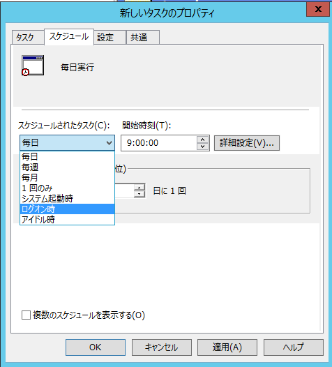

こんにちは、じんないです。

PowerShell5.1の[Compress-Archive](https://docs.microsoft.com/en-us/powershell/module/microsoft.powershell.archive/compress-archive?view=powershell-6)を使ってログオンスクリプトを作成し、任意のログをローテートしてみます。

## 想定シナリオ

特定のアプリから `d:\logs` 配下に出力される hogehoge.log や fugafuga.log などをログオン時にローテートします。

ローテートの際は `logs` を丸ごとzip圧縮し、お尻に `yyyyMMdd-HHmmss` 形式で日時を付与します。

作成から1か月以上経過したzipファイルは削除します。

## PowerShell スクリプト

コマンド例は以下のとおり。

``` powershell
if ( Test-Path d:\logs\*.log ) {
Compress-Archive -Path d:\logs\*.log -DestinationPath d:\logs-$(Get-date -Format "yyyyMMdd-HHmmss").zip
Remove-Item d:\logs\*.log
}
Get-ChildItem D:\ -Filter *.zip | Where-Object {$_.CreationTime -lt (Get-Date).AddDays(-31)} | Remove-Item
```
**Test-Path** でファイルが存在するかどうかチェックします。

戻り値が `True` or `False` で返ってくるので、ファイルがあればローテートします。

**Compress-Archive** では `-Path [圧縮元] -DestinationPath [出力先]` を指定します。この時に現在日時を取得してくっつけています。

**Get-ChildItem** でzip形式のファイルをピックアップし、31日より前に作成されたものを **Remove-Item** に渡すといった流れです。

## ログオンスクリプトとして使う

### 実行はバッチファイルから

PowerShellは実行ポリシーやら何やらありますが、今回は単純にバッチファイルからキックしてみます。

``` dos
@echo off
powershell -NoProfile -ExecutionPolicy Unrestricted .\LogRotater.ps1
```

### ログオンスクリプトに仕込む

ドメインやローカルのグループポリシーでログオンスクリプトとして指定してもよいですが、Windows10では以下のディレクトリに格納することで実行することができます。

`C:\Users\<USERNAME>\AppData\Roaming\Microsoft\Windows\Start Menu\Programs\Startup`

バッチファイルとPowerShellスクリプトを仕込んでおきましょう。

### タスクスケジューラから実行したい場合

ログオンスクリプトだけでなく、ローカルやグループポリシーのタスクスケジューラからスクリプトを実行することもできます。

このあたりはお好みでどうぞ。

[caption id="attachment_7385" align="alignnone" width="476"]<a href="images/log-rotation-using-compress-archive-1.png"></a> グループポリシーで指定する場合[スケジュール]から[ログオン時]を選ぶ[/caption]

ではまた。
