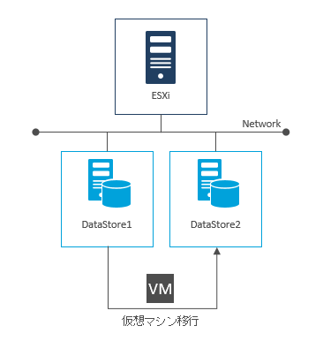
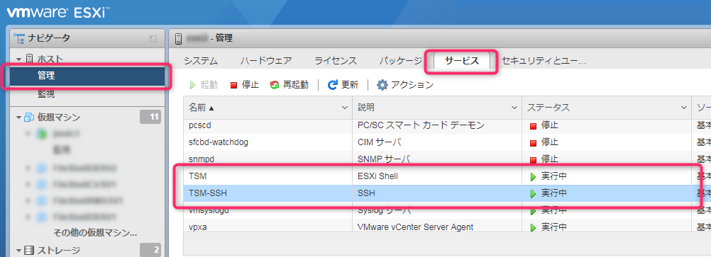

こんにちは、じんないです。

今回は、コマンドラインからVMware 上の仮想マシンをシンプロビジョニングのまま別のデータストアへ移行する方法を紹介します。

ストレージのリプレイスなどで、仮想マシンを別のデータストアへ移行しないといけないときもあると思います。

データストアブラウザやエクスプローラーからのコピーではプロビジョニングタイプがシン→シックとなってしまい、仮想ディスク容量が増加してしまいます。

一番簡単なのは[Storage vMotion](https://docs.vmware.com/jp/VMware-vSphere/6.5/com.vmware.vsphere.vcenterhost.doc/GUID-AB266895-BAA4-4BF3-894E-47F99DC7B77F.html)をすることですが、[Standardライセンス](https://www.networld.co.jp/product/vmware/pro_info/vsphere/edition/latest/)以上が必要です。

また、vCenter Serverで管理を行っている場合は、vCenter Serverからデータストアの変更が可能(オフライン)です。

無償のHypervisor(ESXi)環境で利用できる手段としては、**コマンドラインを使う方法**と**[VMware vCenter Convertor](https://my.vmware.com/jp/web/vmware/info/slug/infrastructure_operations_management/vmware_vcenter_converter_standalone/5_5)**を使う方法があります。

今回はコマンドラインを使う方法を紹介します。

前提として、仮想マシンのスナップショットは無いものとします。

スナップショットがある場合は、削除して仮想ディスク(vmdk)を統合しておいてください。

## 想定環境



ESXiに**DataStore1**と**DataStore2**の2つのデータストアがマウントされているとします。

1と2はそれぞれ移行元、移行先と思ってください。

ESXiのバージョンは6.5を想定しています。

## 仮想マシンの移行

### 事前準備

#### 仮想マシンの停止

コールドクローニングになりますので、対象の仮想マシンはシャットダウンしておきます。

インベントリからも登録を解除しておいてください。

#### SSH接続の許可
ESXiをコマンドラインで操作するためには、Tera TermなどのターミナルソフトからSSHで接続します。

デフォルトではSSHのサービスが起動していないので、起動します。

[管理] > [サービス]の順にクリックし、**TSM(ESXi Shell)**と**TSM-SSH(SSH)**を起動します。



起動したらESXiにSSH接続してみましょう。

ESXiへのログインにはチャレンジレスポンス認証を用います。

### ステップ1.仮想ディスク(vmdk)の移行

ESXiにマウントしたデータストアは`/vmfs/volumes/<データストア>`にあります。

上の図（想定環境の）でいうと、lsコマンドの結果は以下のようになります。

```
ls /vmfs/volumes/
DataStore1
DataStore2
```

カレントディレクトリをここに変更します。

`cd /vmfs/volumes`

移行対象の仮想マシンは`DataStore1/vm/`に格納されていると仮定して、移行先のディレクトリを作成します。

`mkdir DataStore2/vm`

そして、vmkfstoolsコマンドで仮想ディスク(vmdk)を移行します。

`vmkfstools -i DataStore1/vm/vm.vmdk -d thin DataStore2/vm/vm.vmdk`

`-d Thin`でプロビジョニングタイプをシンプロビジョニングに指定しています。

`Clone: 100% done.`と表示されれば完了です。

ちなみに、10%からスタートするのは謎です。

### ステップ2.それ以外のファイルの移行

仮想ディスク(vmdk)以外にも仮想マシン(vmx)ファイルやログファイルなどがあり、これらも移行しなければいけません。

以下のコマンドを実行します。

`find DataStore1/vm/* -not -name "*.vmdk" -exec cp {} DataStore2/vm/ \;`

RedHat系のOSならrsyncコマンド等でvmdkをexcludeすればスマートなのですが、残念ながらESXiではrsyncコマンドは使えません。

苦肉の策で、findコマンドでvmdk以外を取得したあと、cpコマンドでコピーするとういう方法をとっています。

もっと楽な方法があればコメントください。笑

これで、移行は完了です。

### ステップ3. 仮想マシンの再登録

移行先のデータストアから仮想マシンを再登録します。

起動してエラーがでなければ成功です。

あとは、必要に応じて移行元のデータストアから仮想マシンデータを削除してください。

## あとがき

VMware vCenter Converterを使うと、スナップショットを移行できたりもするようですが全ての仮想マシンでできるわけでもないようです。

同じESXiにクローンするには仮想マシン名を変えないといけないので、そのあたりも注意が必要ですね。

機会があれば紹介したいと思います。

ではまた。
