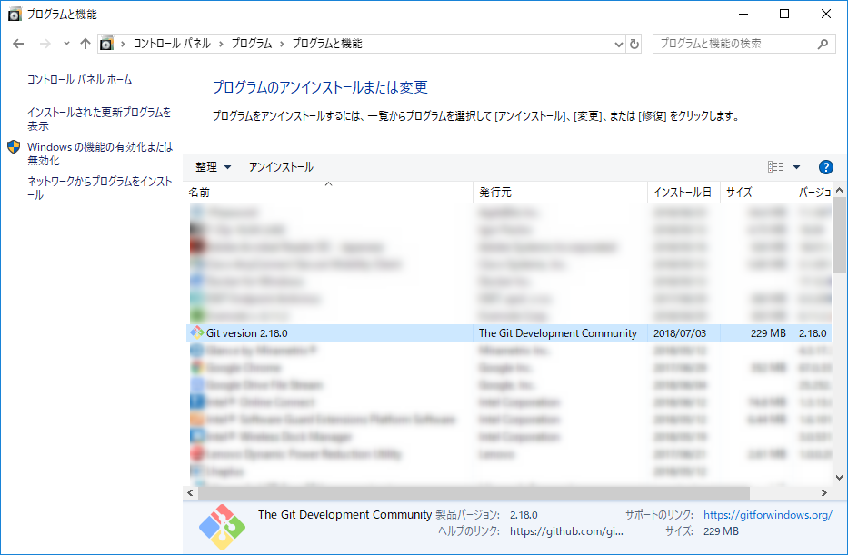
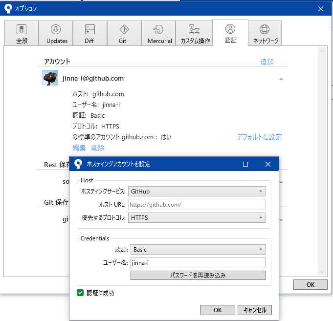

こんにちは、じんないです。

久しぶりに SourceTreeを起動し、GitHub上のリポジトリをフェッチしてみるとGitHubのログイン画面がでて認証を求められました。

**正しいユーザー名とパスワードを入れているのにもかかわらず**、GitHub Login 画面が連発します。

フェッチや新しいリポジトリのクローンもできませんでした。

結論から言うと、**Gitの再インストール** と **アカウントの再設定** で直りました。

## 環境

* SourceTree 2.6.9
* Git 2.18

## 事前準備

トラブルシューティング時に、一度まっさらな状態に戻そうと思い SourceTreeの再インストールをしました。

本事象の解決に関連したものかは確認できていません。

SourceTreeのアンインストールのほか、ローカルリポジトリとSourceTreeのプロファイルも削除しています。

SourceTreeのプロファイルは以下に格納されています。

`C:\Users\<USERNAME>\AppData\Local\Atlassian`

## Gitの再インストールをする

コントロールパネルのプログラムと機能からアンインストールが可能です。

[Git - Downloading Package](https://git-scm.com/download/win)からGitのパッケージをダウントードして再度インストールします。

## アカウントの再設定

SourceTreeを起動して[ツール] > [オプション]から[認証]タブを開き、アカウントを再設定します。

このとき、GitHubの2段階認証を利用している場合はパスワードの代わりにトークンを入力します。

トークンの発行どないするねんって方は以下を参考にしてください。

[GitHub の 2段階認証が有効なアカウントに SourceTree から Personal access token を使ってアクセスする](/access-github-with-sourcetree-with-two-factor-authentication/)

**認証に成功** と表示されたらデフォルト設定にして終了します。

筆者と同じ症状の場合は、これで直っているはずです。

プロファイルを削除した方は**プロジェクトフォルダ**や**グローバル無視リスト**を再設定しておきましょう。

WireSharkやProcessMonitorを準備していましたが、出番がなくてよかったです。

ではまた。