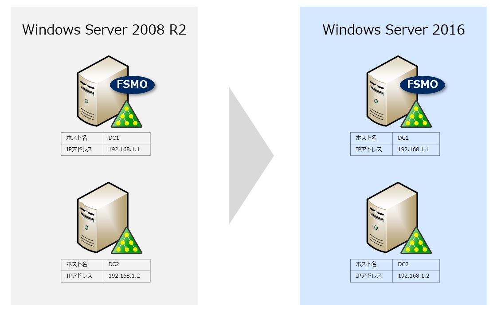
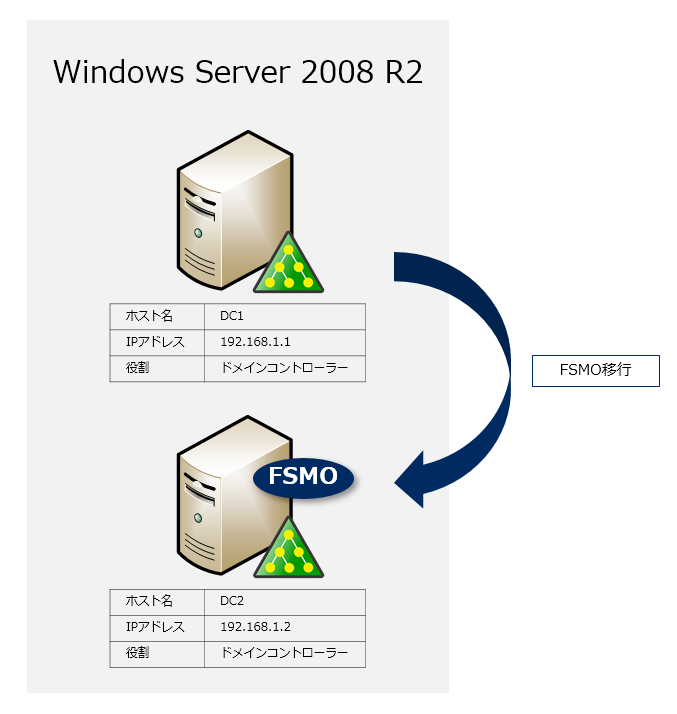
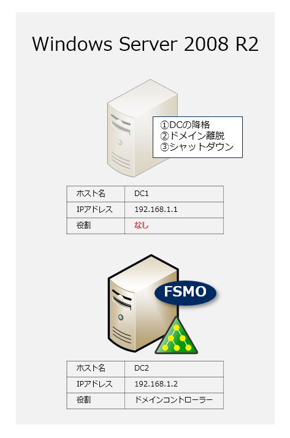
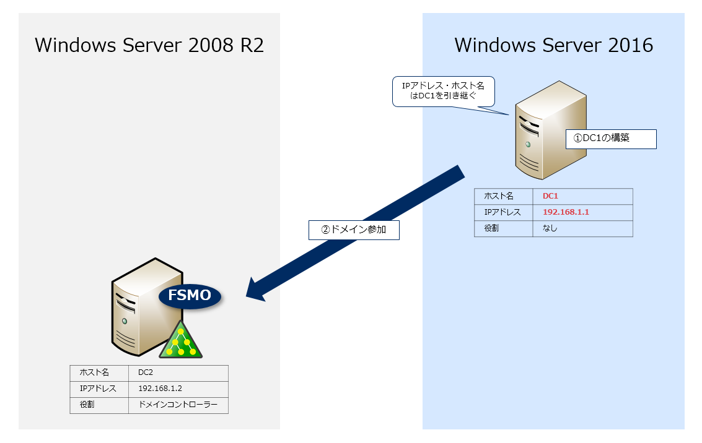
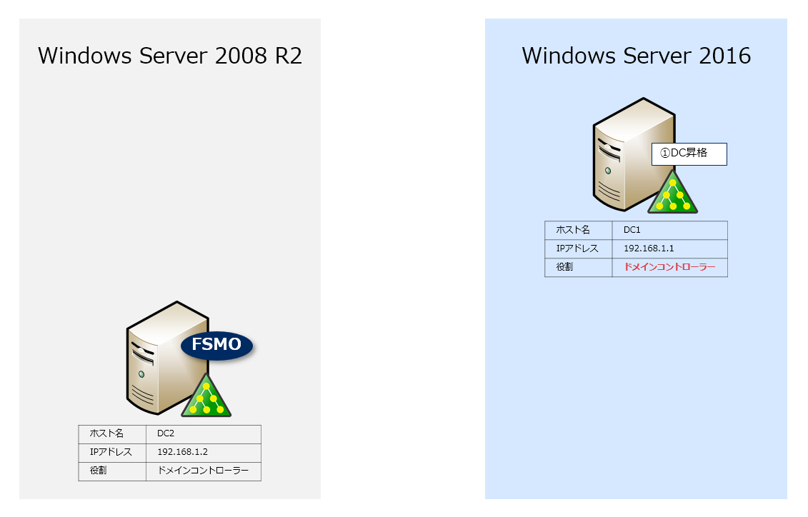
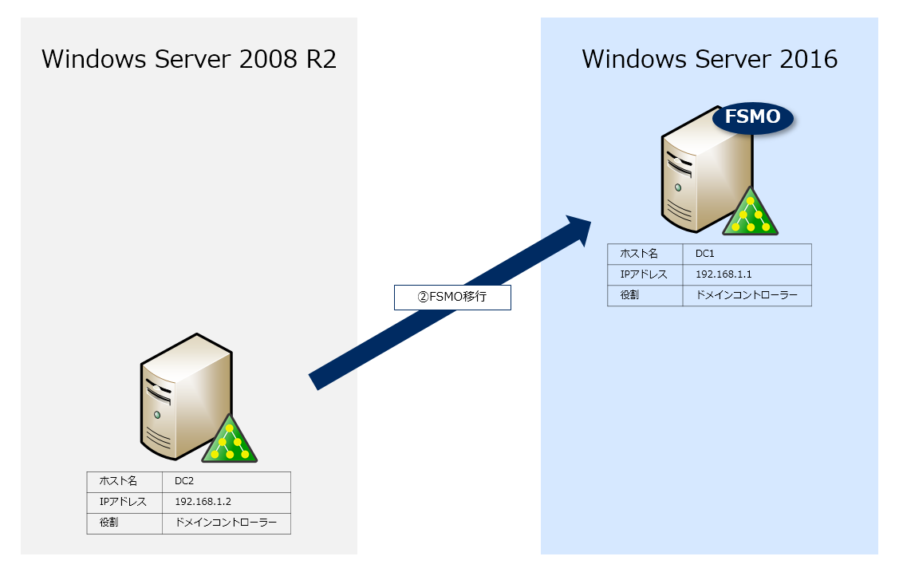
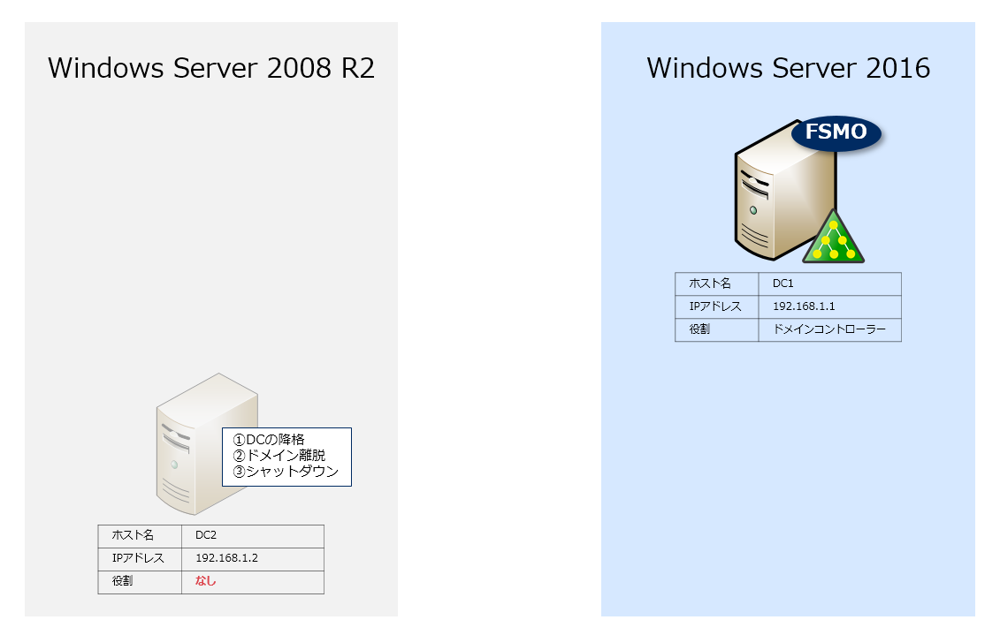
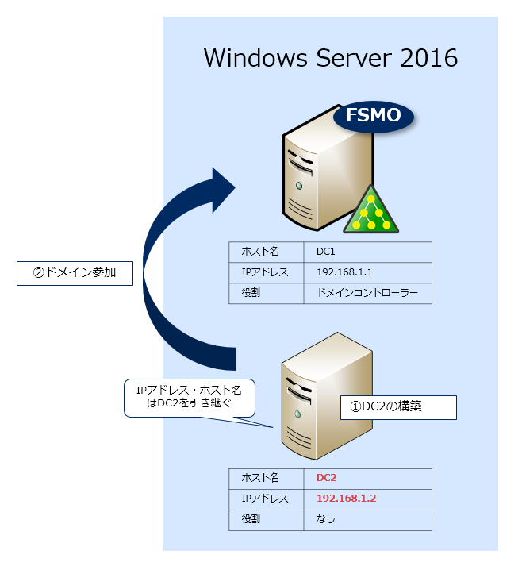
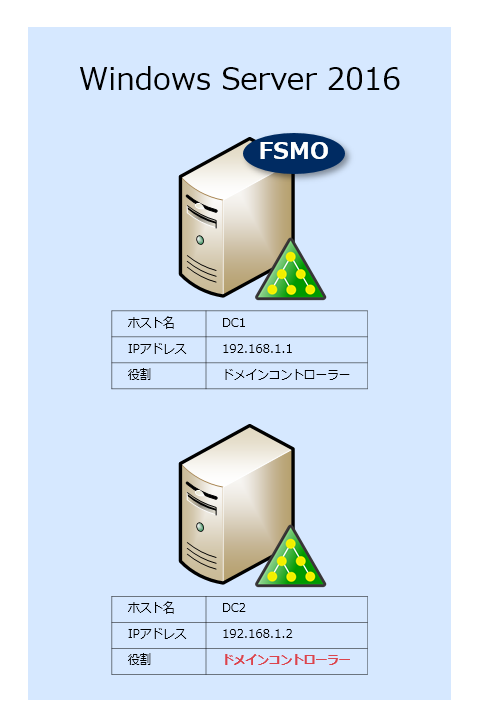

こんにちは、じんないです。

Windows Server 2008 のサポート期限も残すところ1年ほどとなりました。

インフラをご担当のSEさんは Active Directory ドメインコントローラーのリプレイスも多くなっているのではないでしょうか。

ドメインコントローラーの移行は多くのナレッジが公開されており、移行作業自体はそれほど難易度の高いものではありません。

しかし、状況によってはドメインコントローラーのIPアドレスとホスト名を移行の際に引き継ぎたいという要望もあるでしょう。

大規模なクライアントを展開している場合などDNSサーバーのIPアドレスを変更したくない場合に適しています。

今回は Windows Server 2008 R2 と Windows Server 2016 をモデルに**ホスト名とIPアドレスを引き継いでドメインコントローラーを移行するシナリオを紹介**します。

**免責事項**
本記事はドメインコントローラーの移行についてシナリオを掲載しています。
本番環境での実施の際は本シナリオを参考に十分評価をお願いします。

## 想定環境

### 登場人物

  | DC1 | DC2
-- | -- | --
IPアドレス | 192.168.1.1 | 192.168.1.2
ホスト名 | DC1 | DC2
役割 | ドメインコントローラー（プライマリ） | ドメインコントローラー（セカンダリ）
移行前 | Windows Server 2008 R2 | Windows Server 2008 R2
移行後 | Windows Server 2016 | Windows Server 2016

ドメインコントローラーは2台とし、ホスト名とIPアドレスを引き継いだまま移行します。

### 前提
フォレストの機能レベルは2003以上であることを前提としています。2003未満の場合 Windows Server 2016 をドメインコンローラーへ昇格できませんので注意してください。

## 移行の流れ

基本的にはドメインコントローラーが1台存在する状態で、DC1とDC2を交互に移行していきます。

### 作業時ポイント
以下の点に注意しながら作業を行うと大きなトラブルは避けられるでしょう。

- どのサーバーがFSMOを持っているのか
- 参照しているDNSサーバーはどれか
- ドメインコントローラーの複製状態は良好か

### DC1の移行

#### FSMOをDC2へ転送

FSMO(操作マスタ)をDC2へ転送しDC1の降格準備をします。

FSMOは以下の5種類です。

- スキーママスタ
- ドメイン名前付けマスタ
- インフラストラクチャマスタ
- PDCマスタ
- RIDマスタ

どのサーバーがFSMOを持っているのか不明な場合はドメインメンバーサーバーで以下のコマンドを実行し確認します。
`netdom query fsmo`

#### DC1を降格

DC1でドメインコンローラーの降格を行い、ドメインから離脱します。その後、DC1をネットワーク的に遮断するかシャットダウンします。

DC1の離脱後、DNSやOU内にオブジェクトが存在する場合は削除しておきましょう。

#### 新DC1の構築

新DC1( Windows Server 2016 )を構築しドメイン参加します。

このとき、IPアドレスやホスト名は旧DC1( Windows Server 2008 )の設定を引き継ぎます。

#### 新DC1を昇格

新DC1をドメインコントローラーへ昇格します。

以上でDC1の移行が完了しました。同様の手順でDC2を移行します。

### DC2の移行

#### FSMOを新DC1へ転送

FSMOを新DC1へ転送しDC2の降格準備をします。

#### DC2を降格

DC2でドメインコンローラーの降格を行い、ドメインから離脱します。その後、DC2をネットワーク的に遮断するかシャットダウンします。

DC2の離脱後、DNSやOU内にオブジェクトが存在する場合は削除しておきましょう。

#### 新DC2の構築

新DC2( Windows Server 2016 )を構築しドメイン参加します。

このとき、IPアドレスやホスト名は旧DC2( Windows Server 2008 )の設定を引き継ぎます。

#### 新DC2を昇格

新DC1をドメインコントローラーへ昇格します。

以上でドメインコントローラーの移行が完了しました。クライアントで動作確認をしておきましょう。

### 事後作業

あとは必要に応じて以下の作業を実施します。今後廃止されるものもありますので、可能な限り実施しておくことをおすすめします。

- ドメインの機能レベルの昇格
- フォレストの機能レベルの昇格
- SYSVOL複製方式の方法

## 参考

- [ドメイン コントローラーの IP アドレス変更 – Ask the Network & AD Support Team](https://blogs.technet.microsoft.com/jpntsblog/2013/10/07/ip/)
- [ドメイン コントローラーのコンピューター名の変更における注意事項について – Ask the Network & AD Support Team](https://blogs.technet.microsoft.com/jpntsblog/2016/12/13/name_change_dc/)
- [Active Directory の機能レベルを上げる際の影響について – Ask the Network & AD Support Team](https://blogs.technet.microsoft.com/jpntsblog/2017/11/09/ad-functional-level/)
- [FRS から DFSR への移行 (SYSVOL) – Ask the Network & AD Support Team](https://blogs.technet.microsoft.com/jpntsblog/2009/12/04/frs-dfsr-sysvol/)
