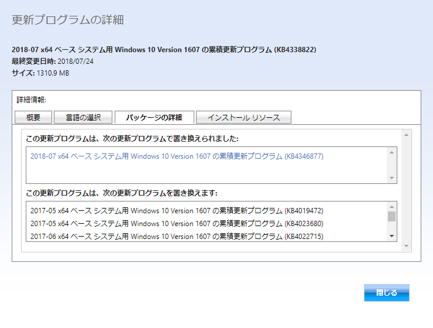

こんにちは、じんないです。

2018年7月のWindows Updateは色々と問題が多いようですね。

先日、[2018-07 x64 ベース システム用 Windows 10 Version 1607 の累積更新プログラム (KB4338822)](https://support.microsoft.com/ja-jp/help/4338822/windows-10-update-kb4338822)をインストール中に、**エラー0x80070002**が出て完了できませんでした。

7月の中旬ぐらいまでは問題なかったのですが・・・

他の方が公開されているのと少し異なるのでメモしておきます。

## 環境
- Windows 10 LTSB (Long Term Service Branch) (1607)

## 解決策
KB4338822をスタンドアロンでインストールしようと思い[Microsoft Update カタログ](https://www.catalog.update.microsoft.com/Home.aspx)にアクセスすると、7月30日付で置き換えのパッチ[KB4346877](https://support.microsoft.com/ja-jp/help/4346877/windows-10-update-kb4346877)がでていました。

Microsoft Update カタログから[2018-07 x64 ベース システム用 Windows 10 Version 1607 の累積更新プログラム (KB4346877)](https://www.catalog.update.microsoft.com/Search.aspx?q=KB4346877)をダウンロードし、スタンドアロンインストールを行います。

インストール後、再起動を行って更新プログラムのチェックを行えば最新の状態となります。

この**KB4346877は通常の更新プログラムのチェックではインストールできないので、スタンドアロンでの適用が必要**です。

8月の累積更新プログラムで解決しそうですが、同様のエラーでお困りの方はお試しください。

ではまた。