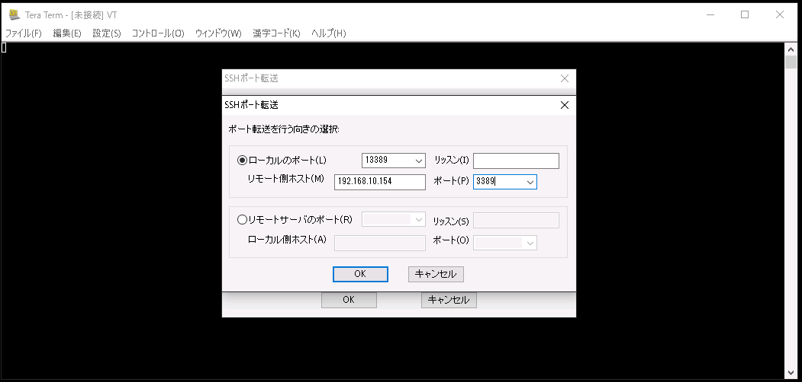
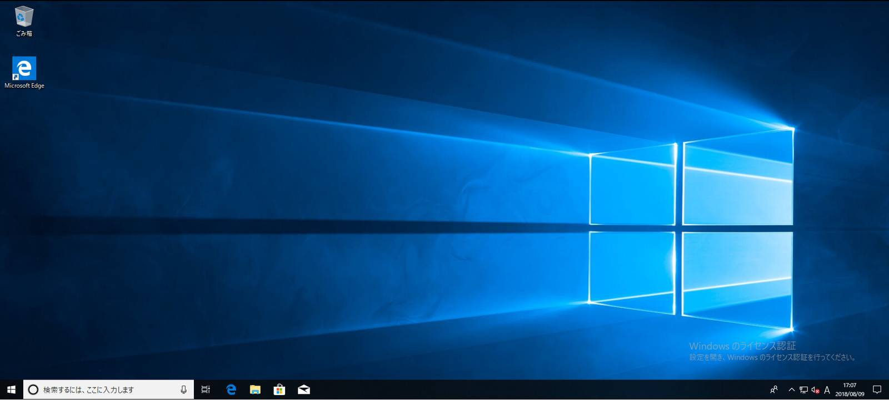

こんにちは、じんないです。

リモートデスクトップは非常に便利な機能です。IT系の方はもちろんのこと、それ以外の方でも利用された経験のある方は多いのではないでしょうか。

そんなリモートデスクトップですが、ファイアウォールで制限をしていなければ任意の接続元(IPアドレス)から受け付ける状態になっています。

セキュリティの観点からネットワークや任意のホストを指定し、接続元を制限しているケースも多くあります。

Windows 10ではWindows 10 April 2018 Update (1803)からOpenSSH Serverが正式にリリースされました。

OpenSSH Serverを有効化しSSHポートフォワーディングをすることで、リモートデスクトップの接続元をlocalhost(127.0.0.1)に制限（事実上無効に）しつつリモートデスクトップ接続をすることが可能になります。

リモートデスクトップの接続元をlocalhost(127.0.0.1)に設定すると、たとえ同一セグメントであってもダイレクト（3389ポートへ）にリモートデスクトップ接続をすることはできません。

## 想定環境
- Windows 10 (1803)

前提として、リモートデスクトップがすでに許可されている状態とします。

## OpenSSH Serverの有効化

設定のアプリと機能から「オプション機能の管理」をクリックします。

「機能の追加」をクリックします。

「OpenSSHサーバー」をインストールします。

サービスから「OpenSSH SSH Server」を開始します。スタートアップの種類が手動になっているので、自動とかにしておきます。

コマンドプロンプトを立ち上げて`ssh localhost`を実行すると、SSHで接続ができました。

ちなみに、この状態でリモートからもSSH接続ができます。

## リモートデスクトップのファイアウォールの変更

この作業をリモートデスクトップ越しにやっている場合は、設定した瞬間に接続が切れるので注意してください。

セキュリティが強化されたWindows Defender ファイアウォールを開き、以下の3つの規則に接続元のIP制限をします。

- リモートデスクトップ-シャドウ(TCP受信)
- リモートデスクトップ-ユーザーモード(TCP受信)
- リモートデスクトップ-ユーザーモード(UDP受信)

「これらのIPアドレス」を選択し、「127.0.0.1」を追加します。

## リモートデスクトップをしてみる

まずは、同一セグメントのクライアントから普通にリモートデスクトップしてみます。接続元制限をかけているので接続できませんでした。ここではIPアドレス`192.168.10.154`がリモートデスクトップの接続先です。

次は一旦SSHで接続し、その際にポートフォワーディングを行ってリモートデスクトップに接続します。

ターミナルソフトはTeraTermを使用します。

ここでは、接続元のローカルポート(13389)を接続先のリモートポート(3389)にフォワードする例です。RDPのポートはデフォルトの3389としています。

ユーザー名とパスワード入力し、SSH接続が完了しました。

そして、フォワード設定を入れた`localhost:13389`にリモートデスクトップ接続します。

レスポンスが返ってきました。アカウント情報を入力して接続します。

無事にリモートデスクトップができました！

## もっとセキュリティを高めるには

この時点ですでにセキュアな状態ですが、SSHを鍵認証とすることで更にセキュリティを高めることができます。

鍵認証の方法については、以下のサイトを参考にしてください。

> [OpenSSHサーバーがWindows10に正式にやってきた(April 2018 Update/1803) | Webセキュリティの小部屋](https://www.websec-room.com/2018/05/12/2933)

一旦このコンピューターに入れなければ、サーバー群にアクセスできないような環境をつくっておくとよりセキュリティが高まるのではないかと思います。

ではまた。