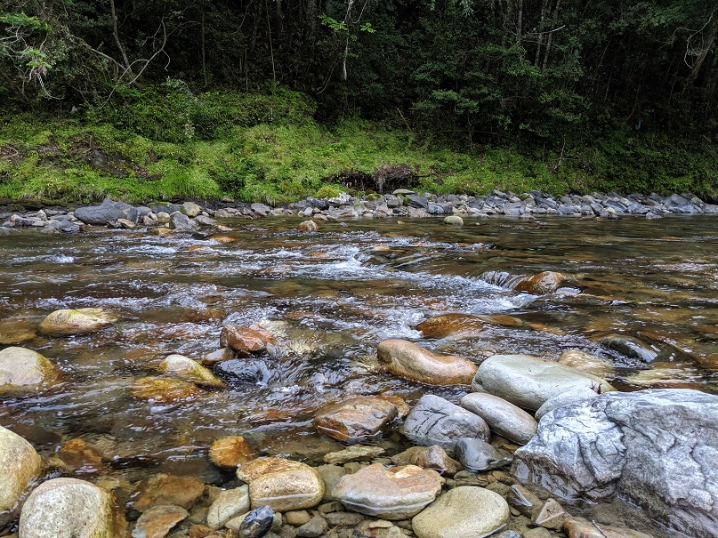

こんにちは、**じんない@春レク幹事** です。

気温もずいぶんと高くなり、初夏を感じる今日この頃。BBQ したいなぁとの思いで、春のレクリエーションとして和歌山方面へ行ってまいりました！

## 1日目

9時頃に大阪を出発、和歌山方面へ一気に南下します。

途中、湯浅で昼食。
5月はしらすの最盛期ということもあり、[かどや食堂](http://www.yuasa-kadoya.com/)さんにお邪魔して生しらすを堪能しました！

[しらす丼の食べ歩きマップ](http://www.town.yuasa.wakayama.jp/publics/download/?file=/files/content_type/type019/183/201601191409187373.pdf)も公開されているので、湯浅に行かれる際は要 Check です！

腹も満たされたところで熊野方面へ。
せっかく来たのだからと[熊野本宮大社](http://www.hongutaisha.jp/)を参拝。無事にこれたことへの感謝をお伝えしてきました。

めちゃくちゃデカい大斎原の鳥居に圧倒。

ここから10分ほど走ったところが本日のお宿。**[熊野　四季亭](http://kumano.shikitei.info/)**です。
実はここ、[2年前の夏レク](/2017-summer-recreation-in-biwako-1/)でお邪魔させてもらったところの姉妹店だそうです。

宿のすぐ裏に綺麗な渓流もあってロケーションは最高です。

準備した後は、念願のかんぱーい。
※ビビりながらスパークリングを開けるシャチョー

気心の知れた仲間とともにする BBQ はまた格別です。

もはやレギュラーになりつつある燻製。ベーコンとチーズ、そして意外にうまいのがナッツです！赤ワインやハイボールとも相性抜群ですね。これはもう外せません。

そんなこんなで時間を忘れて、いろんなことを語り合い、夜は更けていったのでした。

## 2日目
[春レク in 熊野 ～BBQ・友ヶ島散策～(2日目)](/2019-spring-recreation-day2)へ続く