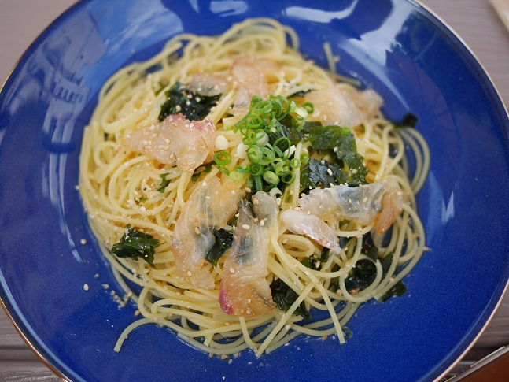
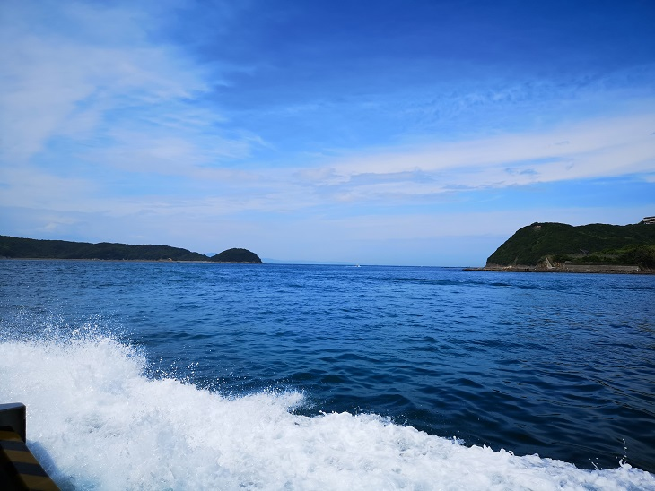
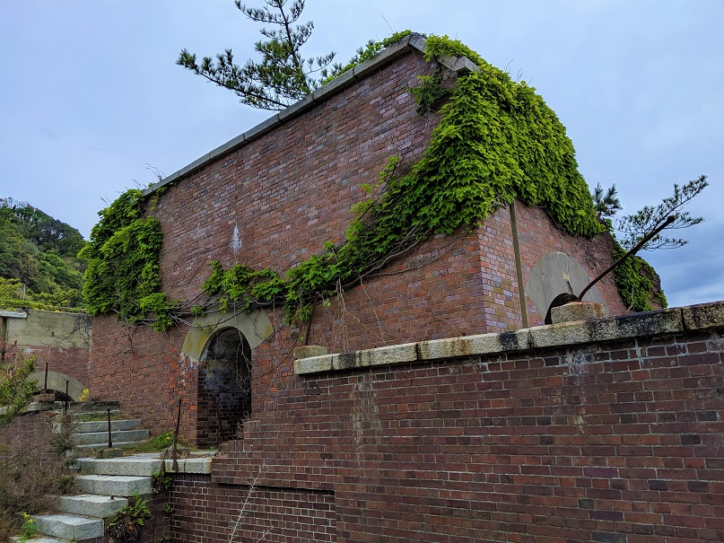
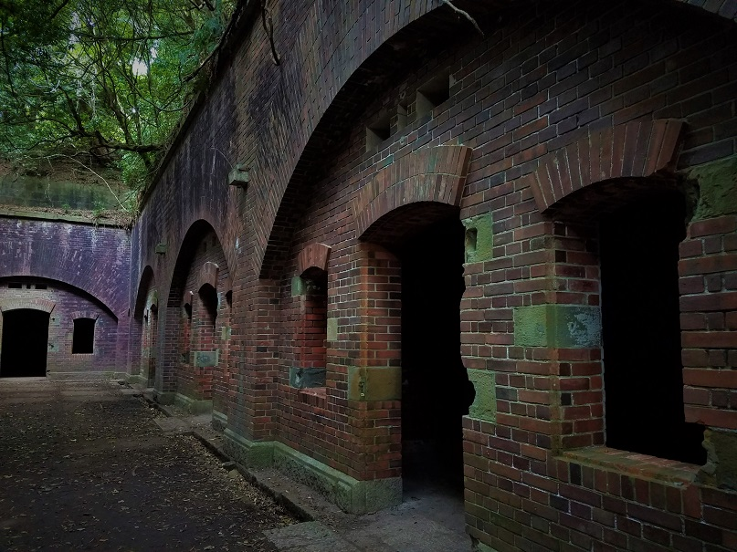
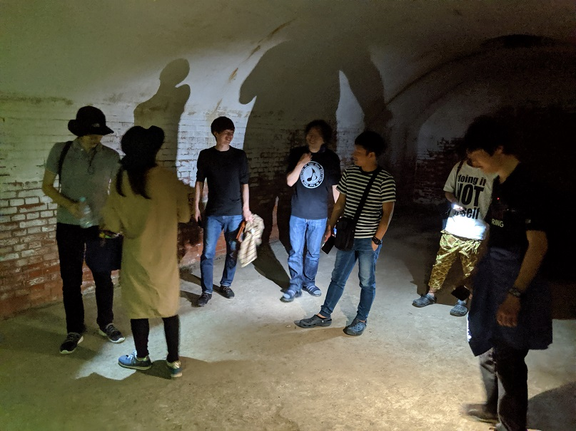
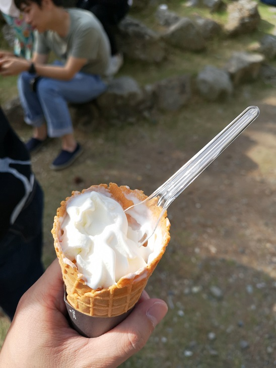

[春レク in 熊野 ～BBQ・友ヶ島散策～(1日目)](https://mseeeen.msen.jp/2019-spring-recreation-day1)のつづき。

## 2日目

お世話になった**[熊野　四季亭](http://kumano.shikitei.info/)**に別れを告げ、向かうは[ラピュタ島こと友ヶ島](http://www.wakayamakanko.com/sightseeing/nature2.html)。友ヶ島へは加太港から[船](http://tomogashimakisen.com/)で約20分です。

その前に近くのカフェで鯛のパスタを堪能。船の時間が迫っててカツカツでしたが、皆さん頑張って食べてくれました（感謝）

朝は曇り空だったので心配でしたが、晴れてくれてよかったです。やっぱり船は気持ちいいですねー。

砲台跡を回ったり

まさにラピュタ感満載でした。

地下にある真っ暗な弾薬庫(？)はワインの貯蔵庫かと思うぐらいひんやりしてました。ライトを消せば今にも出そうな感じ・・・

モデルコース(約2.5h)をぐるっと周り、いい感じに疲れたところで帰港です。

いっぱい歩いたあとのアイスはやっぱりうまい。

みんな協力してくれて、思い出に残るいい旅になりました！

ではまた。