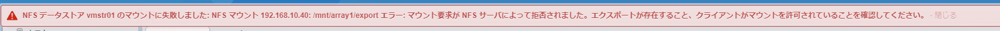

こんにちは、じんないです。

[TeraStation TS5410DN](https://www.buffalo.jp/product/detail/ts5410dn1204.html) で共有フォルダを作成し、NFS で新規データストアとしてマウントしようとすると、下記のエラーでマウントできませんでした。

> NFS データストア vmstr01 のマウントに失敗しました: NFS マウント 192.168.10.40: /​m​n​t​/​a​r​r​a​y​1​/​e​x​p​o​r​t エラー: マウント要求が NFS サーバによって拒否されました。エクスポートが存在すること、クライアントがマウントを許可されていることを確認してください。

ESXi 単体の Host Client からやっても、vCenter Server の vSphere Client からやっても状況は変わません。NFS の設定を確認しても特に変なところもありませんでした。

なかなかハマってしまったのでメモとして残しておきます。
※ NFS の設定は割愛します。

## 想定環境
- ストレージ: [TS5410DN1204 : 法人向けNAS : TeraStation | バッファロー](https://www.buffalo.jp/product/detail/ts5410dn1204.html)
- 仮想化基盤: VMware vSphere 6.5

## モデルケース
- マウント方式: NFS
- ストレージ IP アドレス: 192.168.10.40
- NFS パス: /mnt/array1/export
- データストア名: vmstr01

## NFS のパスはコピペ禁止!!

**結論から先に書きます**。

TeraStation の共有フォルダ設定で NFS のチェックを入れると、**NFS パス** が表示されます。今回の例では `/mnt/array1/export` です。
このパスを使って ESXi からマウントするのですが、**絶対にコピペしてはいけません**。

階層が深くなると長ったらしくなり、間違えたら嫌なのでコピペする人がほとんどだと思いますが、**TeraStation の設定画面からコピーはせず、手打ちするようにしてください**。

TeraStation の NFS で引っかかっている人はこれで解消するはずです。

## なぜコピペだとダメなのか

エラーを見ているとアクセス権限がなかったり、NFS の設定が間違っているんじゃないかと思わされます。私も現にそう思い何度も何度も設定を見直しました。
が、いくら設定を見直してもおかしそうなところはありませんでした。

以降、調査した記録になりますので、興味のある方は読んでみてください。

左が TeraStation の共有フォルダ設定から NFS パスをコピペしたもの。右がメモ帳に手打ちしたものです。
一見、両者は同じ文字列に見えますよね。

次は、これらのファイルをテキストに保存し、Git Bash から `cat` してみます。
上が TeraStation の共有フォルダ設定からコピペしたもの。下がメモ帳に手打ちしたものです。
**コピペしたものには、何やら変な制御文字が含まれていることが分かります**。

`od -c` コマンドで何が含まれているのか見てみます。

少しわかりにくいですが、各文字の間に `\0 \v <スペース>` が含まれていることがわかります。
さらに `x` オプションを追加して16進数でダンプしてみます。

16進数だと `\0 → 00`, `\v → 0b`, `<スペース> → 20` です。
わかりにくいので `/mnt` の部分だけ表にしてみました。

余計わかりにくいですが、文字列と16進数の対応です。この対応が4バイトずつクロスになっており、このデータの並びをリトルエンディアンと呼ぶそうです。
※マルチバイト構成の文字列において、下位バイトから上位バイトに向かってデータを伝送・記録する方式。その逆をビッグエンディアンと呼ぶ。

これで余分な制御文字が、`00`, `0b`, `20` であることがわかりました。
これらの制御文字が何を意味するのかは下記の表のとおりです。

コード | 値 | 説明
-- | -- | --
00 | NUL | NULL(ヌル・ナル)
0b | VT | Vertical Tabulation（垂直タブ）
20 | SPC | スペース (空白)

`/mnt/array1/export` の各文字の間に **NULL、垂直タブ、空白文字が含まれていることがわかりました**。
なぜこのような文字列が含まれているのはわかりませんが、コピペするとこれらの制御文字も一緒に入力されてしまうわけですね。
私の場合は直接コピペではなく、**一度メモ帳に貼り付けてそれをコピーしていたので大丈夫だと思ってましたが思わぬ落とし穴がある**ようです。
パスは間違えたくないって気持ちがありますが、コピペがいかに怖いか思い知らされますね・・・。いい勉強になりました。

ではまた。

## 参考

[Adding a TeraStation NFS Share to ESXi 6.5](https://www.buffalotech.com/knowledge-base/adding-a-terastation-nfs-share-to-esxi-6.5)
