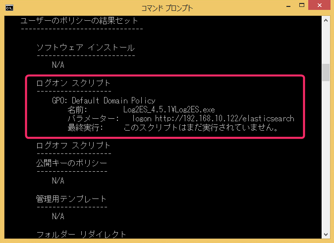
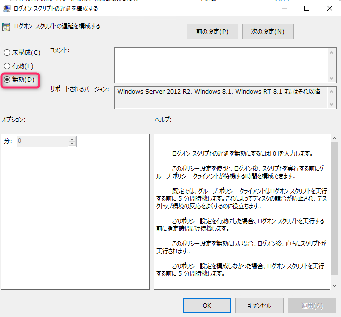

こんにちは、じんないです。

**Windows 8.1 および Windows Server 2012 R2 ベースのコンピューターでは、ログオンスクリプトの実行が5分遅延**します。

これは Microsoft が公開しているとおり、Windows の仕様のようです。

> [ログオン スクリプトは、ユーザーが Windows 8.1 ベースのコンピューターにログオンした後、5 分間は実行されません。](https://support.microsoft.com/ja-jp/help/2895815/logon-scripts-do-not-run-for-five-minutes-after-a-user-logs-on-to-a-wi)

複数の Windows OS が混在する環境で、ログオンスクリプトによるログオンのログを収集しようと考えていたところ、この仕様が影響するのではと思い調査してみました。

## ほんとうに5分遅延するのか

さて、 Microsoft が言うのだから本当なんでしょうが、実際に遅れるのかチェックしてみました。

テストマシンは Windows 8.1 です。

ログオン後、コマンドプロンプトを起動しログオンスクリプトの実行状況を確認します。

`gpresult /z`

> このスクリプトはまだ実行されていません。

はい、本当にログオン直後では実行されていませんでした。

ストップウォッチで測ったわけではないですが、5分ほど経過した後に再確認するとちゃんと実行されていました。

ちなみに、ログオフスクリプトは遅延することはありません。

## Windows 10 では影響しない?

気になるのは Windows 10 でもそうなの?!という部分ですが、 **Windows 10 ではログオンスクリプトの実行は遅延しない**ようです。

先ほどと同様にログオン後、ログオンスクリプトの実行状況を確認すると、ちゃんとログオン時に実行されていました。

何回かやってみて同じ結果だったので、Windows 10 では大丈夫のようですね。それらしいナレッジも見つかりませんでした。

Windows 8.1 時代では少しでもログオン処理を早くしたいという思いがあったのかもしれません。

## 遅延を無効化するにはグループポリシーを設定する

ログオンスクリプトでログオンのログを取得したり、ネットワークドライブをマウントしたりしている場合など、遅延してほしくない時も多々あると思います。

この遅延はグループポリシーを設定することで、無効化する (遅延をなくす) ことができます。

`コンピューターの構成 > ポリシー > 管理用テンプレート > システム > グループポリシー > ログオン スクリプトの遅延を構成する`

**未構成から無効に変更します**。

このポリシーを適用することで、Windows 8.1 でも遅延せずログオンスクリプトを実行できます。

ではまた。