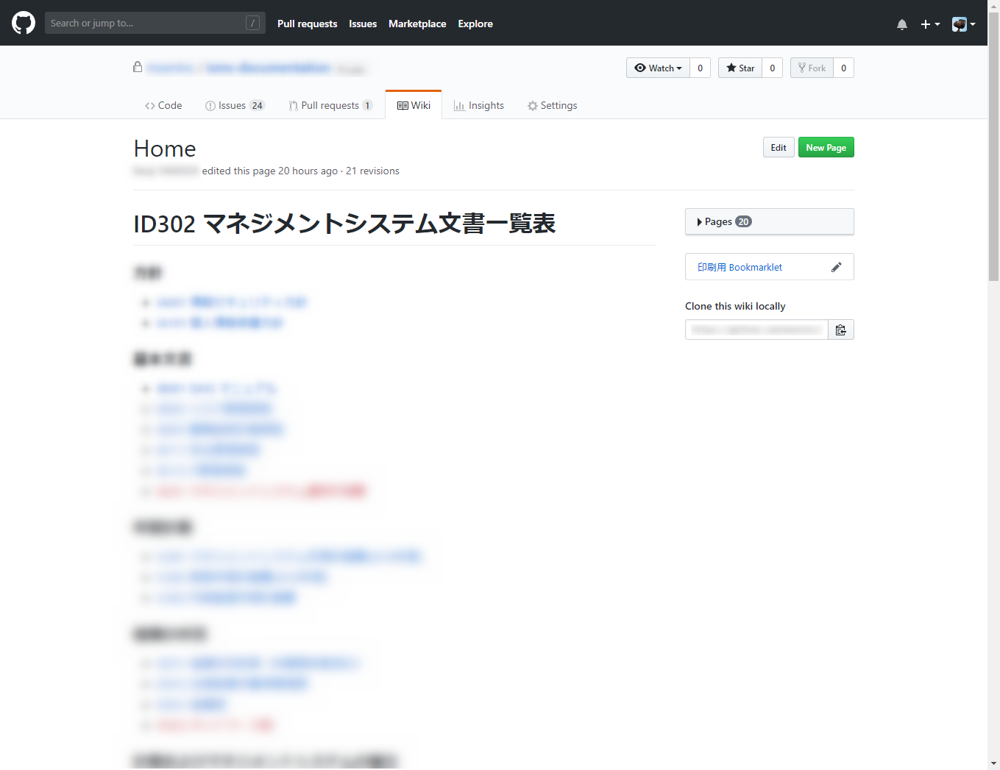
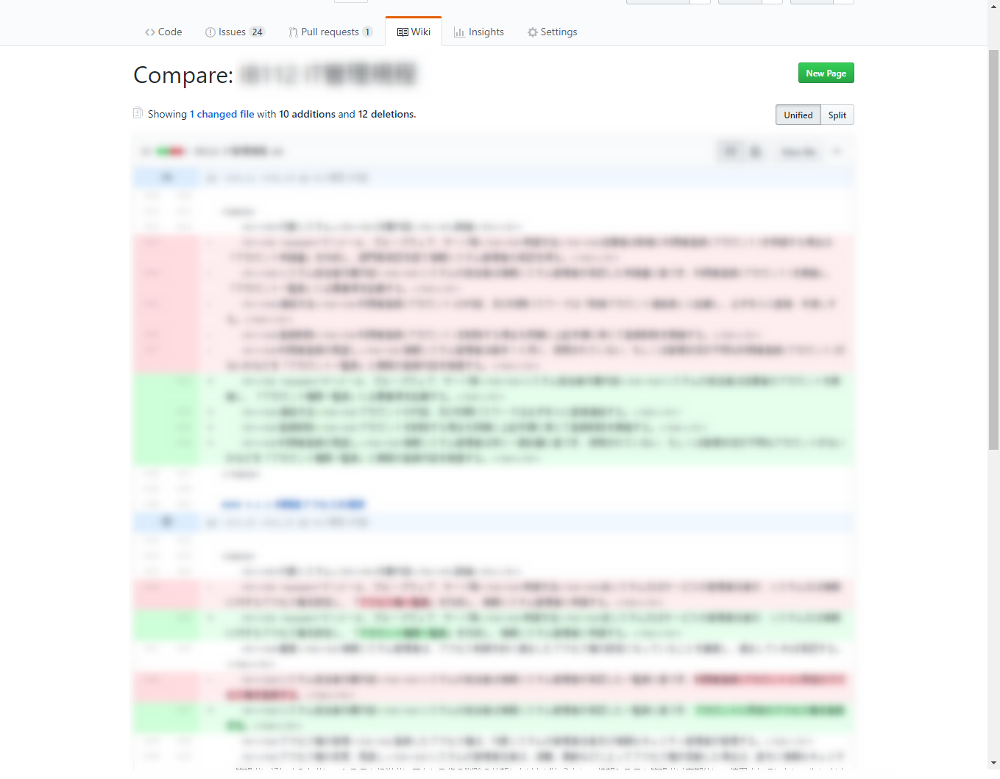
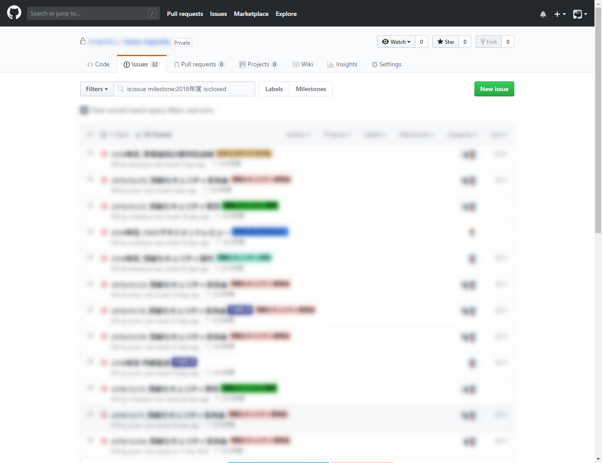
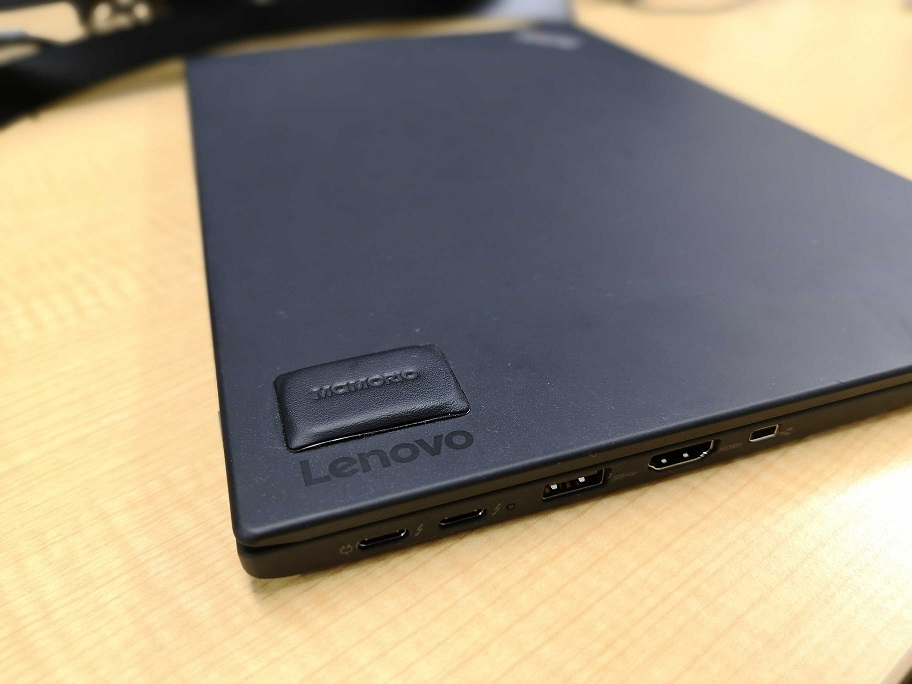
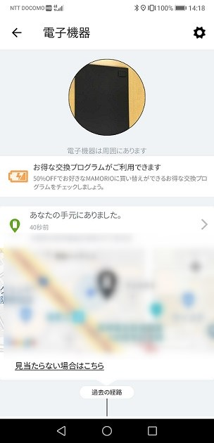
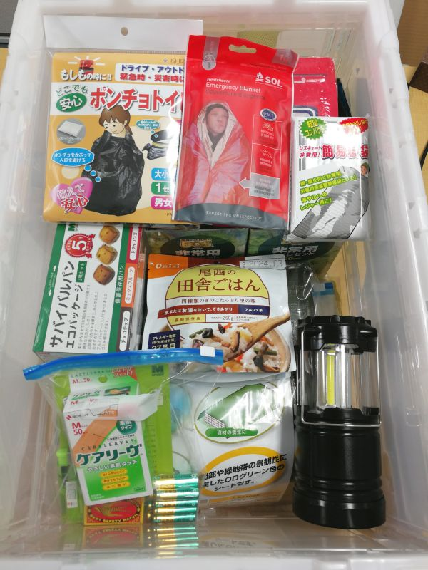

こんにちは、じんないです。

弊社は 2016年より **ISO27001 ISMS** を取得しています。

つい先日、今年度の審査がありました。

今年で取得から3回目の審査となり、再認証審査にあたります。

## 今年の取り組み

今年は ISMS の活動に力を入れ、下期に至っては情報セキュリティ委員会を毎週のように開催しておりました。

各規程の見直しをはじめ、課題にも積極的に取り組んでいきました。

### ISMS 関連文書の電子化

まず、大きな変更点は ISMS 文書の電子化です。

電子化可能な文書は GitHub の Wiki を活用するようにしました。

markdownで記述することで、変更点が容易に判断でき改訂管理がとても楽になりました。

情報セキュリティ委員会や監査の記録、課題などは Issues で管理し、それぞれにラベリングを行っています。Milestones で年度を登録しておけば、その年度の活動が一覧化できます。

文書を電子化するのは結構大変でしたが、みんなで手分けしてやりました。期待以上に便利さを感じており、やってよかったなぁと実感しています。

### MAMORIO の導入

業務で使う PC はもっぱらノートパソコンですが、その紛失防止と紛失時のトラッキングができるよう [MAMORIO](https://mamorio.jp/) を装着しました。

スマホとペアリングしておけば、このようにトラッキングが可能です。紛失しないのが一番ですが、万が一の際にあるのとないのとでは大違いです。**今回の審査でも "Good Point!" をいただきました**。

### 災害用品の整備

今年度は大阪でも台風で大きな被害があり、事業継続を考えるのに好適な年でした。

事務所と社員の各家に災害用品の備蓄と配備を行いました。今年はこの災害用品使い方や実際の災害を想定した訓練を行うことも検討しています。

詳細は以下の記事を参照してください。
[2018年 社内向け災害対策用品を整備しました (物品リストあり)](/emergency-packing/)

## 来年度への意気込み

ずいぶんと取り組んできたつもりでしたが、いざ審査を受けてみると見直さないといけないなと感じるところが多くありました。

とてもよい改善の機会となり、レビューいただくことの大切さを改めて感じました。

せっかくの認証も持っているだけではただの飾りとなってしまうので、自分たちの身の丈にあったマネジメントシステムができるよう取り組んでまいります。

ではまた。
