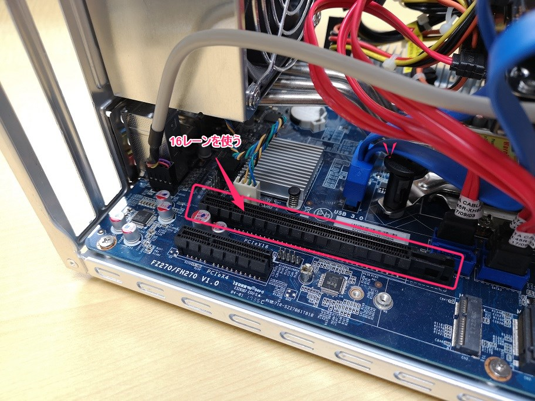

こんにちは、じんないです。

弊社は評価環境に **VMware vSphere** を使用しています。ちょうど昨年にリプレイスが完了して、安定稼働しています。

基盤には Shuttle SZ270 R9 を使用してます。 SZ270 は RAID 対応と書いてあるのですが、**[Intel Rapid Storage Technology](https://www.intel.co.jp/content/www/jp/ja/architecture-and-technology/rapid-storage-technology.html) によるソフトウェア RAID のため ESXi では使えません**。

以前に BIOS から設定してみたこともありましたが、やはり ESXi からは認識してくれませんでした。

ということで、RAID カードを追加して構成してみることにしました。ハードウェアとの相性はわかりませんが、少なくとも ESXi との相性は担保したいので [VMware 互換性ガイド](https://www.vmware.com/resources/compatibility/search.php)を見ながら選定します。

もう10年物になりますが、**[LSI MegaRAID 9261-8i](http://www.arms-corp.co.jp/lsi9261)** にしました。

## 構成
- 本体: Shuttle SZ270 R9
- RAID カード: MegaRAID 9261-8i (LSI)
- HDD: WD 赤 3TB×3
- RAID: RAID 5
- 仮想化基盤: VMware vSphere 6.5 u2

## 組み立て

RAID カードは某オークションで手配しました。 Mini SAS が2つついてます。 HDD へは変換して SATA で接続します。

PCI は 16 レーンの方が空いていたのでそっちを使います。

何も意識してなかったのですが、本体はフルハイトなのに付属品はロープロだったという・・・笑
ちょうどいいのが無かったので、ブラケットをぶった切って両面テープで固定してます（そのうち何とかします）

## Boot Mode の変更

さぁ、電源を入れて RAID の構成に移りたかったのですが、RAID の設定に突入できる画面が出てこず。

色々試していると BIOS の Boot Mode が UEFI だとダメなようです。**Legacy** へ変更します。

ようやく設定画面が出てきたので、 `<Ctrl><H>` で WebBIOS へ突入します。

## RAID 構成

WebBIOS による RAID の構成方法は以下のサイトを参考にしました。

[MegaRAID 設定方法 – WEB BIOSによる設定](https://changineer.info/server/server_hardware_management/server_hardware_megaraid_web_bios.html)

Read Policy は **Normal(先読みなし)**、
Write Policy は **Write Back with BBU(バッテリーが良好ならライトバック、そうでなければライトスルーに自動切替)** を選択してます。
※バッテリーが生きているかは怪しいですが・・・

## ESXi からストレージを確認

vCenter Server に接続し、ストレージデバイスを確認すると、ちゃんと認識していました。この瞬間が一番緊張します。笑

もし、ストレージやストレージアダプタが見えてない場合、ドライバが不足している可能性があります。
※比較的古いものだと大丈夫だと思いますが。。。

その場合は、RAID カードのドライバを ESXi のイメージに組み込む必要があります。これは RAID カードに限ったことではなく、NIC などでもよくある話です。

任意のドライバを組み込んだカスタムイメージの作成方法は以下の記事を参考にしてみてください。

[VMware ESXi のカスタムインストールディスクの作成方法](https://mseeeen.msen.jp/how-to-make-vmware-esxi-install-disc/)

ではまた。