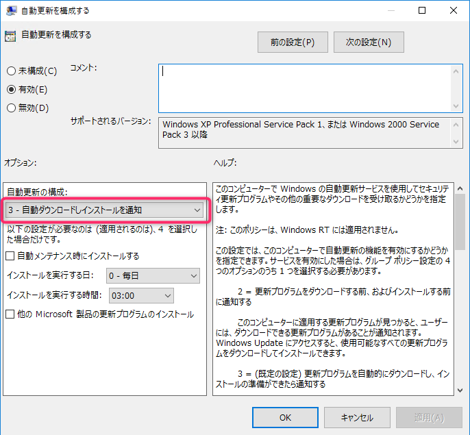
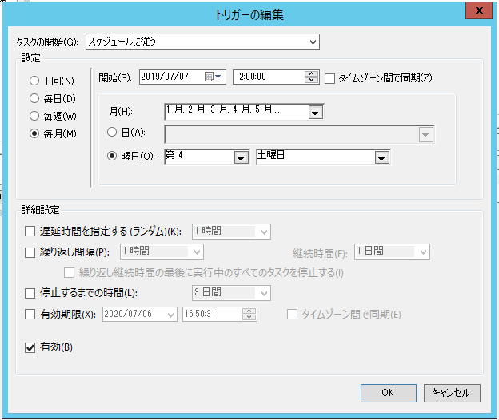
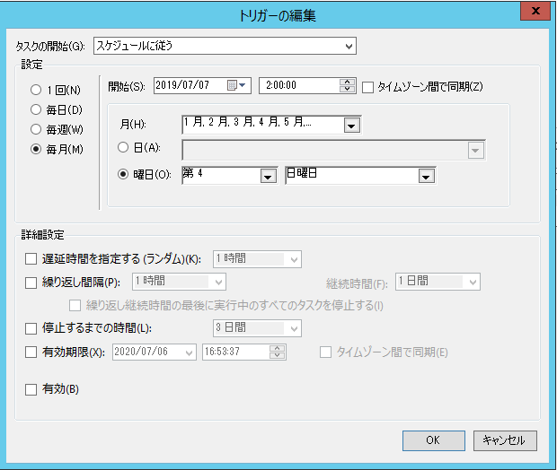
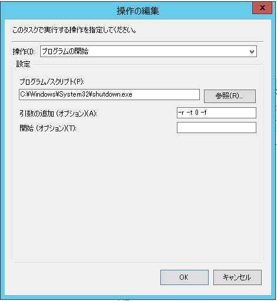
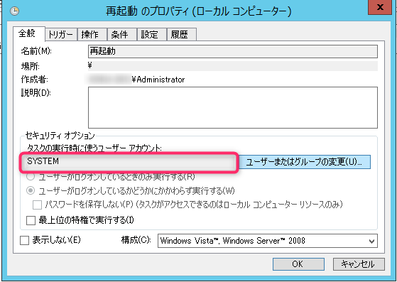

こんちには、じんないです。

Windows Server を運用していれば Windows Update (更新プログラム) をどうするかという問題を考えないわけにはいきません。

クローズドネットワーク内であれば Windows Update を適用しないという手もありますが、インターネットにアクセス可能な環境であれば少なくともセキュリティパッチだけでも当てておきたいというのが本音です。

また、昨今のセキュリティ事情を鑑みても、**Windows Update は自動更新とする** と考えるユーザーも少なくないでしょう。

しかしながら、Windows Update の制御は意外と難しく、思ったとおりの動きにならないことがしばしばあります。

今回は以下のポリシーを例にとって、更新プログラムの適用や再起動のタイミングを制御してみます。
**毎月1回 Windows Update を適用したい**というケースです。スケジュールはお使いの環境に合わせて適宜読み替えてください。

- 更新プログラムのダウンロード：自動ダウンロード
- 更新プログラムのインストール：第4週目の土曜日
- 再起動：第4週目の日曜日

## 更新プログラムを自動的にダウンロードする

更新プログラムのダウンロードは事前にバックグラウンドで進めておきます。

以下のグループポリシーを設定します。ドメイン GPO でもローカル GPO でも構いません。

`コンピューターの構成 > ポリシー > 管理用テンプレート > Windows コンポーネント > Windows Update > 自動更新を構成する`

- **自動更新の構成: 3 - 自動ダウンロードしインストールを通知**

このポリシーを有効にすることで、**更新プログラムは自動的にダウンロードするがインストールは任意**という状態になります。

## インストールを制御する

つぎに前項でダウンロードした更新プログラムをインストールします。

インストールには [Microsoft が公開している VB スクリプト](https://msdnshared.blob.core.windows.net/media/2018/02/DownloadedUpdatesInstall.vbs_.txt)と、タスクスケジューラを組み合わせます。

この VB スクリプトは **"ダウンロードが完了した更新プログラムのインストール処理を実行する"** というものになります。※本番環境へ適用の際は十分に動作チェックをお願いします。

あとは (今回の例では) 毎月第4週目の土曜日にこのスクリプト実行すればよいです。

タスクスケジューラの設定は割愛しますが、トリガーはこんな感じです。

## 再起動を制御する

最後は再起動の制御です。こちらはシャットダウンコマンドをタスクスケジューラから実行してやればよく、難しい設定はありません。

第4週目の日曜日にタスクが実行されるようにします。

操作項目ではシャットダウンの exe ファイルを指定します。

- プログラム/スクリプト: `C:\Windows\System32\shutdown.exe`
- 引数の追加: `-r -t 0 -f`
  - `-r` : 再起動
  - `-t 0` : 再起動が実行されるまでの時間(0秒)
  - `-f` : 強制

タスク実行時に使うユーザーアカウントは権限の問題で失敗しないよう `SYSTEM` アカウント指定します。

最終的には **ダウンロードが完了した更新プログラムのインストールを実行するタスク** と **再起動を実行するタスク** の2つができていれば OK です。

これで、**更新プログラムは毎月第4週目の土曜日にインストールし、毎月第4週目の日曜日に再起動する** という制御が可能になります。

ではまた。

## 参考

- [Windows 10 / Windows Server 2016 の Windows Update 後の自動再起動の制御方法 – Japan WSUS Support Team Blog](https://blogs.technet.microsoft.com/jpwsus/2018/02/08/manage-reboot/)
