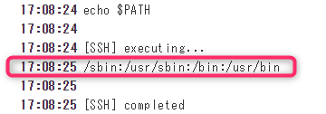
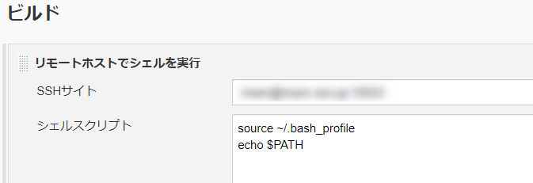
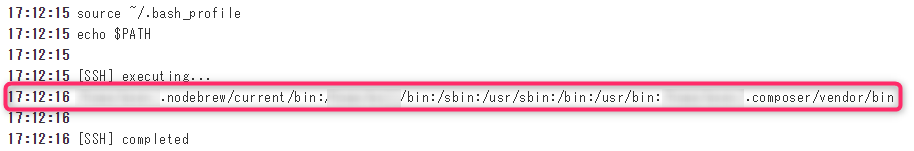

こんにちは、じんないです。

jenkins を使って、作業を自動化されている方も多いのではないでしょうか。

jenkins ではリモート先のホストを登録しておくことで、そのサーバーに対してシェルスクリプトを実行することができます。

先日、[エックスサーバー](https://www.xserver.ne.jp/) の上のサーバー (CentOS) に対してシェルを実行していたのですが、 `~./bash_profile` で任意に設定した環境変数が使えませんでしたので解決方法をメモしておきます。

## 環境

- jenkins 2.187
- リモートホスト: エックスサーバー 2000番台

## 「リモートホストでシェルを実行」では bash_profile を読み込まない!

**リモートホストでシェルを実行** では SSH 経由でコマンドが実行されます。

SSH 経由でコマンド実行する際は **非対話モード** となるので、`./bash_profile` は読み込まれないようです。※bash の仕様

実際に jenkins で `echo $PATH` をしてみると。

こんな感じで、任意で設定したパスが全く通ってないことがわかります。

### 対策

リモートホストで実行するシェルスクリプトで明示的に `~/.bash_profile` を読み込ませればいいです。

`source ~/.bash_profile`

結果は以下のとおり、パスが通りました。

エックスサーバーなどのレンタルサーバーでは、root 権限が与えられていないために `/sbin:/usr/sbin:/bin:/usr/bin:` などを触ることができません。

ソースからインストールしたプログラムのパスを通したいときは、こんな感じでやってみてください。

## 参考

[\[FreeBSD\]\[Linux\] ssh経由でコマンド実行すると環境変数を読まないでござる | Nobwak's Lair](http://april.fool.jp/blogs/2013/07/25/freebsdlinux-ssh%E7%B5%8C%E7%94%B1%E3%81%A7%E3%82%B3%E3%83%9E%E3%83%B3%E3%83%89%E5%AE%9F%E8%A1%8C%E3%81%99%E3%82%8B%E3%81%A8%E7%92%B0%E5%A2%83%E5%A4%89%E6%95%B0%E3%82%92%E8%AA%AD%E3%81%BE%E3%81%AA/)