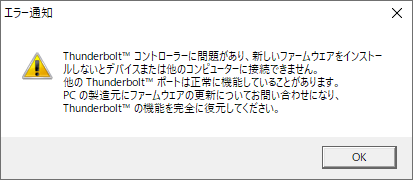

こんにちは、じんないです。

ここのところ、 USB-C にやディスプレイ出力のケーブルを接続すると以下のエラーダイアログが表示されることがありました。

> Thunderbolt コントローラーに問題があり、新しいファームウェアをインストールしないとデバイスまたは他のコンピューターに接続できません。他の Thunderbolt ポートは正常に機能していることがあります。 PC の製造元にファームウェアの更新についてお問い合わせになり、 Thunderbolt の機能を完全に復元してください。

Thunderbolt ソフトウェアの詳細を見ても警告が出ています。

充電できなくなったり、ディスプレイ出力がうまくいかなかったりという不具合は無かったのですが、何度も出てくるので対処してみました。

## 環境
- Lenovo ThinkPad X1 Carbon (5th)
- Windows 10 Pro 1809

## Lenovo Vantage の更新では解消されない

気づいたときに Lenovo Vantage からシステム更新を実施していますが、システムが最新の状態であっても事象が改善されることはありませんでした。
まだやったことないって人はとりあえず更新しておくことをオススメします。

ここで、下部に表示されている **シリアル番号**、**製品番号** は次項で役立ちますので控えておきましょう。

## Thunderbolt ファームウェアをアップデートする

[Lenovo のサポートページ](https://support.lenovo.com/jp/ja/home)へアクセスし、前項で確認したシリアル番号または製品番号で検索します。

製品ホームから thunderbolt で検索します。

Thunderbolt のファームウェアアップデートがあるので、ダウントード&インストールします。
※画像は 2019/7/2 リリースのものですが、執筆時の最新は 2019/8/21 となっていました。 

インストールが完了したら再起動します。
再起動後は Thunderbolt ソフトウェアの詳細から警告が消えていることを確認しました。

ファームウェアのアップデート以後、エラーダイアログが表示されることはありませんでした。

これにて解決です。めでたしめでたし。

## 【おまけ】4K 外部モニターで Hulu が観れるようになった

余談ですが、このファームウェアのアップデート前に USB-C 出力の外部モニター(4K) で hulu を見ようとすると以下のエラーが出て何も視聴できませんでしたが、アップデートを実施すると無事に見れるようになりました。笑
こちらもめでたしめでたしです。

[Huluで「動画の再生中に問題が発生しました。更新ボタンを押していただくか、インターネットの接続状況をご確認ください。」のエラーメッセージが表示されます。 | Huluカスタマーサポート - Hulu Helpcenter](https://help.happyon.jp/faq/show/2993?back=front%2Fcategory%3Ashow&category_id=282&page=1&site_domain=jp&sort=sort_access&sort_order=desc)

ではまた。