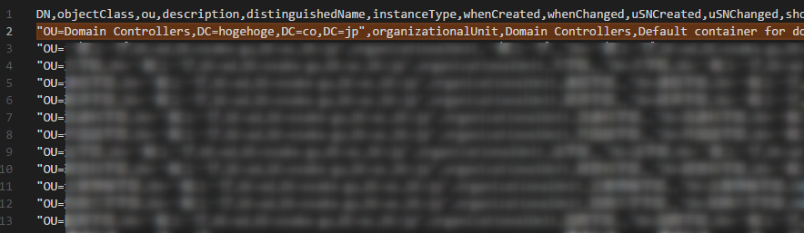
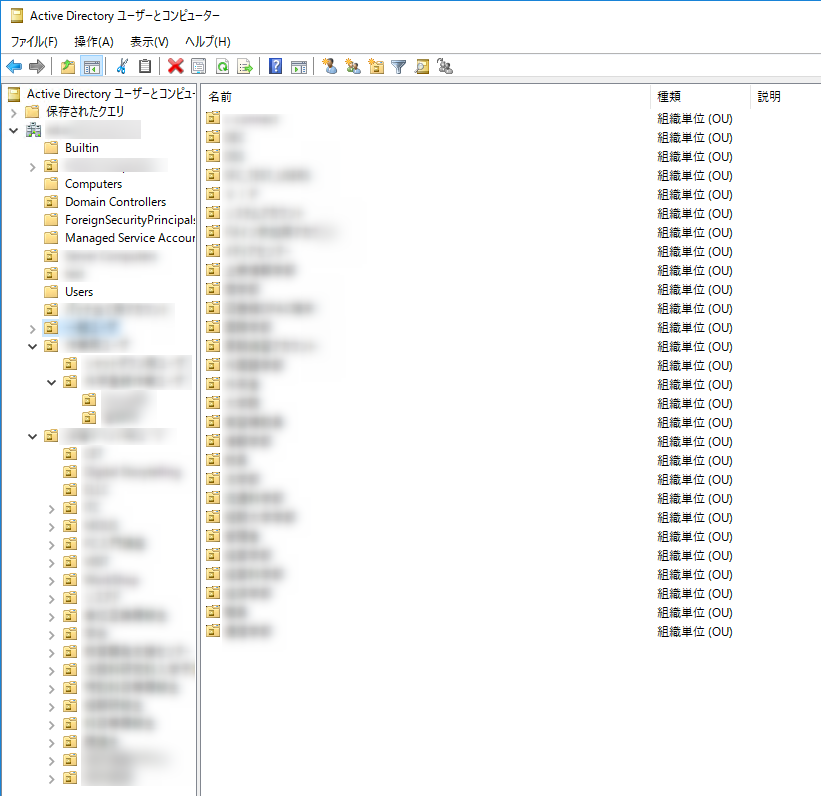

こんちには、じんないです。

今回は **csvde (CSV Directory Exchange) コマンド**を使って **Active Directory の OU (Organizational Unit) をクローン(エクスポート + インポート)する方法**を紹介します。

Active Directory を評価する際に、本番環境と同等の構成としたい場合があります。

OU が少ない場合はよいのですが、複数あったり入れ子構造になっていたりすると環境を作るだけで一苦労です。

比較的にシンプルな方法がないかと模索していたところ、csvde コマンドで実現できました。

## 想定環境
- 本番環境および評価環境はどちらも Windows Server 2016 とします。
- 評価環境の Active Directory は構築初期状態とします。

## まずはエクスポート

本番環境の Active Directory ドメインコントローラーでコマンドプロンプト(管理者権限)を起動し、以下のコマンドを実行します。

`csvde -m -u -f OUTPUT.csv -r objectClass=organizationalUnit -n`

`-r` オプションでOUを指定しエクスポートします。

その他のオプションは以下を参照してください。(csvdeコマンドのヘルプ)

### csvde のコマンドオプション

> **汎用パラメーター**
> 
> -i              インポート モードにします (既定ではエクスポート モードです)
> -f ファイル名   入力ファイル名または出力ファイル名
> -s サーバー名   結合先のサーバー (既定ではコンピューターのドメインの DC)
> -v              詳細モードをオンにします
> -c FromDN ToDN  FromDN を ToDN で置き換えます
> -j パス         ログ ファイルの場所
> -t ポート       ポート番号 (既定値 = 389)
> -u              Unicode 形式を使います
> -h              SASL レイヤーの署名と暗号化を有効にします
> -?              ヘルプ
> 
> **エクスポート固有**
> 
> -d ルートDN     LDAP search のルートです (既定では名前付けコンテキスト)
> -r フィルター   LDAP search のフィルターです (既定では "(objectClass=*)")
> -p 検索範囲     検索範囲 (Base/OneLevel/Subtree)
> -l 一覧         LDAP search で検索する属性の一覧 (コンマ区切り)
> -o 一覧         入力から省略する属性の一覧 (コンマ区切り)
> -g              ページされた検索を無効にします。
> -m              エクスポートで SAM ロジックを有効にします。
> -n              バイナリ値をエクスポートしません。
>
> 
> **インポート**
> 
> -k              'Constraint Violation' エラーと 'Object Already Exists' エラーを無視してインポートを続けます

## インポートする

前項でエクスポートした `OUTPUT.csv` をテキストエディターで開き、`"OU=Domain Controllers,DC=hogehoge,DC=co,DC=jp"～`で始まる2行目を削除します。

`DC=hogehoge,DC=co,DC=jp` の部分はお使いの環境に応じて読み替えてください。

`OU=Domain Controllers` はActive Directory が初期状態から存在する OU です。

この記述を削除しておかないと、インポートする際にエラーとなります。

評価環境が初期状態でない場合は、あらかじめ `OUTPUT.csv` から Active Directory にすでに存在している OU の行を削除しておいてください。

評価環境の Active Directory ドメインコントローラーでコマンドプロンプト(管理者権限)を起動し、以下のコマンドを実行します。

`csvde -i -u -f OUTPUT.csv`

管理ツールから Active Directory ユーザーとコンピューターを起動すると、OU がインポートされていることが分かります。

今回は OU を対象としましたが、**ユーザーやセキュリティーグループなども csvde コマンドからエクスポート+インポートすることができます**。

またそのあたりも紹介できればと思っています。

ではまた。

## 参考

> - [Csvde | Microsoft Docs](https://docs.microsoft.com/en-us/previous-versions/windows/it-pro/windows-server-2008-R2-and-2008/cc732101(v=ws.10))
> - [宇宙電波系ポストギーク csvdeコマンドでドメインのオブジェクトを別のドメインにインポートする](http://chinokamoto.blog.fc2.com/blog-entry-13.html)
