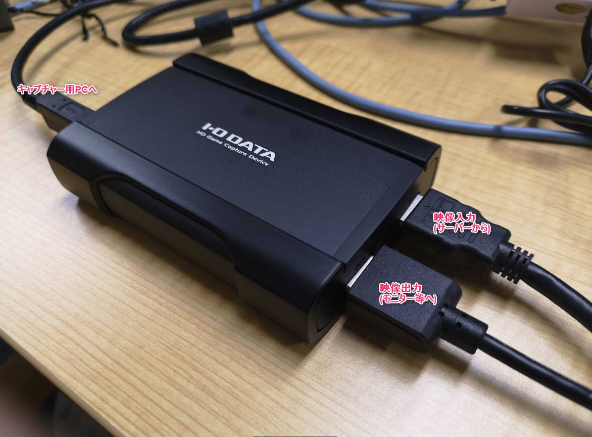
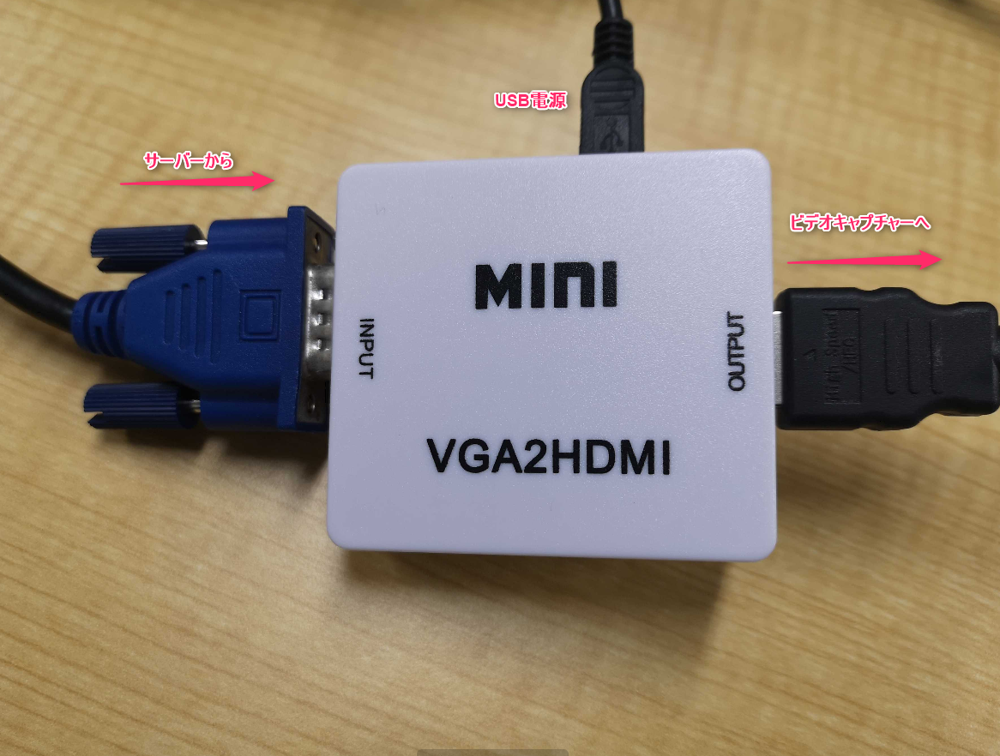
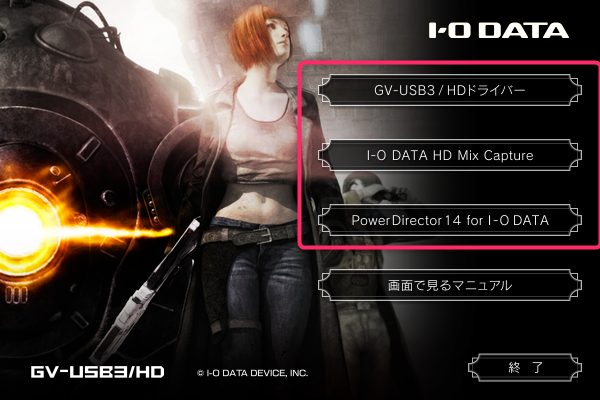
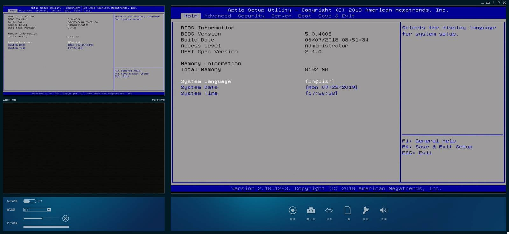
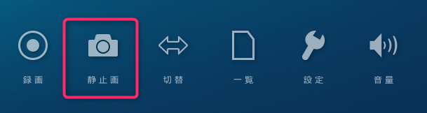
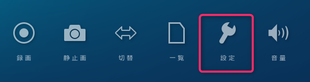
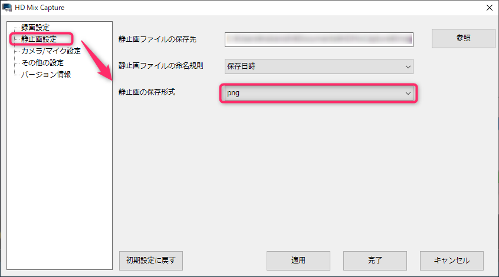

こんにちは、じんないです。

サーバーの構築をしていると、設定変更をしたときにエビデンスとしてスクリーンショット(画面キャプチャー)を撮るのはよくあることです。

OS が起動したあとであれば、[PrintScreen]キーやキャプチャーソフトでスクリーンショットを取得できますが、BIOS や POST 時の画面はそういうわけにはいきません。

多くのサーバーには管理ポートなるものが備えられており、リモート KVM がサポートされていることがありますが、こちらもライセンスが無いと使用できなかったりと制限があります。

そこで今回は汎用的に使えるビデオキャプチャーを使って、スクリーンショットを取得しようと思います。

詳しい説明は割愛しますが、ビデオキャプチャーとはカメラやテレビなどの映像をデジタルデータとしてコンピュータに保存することを指します。

## 構成

- ビデオキャプチャー: [GV-USB3/HD | IODATA](https://www.iodata.jp/product/av/capture/gv-usb3hd/)
- 映像入力: VGA
- 映像出力: HDMI
- 入力映像変換器: GVA to HDMI 変換アダプタ
- キャプチャー用PC: Lenovo ThinkPad X1 Carbon(5th) - Windows 10 Pro

ビデオキャプチャーはこんな感じです。思ってたより小型で、ケーブルの方が目立っています。

## 映像入力のコンバート

ビデオキャプチャー GV-USB3/HD は入力・出力共に HDMI です。

サーバーの映像出力は VGA であることが多いので変換が必要になります。

筆者の場合は、事務所に転がっていたコンバーターを使用しました。

## ソフトウェアのインストール

添付されていた DVD からキャプチャー用のソフトウェアをインストールします。

キャプチャするだけなら上2つでいいかもしれません。

## スクリーンショットの取得

ソフトウェアを起動し、サーバーの電源を入れると。

おおー、ちゃんと BIOS の画面が表示されました。60fps 出ているので遅延等もありません。

[静止画] というボタンをクリックすると、`%userprofile%\Documents\HDMixCapture\Image` 配下にキャプチャがどんどん溜まっていきます。

### 拡張子の変更

デフォルトだと、キャプチャーはビットマップ (bmp) 形式で保存されます。

ちょっとサイズが大きくなってしまうので、png 形式に変えておきましょう。

[設定] をクリックします。

[静止画設定] > [静止画の保存形式] を **png** に変更して適用します。

## あとがき

キャプチャーできるか少し不安でしたが、いい感じに撮れてよかったと思います。思ったよりも小型なのも Good Point ですね。

付属のソフトウェアがまだ使いこなせてないですが、もっといい感じの機能があったらご紹介したいと思います。

ではまた。