こんにちは、じんないです。

VMware で仮想マシンテンプレートを作成し、テンプレートから新規仮想マシンをデプロイすることはよくあると思います。

Windows では仮想マシンテンプレートからデプロイした場合、Security ID (以下、SID) が同じになってしまいます。

下図は、同じ仮想マシンテンプレートからデプロイした仮想マシンの SID を調査したものです。
コンピューターの SID を調べるには `whoami /user` を実行し、ユーザーの SID を調べればわかります。
ユーザーの SID はコンピューターの SID に アカウントの相対 ID (RID) を付与したもので構成されます。
ちょうど、赤枠で囲っている部分がコンピューターの SID となります。

<a href="images/how-to-automate-sysprep-when-creating-virtual-machines-with-vmware-1.png">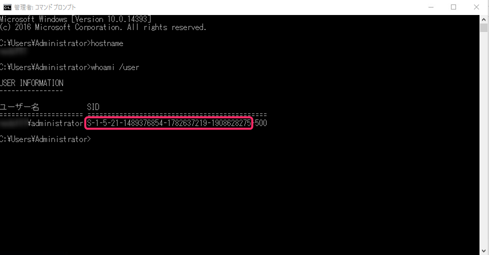</a>

同じ SID であることがわかります。

<a href="images/how-to-automate-sysprep-when-creating-virtual-machines-with-vmware-2.png">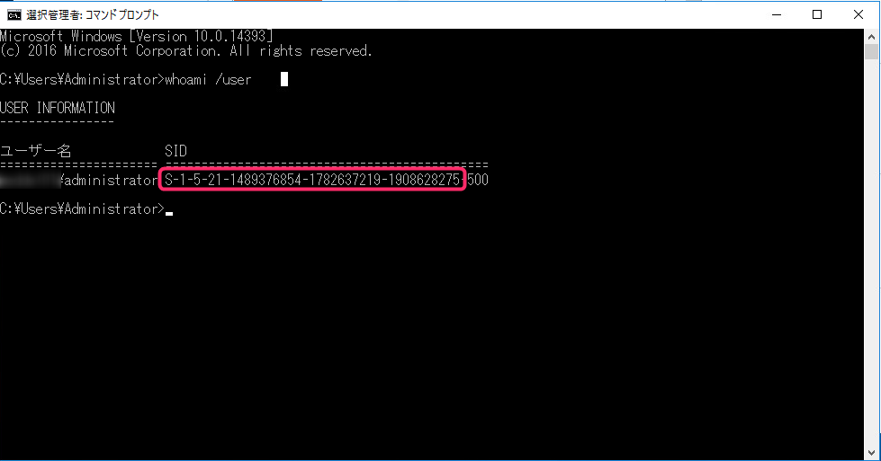</a>

本来は、テンプレートからデプロイした後に sysprep を実行することで、新たに SID を割り当てることができます。
詳細は下記を参照。
[Windows インストールのディスク複製に関するマイクロソフトの方針](https://support.microsoft.com/ja-jp/help/314828/the-microsoft-policy-for-disk-duplication-of-windows-installations)

<a href="images/how-to-automate-sysprep-when-creating-virtual-machines-with-vmware-3.png">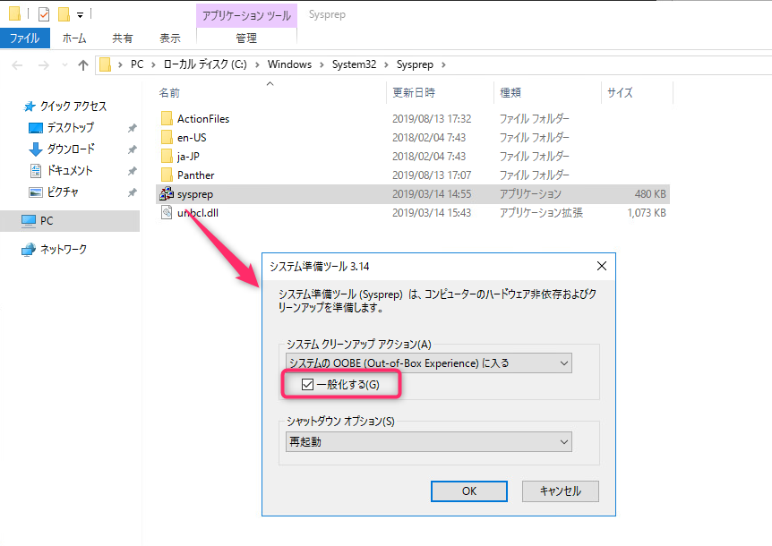</a>

しかしながら、仮想マシンをデプロイするたびに sysprep を実行するのは非常にナンセンスで何より面倒です。

vCenter Server を使用の環境なら、**ゲスト OS のカスタマイズ仕様** を設定でき、クローンやテンプレートから仮想マシンを作成した際に、その設定を適用することができます。

## 想定環境
- VMware vSphere 6.5
- vCenter Server 6.7
- ゲストOS: Windows Server 2016

## 仮想マシンのカスタマイズ仕様の作成

vSpehre Client のインベントリから **仮想マシンのカスタマイズ仕様** をクリックします。

<a href="images/how-to-automate-sysprep-when-creating-virtual-machines-with-vmware-4.png">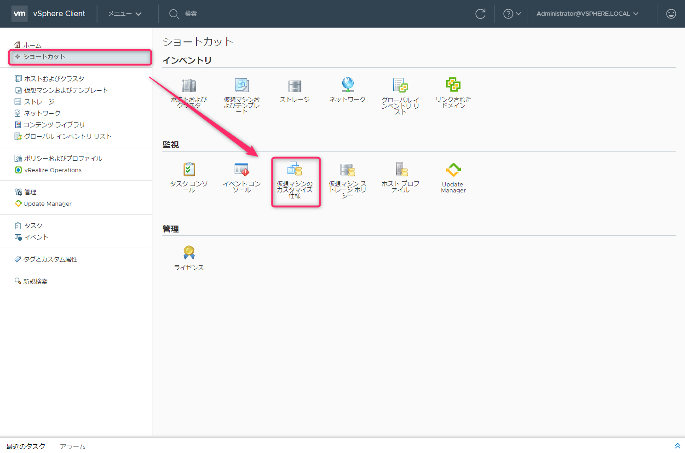</a>

**新規** をクリックします。

<a href="images/how-to-automate-sysprep-when-creating-virtual-machines-with-vmware-5.png">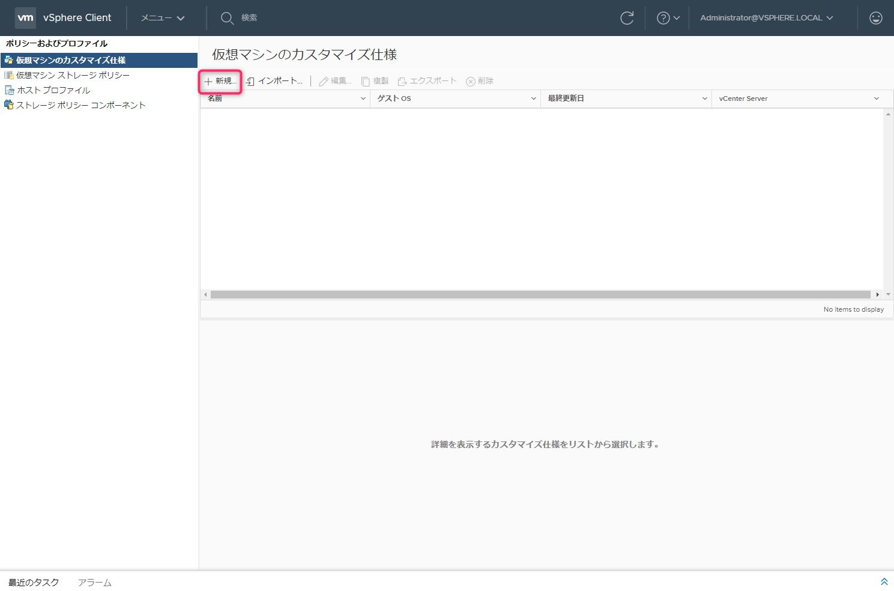</a>

カスタマイズ仕様に適当な名前をつけ、**新規セキュリティ ID(SID) の作成にチェックが入っていること**を確認します。あとは必要に応じてカスタマイズします。

<a href="images/how-to-automate-sysprep-when-creating-virtual-machines-with-vmware-6.png">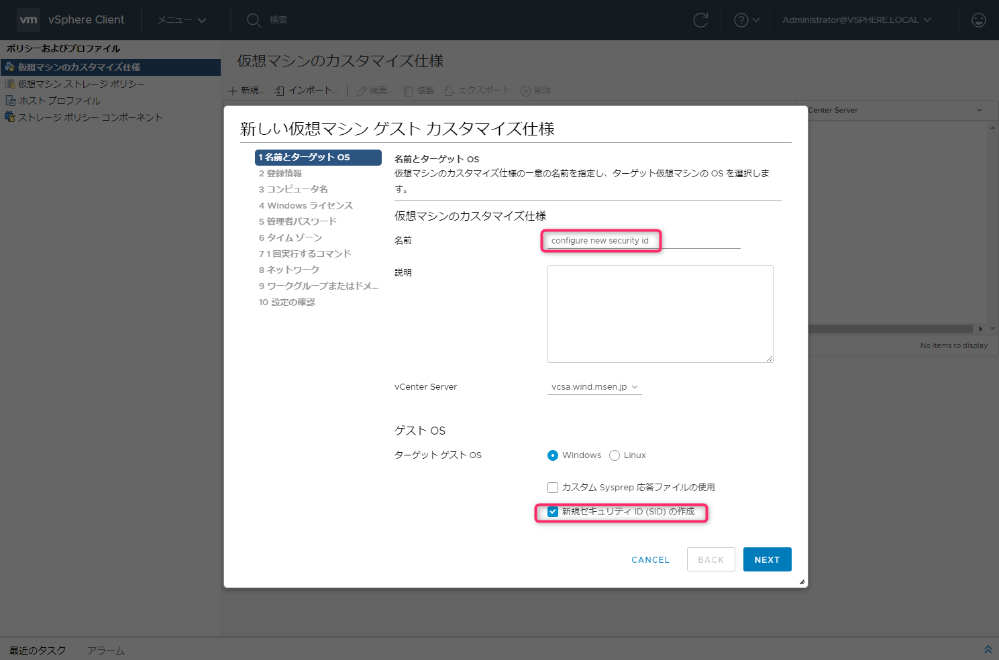</a>

**1回実行するコマンド** という設定項目があり、以下のコマンドを登録しておくと便利です。このコマンドは**システムのプロパティ**と**ネットワーク接続**の画面を起動してくれるものです。どっちみちホスト名と IP アドレスを変更しないといけないので、初回ログオン時に起動してくれるようにしましょう。

`C:\Windows\System32\sysdm.cpl`
`C:\Windows\System32\ncpa.cpl`

<a href="images/how-to-automate-sysprep-when-creating-virtual-machines-with-vmware-7.png">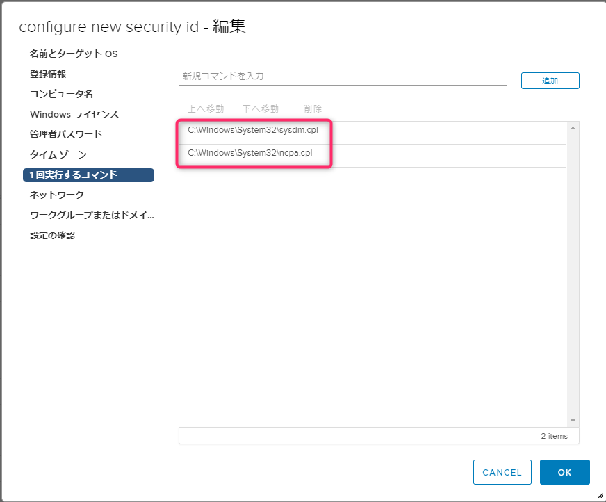</a>

## カスタマイズ仕様の適用
テンプレートからデプロイするとき、クローンオプションの選択で **オペレーティング システムのカスタマイズ** にチェックをいれます。

<a href="images/how-to-automate-sysprep-when-creating-virtual-machines-with-vmware-8.png">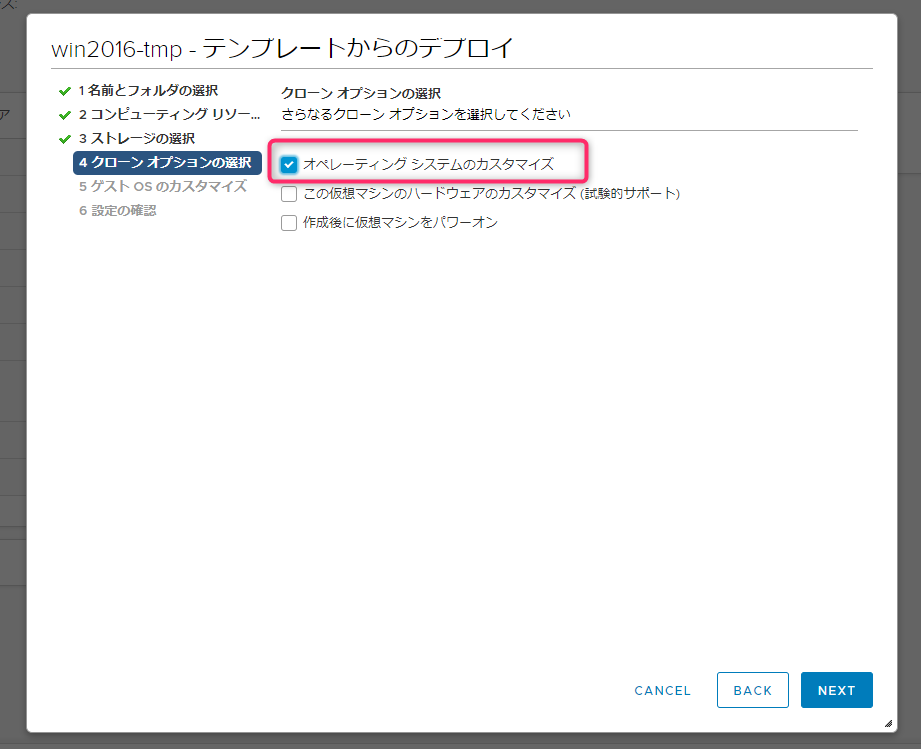</a>

作成したカスタマイズ仕様を選択します。

<a href="images/how-to-automate-sysprep-when-creating-virtual-machines-with-vmware-9.png">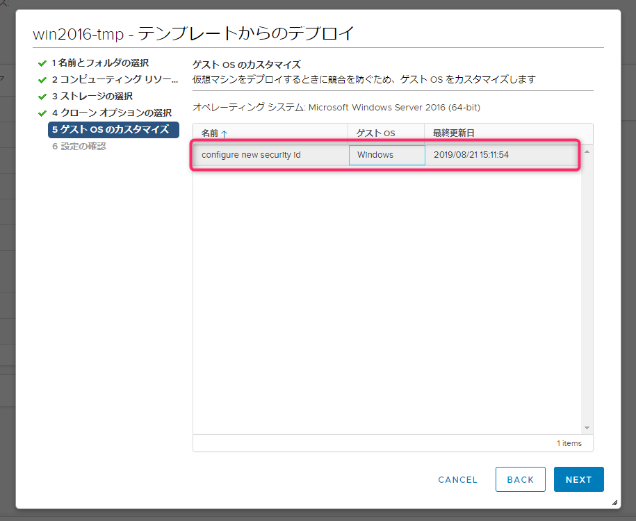</a>

設定の確認で、ゲスト OS のカスタマイズ仕様が適用されていることを確認します。

<a href="images/how-to-automate-sysprep-when-creating-virtual-machines-with-vmware-10.png">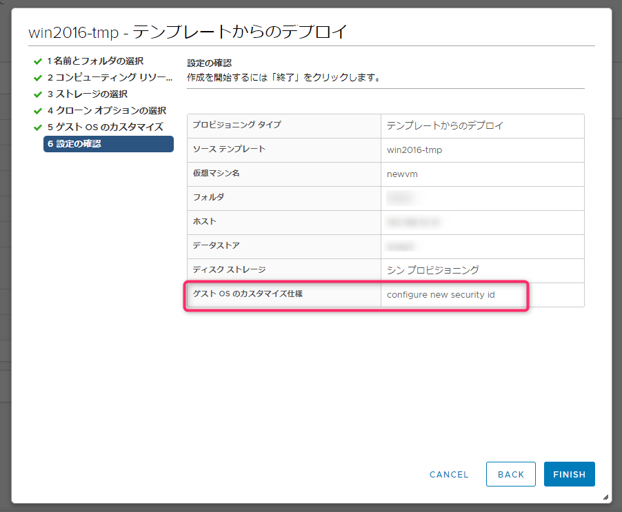</a>

仮想マシンを起動し、**新しい SID が割り当てられていること**、**システムのプロパティが起動すること**、**ネットワーク接続が起動すること** を確認します。

<a href="images/how-to-automate-sysprep-when-creating-virtual-machines-with-vmware-11.png">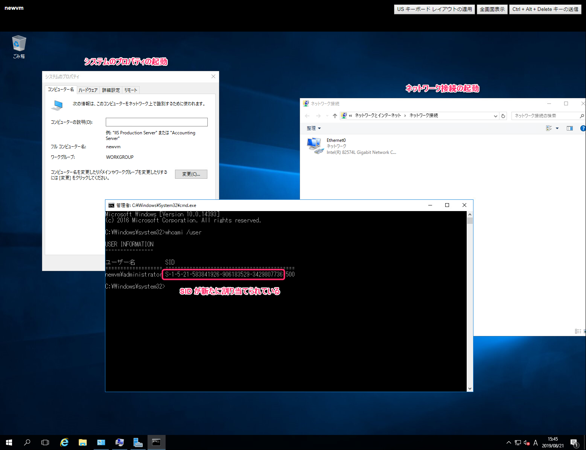</a>

あとはホスト名と IP アドレスを変更すれば OK です！

ではまた。

## 参考
[Windows のカスタマイズ仕様の作成](https://docs.vmware.com/jp/VMware-vSphere/6.0/com.vmware.vsphere.vm_admin.doc/GUID-CAEB6A70-D1CF-446E-BC64-EC42CDB47117.html)
