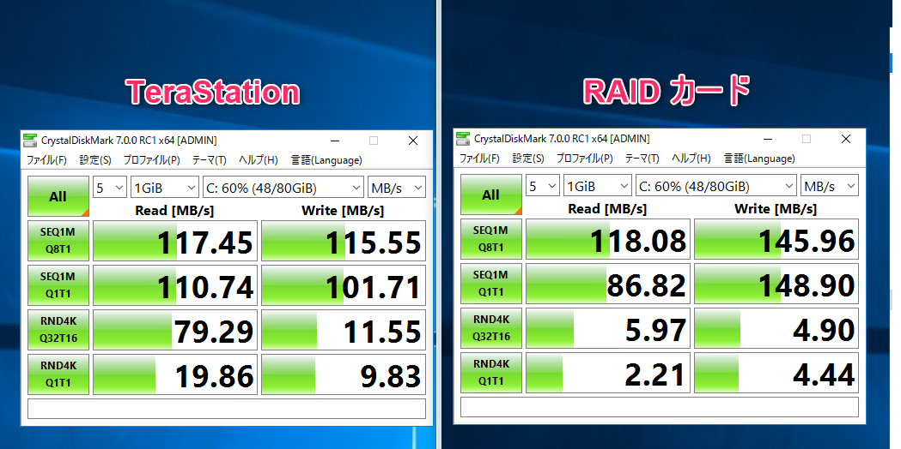

こんにちは、じんないです。

先日、VMware ESXi のデータストア用 (NFS) として [TeraStation TS5410DN](https://www.buffalo.jp/product/detail/ts5410dn1204.html) を導入しました。

別のデータストア (VMFS) で運用していた仮想マシンを引っ越しする際に、ディスクアクセスにどれだけ差があるのかベンチマークを測ってみました。

## 想定環境
- 仮想化基盤: VMware ESXi 6.5
- 仮想マシン構成
  - OS: Windows Server 2016
  - プロビジョニングタイプ: シンプロビジョニング
  - IOPs 制限: なし
  - SCSI コントローラ: LSI Logic SAS

### 引っ越し前環境
- データストア種類: VMFS
- HW 構成: MegaRAID 9261-8i
- ディスク構成: WD RED 3TB * 3本(RAID5) SAS-SATA 変換

### 引っ越し後環境
- データストア種類: NFS
- HW 構成: TeraStation TS5410DN (RAID5)
- NW 構成: 1000Base-T *2 (LACP)

## ベンチマークの測定

ベンチマークの測定には [CrystalDiskMark](https://ja.osdn.net/projects/crystaldiskmark/) を使います。

ディスクアクセスが落ち着いているときを見計らい、ベンチマークを測定しました。

左が、TeraStation 、右が MegaRAID です。

**シーケンシャルの書き込みは MegaRAID に分がありますが、ランダムアクセスは Read/Write ともに TeraStation のほうが速い結果**となりました。

MegaRAID が想像以上に遅い結果で残念ですが、SAS と SATA を変換しているのが原因かと思われます。

TeraStation のシーケンシャルアクセスは、最大 117 MB/sec (936Mb/sec) で**ネットワーク上限速度のほぼ理論値**を出していると言えるでしょう。
※ 1000MBase-T *2 で LACP を構成していますが、**セッションあたりの帯域は 1Gbps が上限値**となります。

スコアの見方は[CrystalDiskMarkの使い方とスコアの見方と目安](https://xn--pc-mh4aj6msdqgtc.com/column/crystaldiskmark.html)でわかりやすく解説されていますので参考にされてみてください。

## 10Gb だとどうなるのか・・・

今回の計測で**ネットワークの伝送速度がボトルネック**となっていることはわかりました。

TeraStation 5410DN は 10GbE を1ポート備えており、これを有効活用できればもっとディスクアクセスが速くなることが想像できます。

どこまでやるか、もはや趣味の領域に入りそうですが Windows OS 等の比較的重い環境がサクサク動いてくれると嬉しいですね。

塵も積もればなんとやらです。

また続きがあればご紹介します。笑

ではまた。