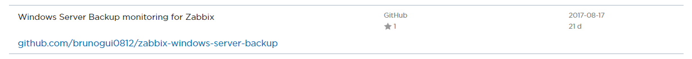
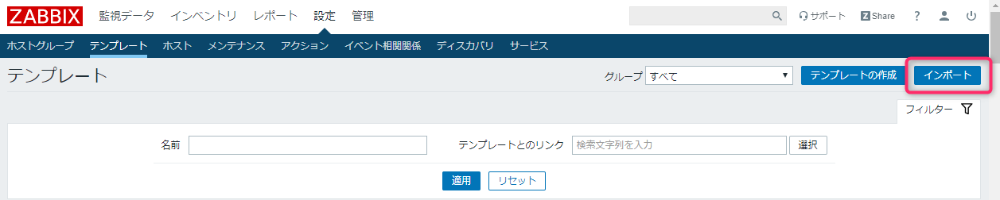
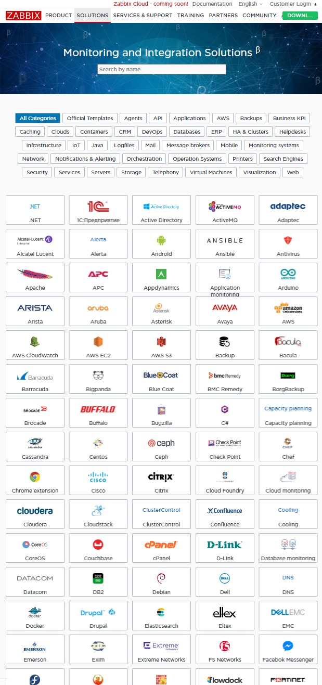
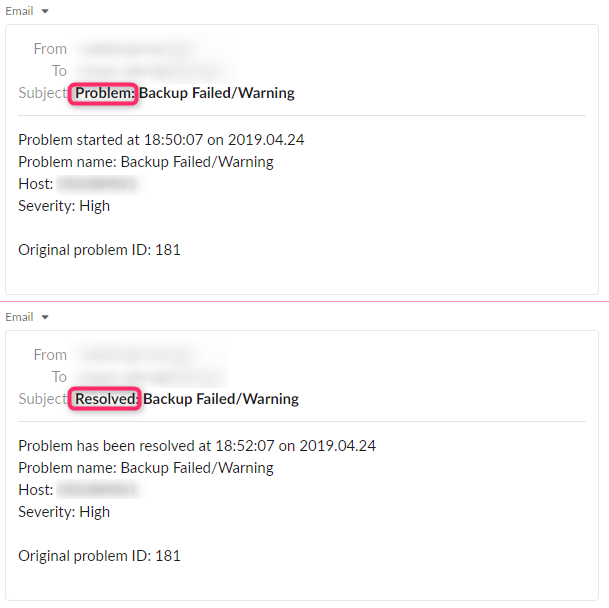

こんにちは、じんないです。

今回は Zabbix から Windows Server Backup の失敗を監視する方法を紹介します。

調べていて意外と例がないのであれこれ自分で試しながらやってました。アラート回復のトリガーとか設定しててあともう少しだなぁと思っていた矢先に、テンプレートがあることを知って愕然としたのは内緒です。

あるものは使おうということで、素敵なテンプレートから監視する方法を紹介したいと思います。

## 環境
- Zabbix 4.0.7 (TLS)
  - CentOS 7 上に構築
- Windows Server 2012 R2
  ※アクティブチェックの設定が完了している想定です。

## テンプレートのダウンロードとインポート

[ZABBIX SOLUTIONS: Backups](https://www.zabbix.com/integrations/backups) に Windows Server Backup をモニタリングするためのテンプレートが公開されています。

リンクをクリックすると [GitHub のリポジトリ](https://github.com/brunogui0812/zabbix-windows-server-backup) に飛びますので、**Windows-Server-Backup.xml** をダウンロードします。

設定 > テンプレート から **インポート** をクリックしダウンロードしたテンプレートをインポートします。

インポートしたファイルは監視対象のホストに割り当てておいてください。

余談ですが、テンプレートも一杯あるんだぁなと感心しました。ここまであると色々やってみたくなりますねー。

## このテンプレートでできること

トリガーは以下の場合に発動します。

- バックアップタスクの失敗
- 2日以上バックアップが取得されていない

イベントID **14(バックアップタスクが終了した)** と **213(バックアップボリュームがロードされた)** を除外して取得しています。

> {$EVENTLOGFILTER} (macro) - This is a Filter for getting any Event ID except 14 (Backup task was finished) and 213 (The backup volume has been loaded)

バックアップタスクが**失敗**した場合、以下のイベントがセットで記録されます。

順番 | レベル | ソース | イベントID | 内容
-- | -- | -- | -- | --
1 | information | Backup | 1 | バックアップ操作が開始されました。
2 | information | Backup | 14 | バックアップ操作が完了しました。
3 | error | Backup | 5 | バックアップ操作は○○のため失敗しました。※割愛

バックアップタスクが**成功**した場合、以下のイベントがセットで記録されます。

順番 | レベル | ソース | イベントID | 内容
-- | -- | -- | -- | --
1 | information | Backup | 1 | バックアップ操作が開始されました。
2 | information | Backup | 14 | バックアップ操作が完了しました。
3 | information | Backup | 4 | バックアップ操作が正常に終了しました。

このようにバックアップが成功しても失敗しても **イベントID 14** が記録されるので、除外しているようですね。

## アラートのテスト

バックアップを失敗させるのは難しいですが、以下の方法でやってみました。

1. `C:\backupfiles` をバックアップ対象とし、適当なテキストファイルでも置いておく
2. `D:\dest` を共有設定し、ネットワークドライブ `\\<hostname>\dest` としてアクセスさせる
3. バックアップ中に共有を停止させる

いい感じでメール通知されました。

タイトルとかは好みで編集してみてもいいかもしれないですね。

ちなみに、アラート回復の定義はそれぞれ以下のようになってます。

- バックアップタスクの失敗
`eventlog[Microsoft-Windows-Backup,,"Information|Error",,{$EVENTLOGFILTER}].logseverity()}<>1`
イベント ID 14または213以外の `Information` イベントが記録される。

- 2日以上バックアップが取得されていない
`eventlog[Microsoft-Windows-Backup,,"Information|Error",,{$EVENTLOGFILTER}].nodata(2d)}=1`
2日未満の間隔でバックアップが取得される

ではまた。