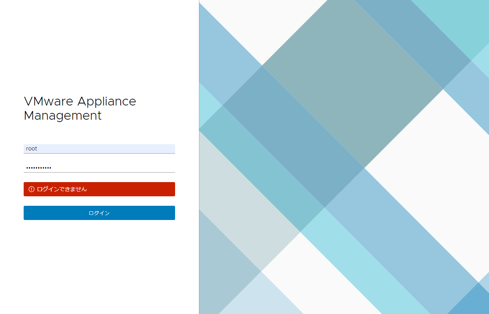
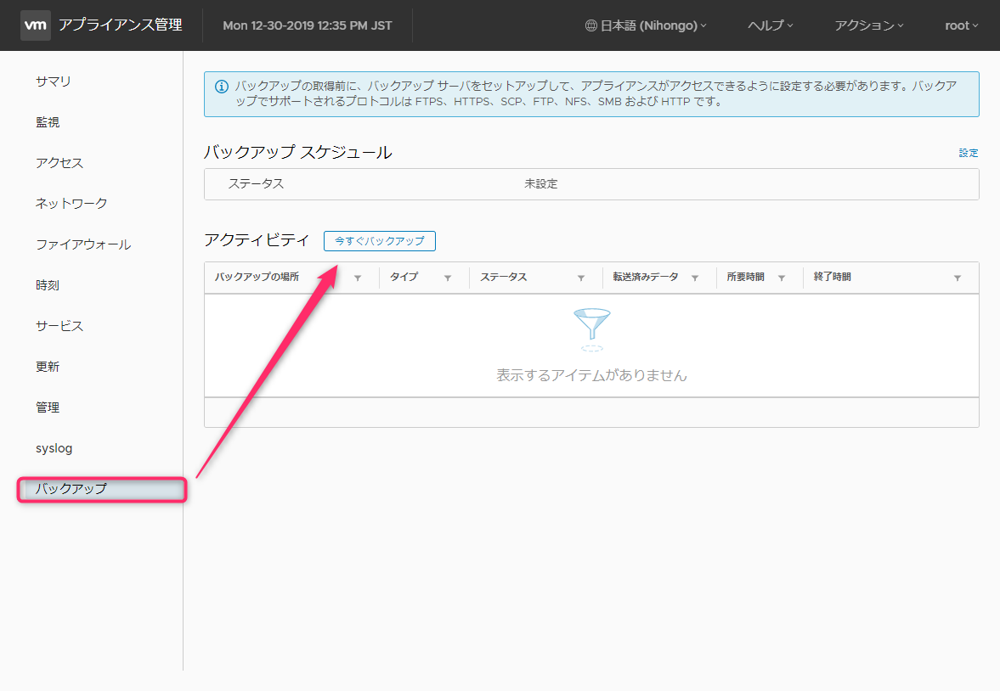
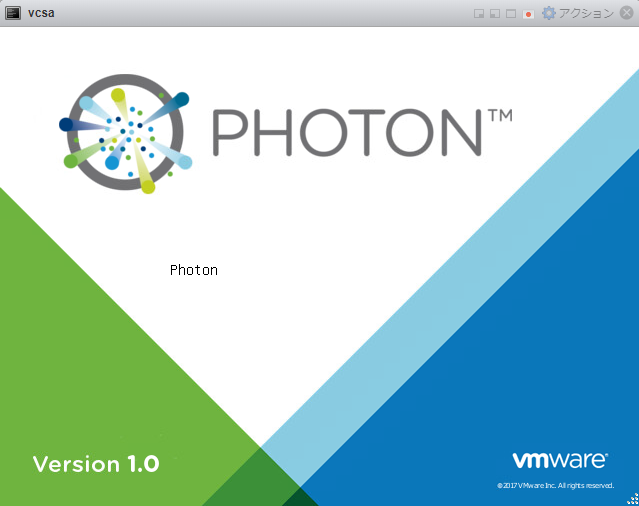
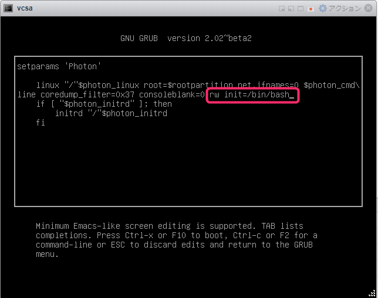
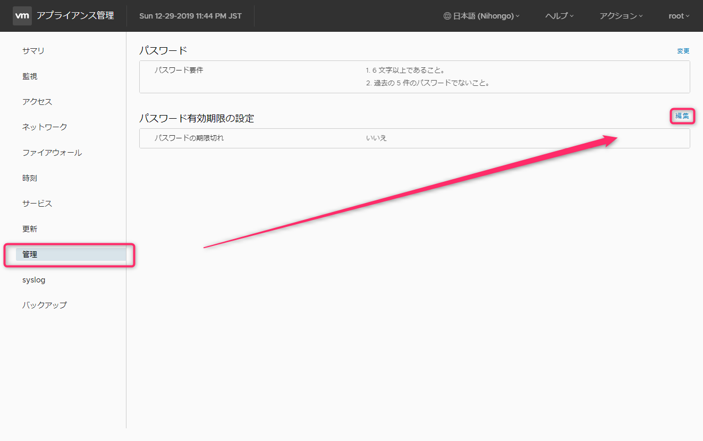

こんにちは、じんないです。

vCenter Server Appliance (以下、vCenter) の管理コンソール `https://<vcsa ip address>:5480` にログインしようと思うとできませんでした。。。

おそらくパスワードの有効期限が切れてしまったのだと思います。

再インストールかぁと落胆していましたが、なんとかパスワードリセットする方法を発見しましたのでご紹介します。

## 環境

- vCenter Appliance 6.7

## パスワードの変更
### バックアップを取得

まずは元の環境に戻せるようバックアップを取得しておきます。

vCenter の管理コンソール `https://<vcsa ip address>:5480` にログインして、[バックアップ] > [今すぐバックアップ] からバックアップしておきましょう。

バックアップでサポートされているプロトコルは FTPS, HTTPS, SCP, FTP, NFS, SMB, HTTP です。Linux サーバー等がある場合は一時的に SCP でバックアップを取っておくのが簡単かもしれません。

スナップショットという手もありますが、vCenter がダメになってしまった場合戻せる手立てがないのでおすすめはしません。

## パスワードのリセット

vCenter が稼働する ESXi の Host Client にログインします。

vCenter のコンソールを起動し、再起動を行います。

再起動後、以下の画面が起動したら **e キー** を入力します。
※ Enter ではない

続いて以下の画面で、2行目の末尾に(画像参照) に **`rw init=/bin/bash`** を入力、**F10 キー**で決定します。
※ 英字配列となっているので、`=` の部分は `^(キャレット)` を入力しましょう。

コンソールが立ち上がるので **`passwd`** コマンドを入力し、新しいパスワードを入力します。
パスワード要件は下記のとおりです。

1. 6文字以上であること
1. 過去の5件のパスワードでないこと

**`umount /`** でファイルシステムをアンマウントします。

**`reboot -f`** で再起動します。

再起動が終われば、ログインできるようになっているはずです。

## パスワードの有効期限を変更する

vCenter の管理コンソール `https://<vcsa ip address>:5480` にログインして、[管理] からパスワードの有効期限を変更しておきましょう。

複雑で長いパスワードを設定したあと、有効期限を [いいえ] にしておくのもいいかもしれません。

ではまた。

## 参考

> [失くしてしまったか忘れてしまった vCenter Server Appliance 6.5 / 6.7 の root パスワードをリセットする方法 (2147144)](https://kb.vmware.com/s/article/2147144?lang=ja)