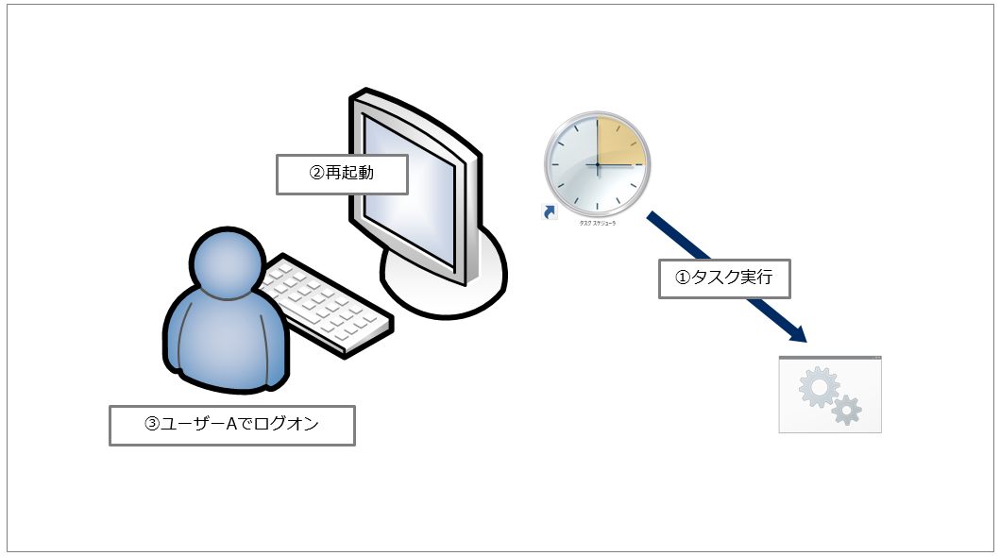
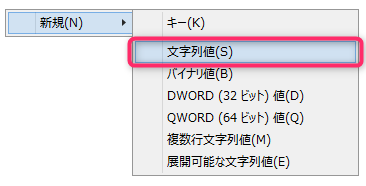
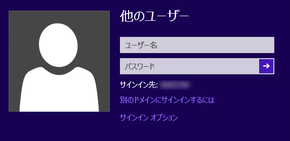
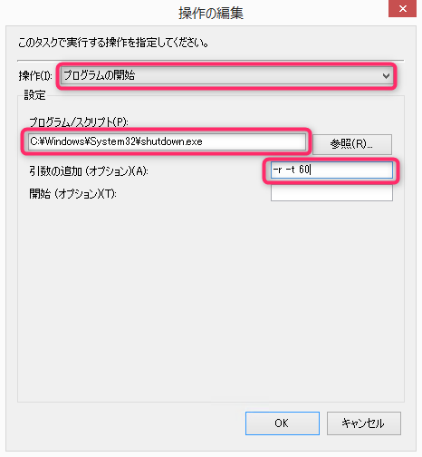
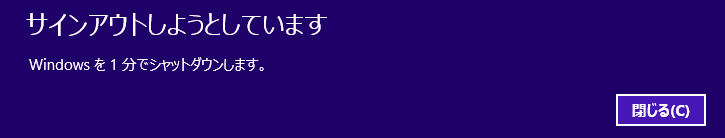

こんにちは、じんないです。

今回はタスクスケジューラーから PC を再起動させる方法と、レジストリから任意のアカウントで自動ログオンする方法を紹介します。

シチュエーションは限られていますが、権限やプロファイルの都合から常時ログオンが必要なPCで何らかのタスクをスケジュール実行しているものとします。

そのタスクを実行した後、再起動してまた同じアカウントでログオンしておきたい場合などに適しています。

[caption id="attachment_8785" align="alignnone" width="1059"] ①スケジュールされたタスクを実行する ② ①のタスク実行後に再起動する ③ユーザーAでログオンする ※以降繰り返し[/caption]

## モデル環境
- Windows 8.1 Pro

## 自動ログオンの設定

自動ログオンの設定はレジストリから行います。管理者権限でレジストリエディターを起動します。

レジストリ内の次のサブキーまで移動します。
`HKEY_LOCAL_MACHINE\SOFTWARE\Microsoft\Windows NT\CurrentVersion\Winlogon`

次のキーに自動ログオンしたいユーザー名を設定します。
キー：`DefaultUserName` 
値：`<Username>`

次のキーにパスワードを設定します。
キー：`DefaultPassword` 
値：`<Password>`

※キー：`DefaultPassword` が無い場合は**文字列値**で新規作成します。

次のキーに**1**を設定し、自動ログオンを有効化します。
キー：`AutoAdminLogon` 
値：`1`

※こちらもキーが無い場合は**文字列値**で新規作成します。

それでは実際に再起動して動作をチェックしてみます。

ユーザー名が表示されて自動ログオンされればOKです。

### 自動ログオンしたくない場合は

Windows の起動中に `shiftキー` を押し続ければいつもどおりのログオン画面が表示されます。

そのままログオンせずに放置したとしても自動ログオンされることはありません。

## タスクスケジューラーから再起動する

新規タスクを作成し[操作]で以下のように設定します。
操作：`プログラムの開始`
プログラム/スクリプト：`"C:\Windows\System32\shutdown.exe"`
引数の追加(オプション)：`-r -t <sec>`

`-r` で再起動
`-t` はシャットダウン開始までの時限を秒単位で指定します。既定値は`30`のようです。
ヘルプを見てびっくりしましたが、`-t`の有効範囲は`0`から`315360000 (10 年)`までらしいです笑
ちなみに`1`以上なら強制終了を表す`-f`オプションが自動的に設定されます。

即シャットダウンしたい場合は `-r -t 0 -f` にします。 

その他の設定はお使いの環境に合わせてください。

タスクの作成ができたら実行してみましょう。

こんな感じでシャットダウン画面がでればOKです。

※筆者は60秒を指定したので、`1分でシャットダウンします`と出ています。

ではまた。

## 参考
> [Windows で自動ログオン機能を有効にする方法](https://support.microsoft.com/ja-jp/help/324737/how-to-turn-on-automatic-logon-in-windows)