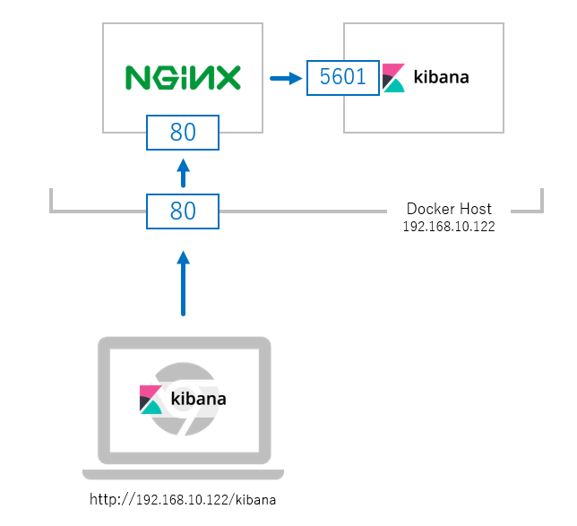
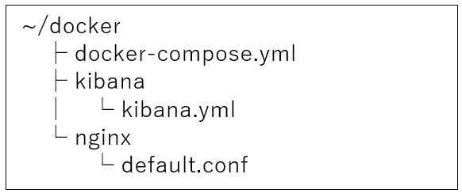

こんにちは、じんないです。

今回は docker 上で動いている **[Kibana](https://www.elastic.co/jp/products/kibana) を [nginx](https://nginx.org/en/) でリバースプロキシする方法**を紹介します。

ちょっとハマってしまいましたのでメモしておきます。

kibana や elasticsearch の構築方法は過去の記事を参考にしてみてください。
[Windows のイベントログを Winlogbeat+Elasticsearch+Kibana で可視化する](/visualize-windows-event-log-winlogbeat-elasticsearch-kibana/)

## 想定環境
- CentOS 7 (dockerホスト)
- elasticsearch 6.4.3
- kibana 6.4.3
- nginx 1.15.8
- docker-ce 1.13.1
- docker-compose 1.23.1

docker ホストの IP アドレスは 192.168.10.122 とします。

## モデルケース



nginx によるリバースプロキシを行う前は docker 起動時にホストの `5601` とコンテナの `5601` をポートフォワーディングしておけば `http://192.168.10.122:5601` でダイレクトに kibana へ接続できます。

ただこれだと細かな制御がしにくいため、**リバースプロキシすることで `http://192.168.10.122/kibana` で接続できる**ようにします。名前解決ができる場合は `http://<hostname>/kibana` でいいでしょう。



各設定ファイルはこんな感じで配置しています。この辺りはお使いの環境に合わせてください。

## 設定

### docker-compose.yml

- **全体**

``` yml
version: '2'
services:
  kibana:
    image: docker.elastic.co/kibana/kibana:6.4.3
    container_name: kibana
    links:
      - elasticsearch:elasticsearch
    volumes:
      - ./kibana/kibana.yml:/usr/share/kibana/config/kibana.yml
      - /usr/share/zoneinfo/Asia/Tokyo:/etc/localtime
    restart: always
  nginx:
    image: nginx
    container_name: nginx
    ports:
      - 80:80
    links:
      - kibana:kibana
    depends_on:
      - kibana
    volumes:
      - ./nginx/default.conf:/etc/nginx/conf.d/default.conf
    restart: always

volumes:
  esdata:
```

- **kibana 設定**
``` yml
    volumes:
      - ./kibana/kibana.yml:/usr/share/kibana/config/kibana.yml
```

kibana の設定を変更するため、 `volumes` で手元にある `kibana.yml` をコンテナ上の `/usr/share/kibana/config/kibana.yml` へマウントしています。

- **nginx 設定**
``` yml
ports:
  - 80:80
```
ポートは `80` で受けられるようにします。ここは任意で構いませんが、**nginx のコンフィグと合わせておきます**。

``` yml
links:
  - kibana:kibana
```
`links` で連携するコンテナ名を指定しておくことで、nginx のコンテナから名前解決ができるにようになります。 


``` yml
volumes:
  - ./nginx/default.conf:/etc/nginx/conf.d/default.conf
```

こちらも同じく手元のファイルをマウントしています。

このように**コンテナの設定ファイルをホスト側に持つ**ことで、コンテナを自由に作り変えることができ docker のメリットを生かすことが可能です。

### kibana.yml

```yml
server.name: kibana
server.host: "0"
elasticsearch.url: http://elasticsearch:9200
xpack.monitoring.ui.container.elasticsearch.enabled: true
server.basePath: "/kibana"
logging.useUTC: false
```

**`server.basePath: "/kibana"` を指定**します。（ここは最後の `/` は不要です。）

※この `server.basePath` がハマったポイントなので、この点については後述します。

また、**リバースプロキシ設定後は Kibana に直接アクセスできなくなるので注意**してください。  

### nginx/default.conf

- **全体**

```
server {
  listen 80;
  server_name localhost;
  proxy_set_header X-Forwarded-For $proxy_add_x_forwarded_for;

  location / {
    root   /usr/share/nginx/html;
    index  index.html index.htm;
  }

  location /kibana/ {
    rewrite /kibana/(.*)$ /$1 break;
    proxy_pass http://kibana:5601;
  }
}
```

`listen 80;` : 80番ポートでアクセスを待ち受けます。

- **kibana の設定** (`location /kibana/`)

`/kibana` でアクセスがあったときにコンテナ側 `http://kibana:5601;` へリダイレクトします。
名前解決ができるように `docker-compose` の `links` で指定した名前と一致させます。

あとは `docker-compose up -d` でコンテナを起動し、ブラウザから `http://192.168.10.122/kibana` でアクセスできれば OK です。

## ハマったポイント

### プロキシ経由だと Kibana が読み込めない問題

#### 経緯と原因

当初は `server.basePath` を設定していなかったため、 Kibana の主要な動作を行う JavaScript ファイルが読み込めず、loading のままずっとクルクル回り続けることになってしまいました。

**原因は Kibana の HTML に書かれたアセットパス (JS ファイル等) が `/bundles/**` などルートパスからの指定で書かれているため**でした。

Kibana への直接アクセスでは `http://192.168.10.122:5601` をルートとして Kibana 自身がホストしているので `http://192.168.10.122:5601/bundles/**` を読み込むことができます。

しかし、リバプロ経由かつサブフォルダー指定にすると `http://192.168.10.122/kibana` がルートになりますが、 Kibana が返す HTML のアセットパス (`/bundles/**`) は変わりません。
`http://192.168.10.122/bundles/**` という URI は存在しないため、アセットファイルの読み込みができない、というオチになります。

要するに HTML のアセットパスを `/kibana/bundles/**` に変えてやる必要があるということです。

※つまりリバプロ経由でも Kibana をルート (`/`) でホストする場合は問題になりません。

#### server.defaultRoute を設定してみた

[Kibana のユーザーガイド | Elastic](https://www.elastic.co/guide/en/kibana/6.4/settings.html#settings) を見ていると、 **`server.defaultRoute: Default: "/app/kibana"`** と書いてあったので、これかと思い変更したのですが以下のメッセージが表示されるだけで解決できる気配もなく。。。

> {"statusCode":404,"error":"Not Found","message":"Not Found"}

説明をよく読んでみると `server.defaultRoute` は kibana を開いたときの初期ページ（ランディングページ）を決めるパラメータでした。

> **server.defaultRoute:**
> Default: "/app/kibana" This setting specifies the default route when opening Kibana. You can use this setting to modify the landing page when opening Kibana.

#### server.basePath を設定すれば OK

結局のところ、先の説明で書いたように `server.basePath` を設定すれば OK でした。

`server.basePath` がアセットパスの先頭に付加されるので、 **`server.basePath: "/kibana"` としておくとアセットパスが `/kibana/bundles/**` に変わります**。

これで**リバプロのサブディレクトリ設定でも正常にアセットが読み込める**ようになります。

> **server.basePath:**
> Enables you to specify a path to mount Kibana at if you are running behind a proxy. Use the server.rewriteBasePath setting to tell Kibana if it should remove the basePath from requests it receives, and to prevent a deprecation warning at startup. This setting cannot end in a slash (/).

ではまた。

## 参考
> - [Running Kibana on Docker | Kibana User Guide \[6.6\] | Elastic](https://www.elastic.co/guide/en/kibana/current/docker.html)
> - [Configuring Kibana | Kibana User Guide \[6.4\] | Elastic](https://www.elastic.co/guide/en/kibana/6.4/settings.html)
> - [kibanaをnginxのリバースプロキシでアクセスする - Qiita](https://qiita.com/fuku2014/items/cb81af84ebac489c9f5a)
