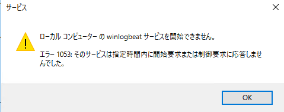
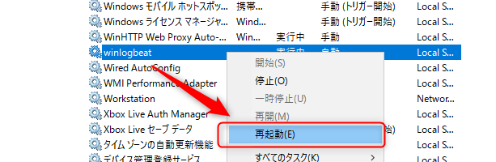

こんにちは、じんないです。

以前に[Windows のイベントログを Winlogbeat+Elasticsearch+Kibana で可視化する](https://mseeeen.msen.jp/visualize-windows-event-log-winlogbeat-elasticsearch-kibana/)方法をご紹介しました。

今回はその構成を元に、**特定のイベントのみ Elasticsearch へ送信**してみます。

Application や System, Security などイベントごと送信してしまってもよいのですが、ログデータストアの肥大化や検索時間の増加につながります。

見たいログがある程度目的が決まっている場合は対象のイベントのみを送信しましょう。

今回は例として以下のイベント (Security) を送信してみます。

- **ログオン (4624)**
- **ログオフ (4634)**

## 想定環境
- イベントログの収集: Winlogbeat 6.4.3
- データストア・検索: Elasticsearch 6.4.3
- 可視化 (GUI): Kibana 6.4.3

すでに上記のサービスが稼働している状態を想定しています。

## winlogbeat.yml の設定

`winlogbeat.yml` を編集し、`event_id: 4624, 4634` を追記します。

複数ある場合は、**イベント ID をカンマ区切り**で記述します。

```
winlogbeat.event_logs:
  - name: Security
    event_id: 4624, 4634
```

範囲指定したい場合はハイフン `-` で記述します。
除外したいイベント ID はカンマで区切った後に `-<イベント ID>` で指定します。

下記はイベント ID `4700`から`4800` を送信し、その中でも `4735` を除外する例です。

```
winlogbeat.event_logs:
  - name: Security
    event_id: 4700-4800, -4735
```

ちなみに `-4700-4800` のように範囲除外ができるかやってみましたが、 Winlogbeat のサービスが起動しませんでした。笑
範囲除外はできないようです。

> ローカルコンピューターの Winlogbeatサービスを開始できません。
> エラー 1053: そのサービスは指定時間内に開始要求または制御要求に応答しませんでした。

<a href="images/send-specified-events-to-elasticsearch-via-winlogbeat-1.png"></a>


## Winlogbeat の再起動

管理ツール > サービス から Winlogbeat のサービスを再起動します。

<a href="images/send-specified-events-to-elasticsearch-via-winlogbeat-2.png"></a>

Winlogbeat をサービスとして登録する方法は[こちら](https://mseeeen.msen.jp/visualize-windows-event-log-winlogbeat-elasticsearch-kibana/#Winlogbeat)を参照してください。

これでログオンとログオフのイベントのみ Elasticsearch へ送信することが可能です。

短い記事でしたが、また Elastic Stack 関連の役立ちそうな記事を書いていこうと思います。

ではまた。

## 参考
[Set up Winlogbeat | Winlogbeat Reference \[6.6\] | Elastic](https://www.elastic.co/guide/en/beats/winlogbeat/current/configuration-winlogbeat-options.html)