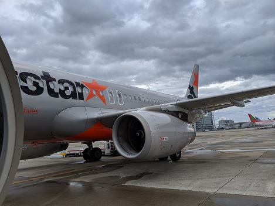
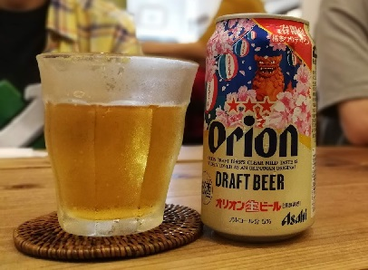
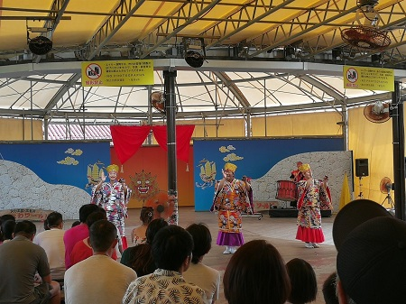
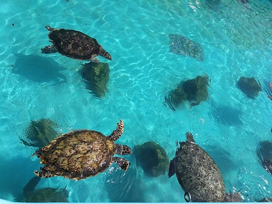
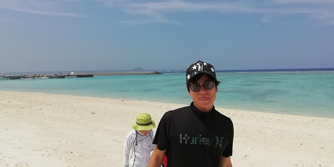

こんにちは、レクリエーション企画推進室のじんないです。

夏のレクリエーションで沖縄本島へ旅してきました～

台風10号の影響で飛行機が飛べるのか危ぶまれましたが、奇跡的に我々の便だけ出発できるという幸運に恵まれ、沖縄へ向けて出発です！

かなり曇天でしたが、風や雨も強くなく揺れませんでした。ありがたいですねー

## 1日目 首里城・沖縄ワールド

[ピパーチキッチン](http://www.tabirai.net/sightseeing/column/0003917.aspx)でお昼。

タコライスならぬイカライス!! これはびっくり。

イカではなく、沖縄県産の鶏ミンチを使っているそうですよ～

もちろん、沖縄といえばこれ、オリオンビールも堪能！昼間から飲むビールはまた格別ですね～

腹ごしらえを済ましてやってきたのは[首里城](http://oki-park.jp/shurijo/)。入場券を買って中を見学してきましたー

みんなで記念にパシャリ。

お次は[沖縄の魅力のすべてが一堂にそろう沖縄屈指の観光スポット、おきなわワールド](https://www.gyokusendo.co.jp/okinawaworld/)。鍾乳洞や猛毒展（行ってないけど）などなんやかんやいっぱいありました！

ちょうど、エイサーの演奏が始まってたので、見学してきました～

元気いっぱいでカッコよかったです！

いい感じの時間になったので、宿に向かい晩ご飯の準備。地元のスーパーでソウルフードを買い集め、みんなでカンパーイ！！

そんなこんなで夜は更けていったのでした。

## 2日目　美ら海水族館・古宇利島・水納島

2日目の朝はめちゃめちゃ早起き。
7時30分に出発で向かうは水納島！のはずが、午前中の渡船のチケットが早くも売り切れてしまい予定変更！向かうは美ら海水族館。

めちゃくちゃデカい水槽に圧巻。ジンベイザメも大きかったです。

チンアナゴもいたり笑

外にはウミガメの水槽も。こんなにたくさんのウミガメを見たのは初めてでした！

美ら海水族館から少し走り、目指すは[古宇利大橋](https://www.okinawastory.jp/spot/1321)！
名前は知らないけど、見たことある！って方も多いのではないでしょうか。海も綺麗で、橋を渡るときも爽快な気分でしたー

午後からはいよいよ[水納島](http://www.tabirai.net/sightseeing/tatsujin/0000354.aspx)へ上陸！

めちゃくちゃ綺麗な海にシャチョーもご満悦です。

みんなでシュノーケリングを楽しみました！沖の方まで行くと急に深くなるところがあり、そこにはサンゴやカラフルな魚が一杯いてめっちゃ綺麗でした。

この日は地元の居酒屋でワイワイ楽しみました～

[後編](https://mseeeen.msen.jp/summer-recreation-in-okinawa-sequel)へつづく