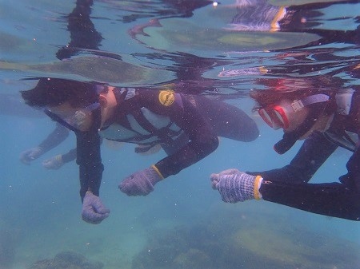
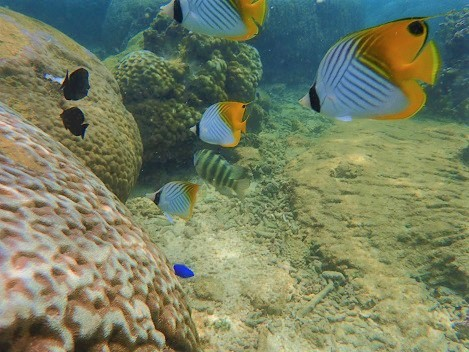
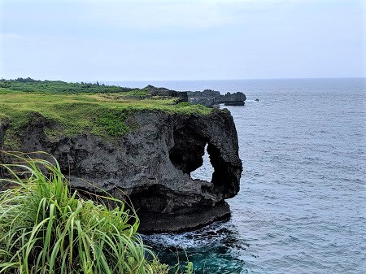
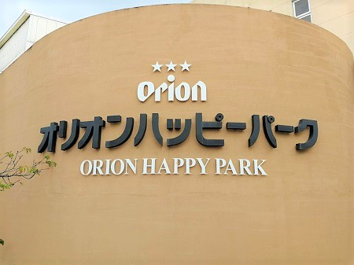
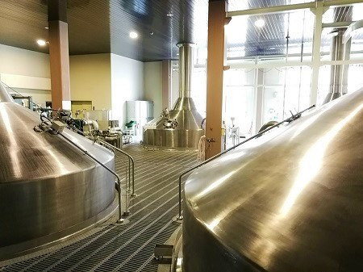
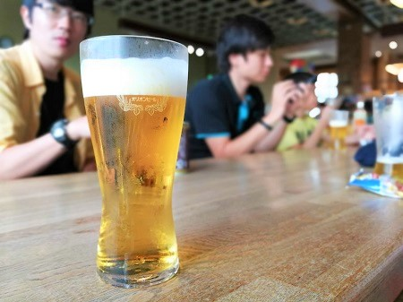
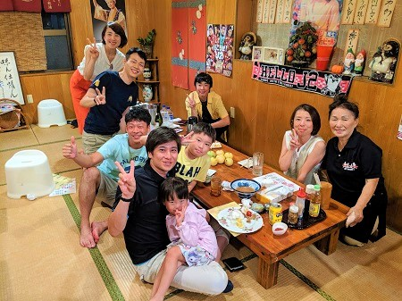
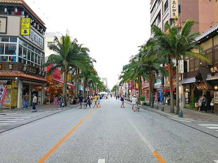

こんにちは、じんないです。

[前編](/summer-recreation-in-okinawa-prequel)のつづき。

## 3日目 真栄田岬・万座毛・オリオンビール工場見学

3日は朝から真栄田岬へレッツゴー！
青の洞窟のシュノーケリングツアーを申し込んでいたのですが、台風10号の影響で波が高く立ち入り禁止になっているとのこと。
代わりに近くのビーチでお魚さんたちを見ることになりました～。

餌のお麩をあげると、魚が寄ってきました！画像はないですが、とっても大きな魚も食べてくれてかなり迫力がありましたよ～

沖縄といえばこれ、[万座毛](http://www.tabirai.net/sightseeing/tatsujin/0000328.aspx)も寄ってきました。

そして、ビール好きにはたまらない！[オリオンハッピーパーク](https://www.orionbeer.co.jp/happypark/)でオリオンビールの工場見学です。

お盆期間中ということもあり工場は停止していましたが、見学させてもらうことができました～
オリオンビールのすべてを、この名護工場で作っているみたいです。
また、缶ビール6：樽生3：瓶ビール1 の割合で製造されているとのこと。樽は半永久的に使える構造になっているみたいで驚きました！

見学が終わるとお待ちかねの試飲！出来立てのオリオンビールは最高です^^
時間は長くありませんが、1人2杯まで飲ませてもらいます！私もきっちり2杯いただきましたよー(^^♪

晩御飯は南城市にある[居酒屋めぐみ](https://www.hotpepper.jp/strJ000721743/)でお世話になることに。
どの料理もおいしくてアットホームな感じがたまりません。地元の常連さんにも仲良くしてもらって楽しいひと時を過ごしました！

## 4日目 国際通り・帰阪

4日目は国際通りを街ぶら！お土産を買ったりお昼ご飯を食べたり。高校生の修学旅行で来たことを思い出し、懐かしくなりました。

帰りも天候に恵まれて、無事帰阪しました。

今回も無事に旅ができたことに感謝です。また旅ができるよう日々頑張ってまいります！

ではまた。