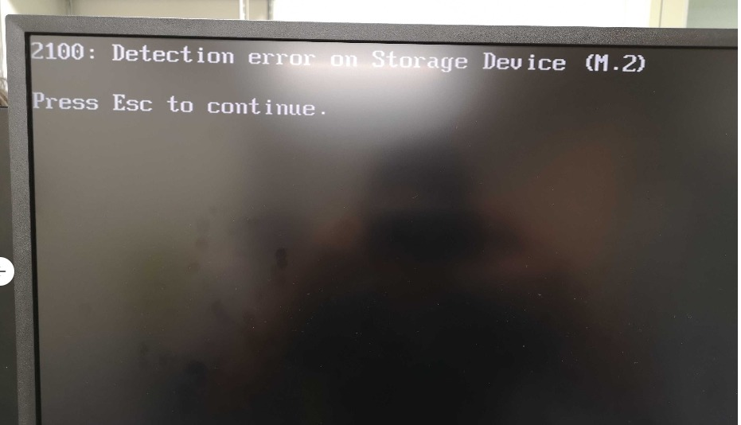
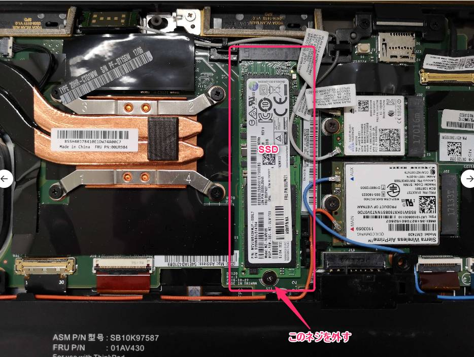
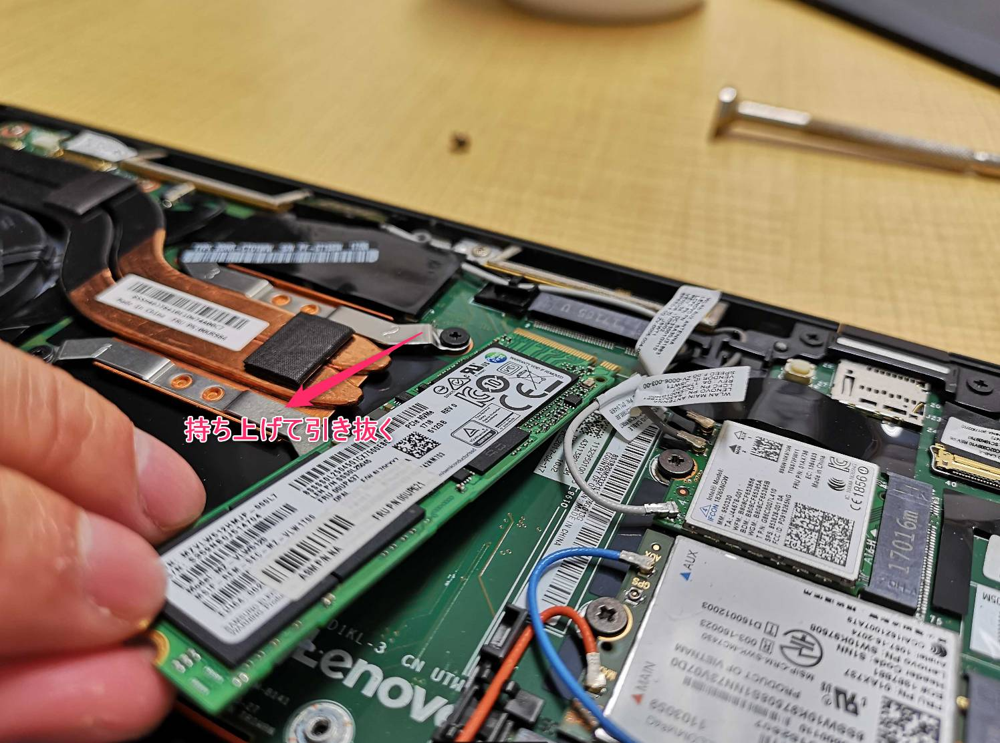
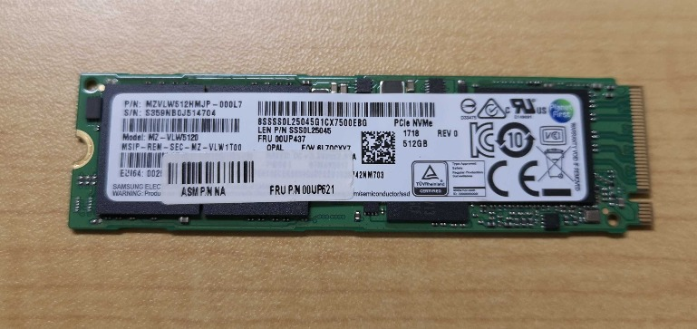
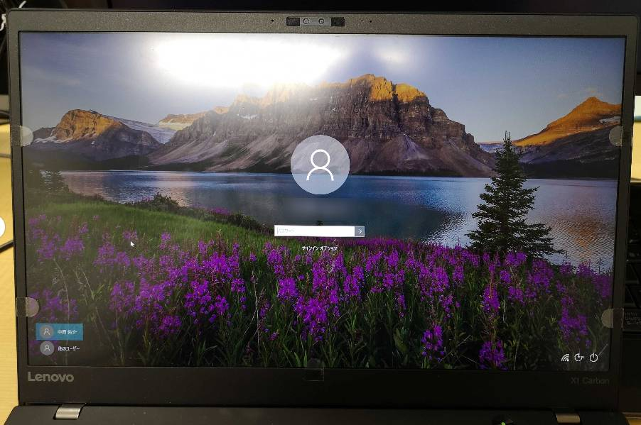
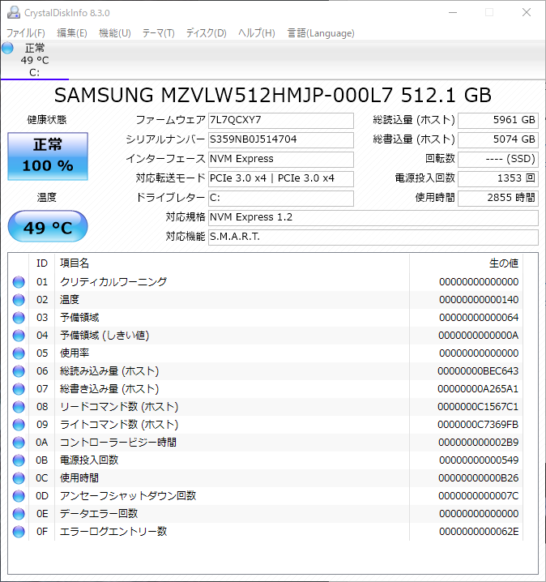

こんにちは、じんないです。

先日、なんだか PC が重いなぁと思いつつ作業していると、突然ブルースクリーンになりました。

Windows では稀にあることで、まぁ再起動すれば直るだろうと思っていたのですが、なんだか見慣れない画面が・・・

> 2100: Detection error on Storage Device (M.2)
> Press Esc to continue.

何回再起動しても状況は変わらないので対処してみました。

## 環境

- ThinkPad X1 Carbon 5th (20HR)
- Windows 10 Pro (1809)

## ディスクを抜き差ししてみる

エラーを見ているとストレージでエラーが出ていることは読み取れます。

SSD が逝ってしまったのかなぁとあれこれ Web で調べていると、接触による問題もあるのだとか。

というわけで、さっそく裏蓋のネジを外し分解していきます。

**分解はメーカーの保障対象外のとなるだけでなく、危険を伴いますので自己責任でお願いします。**

ディスクは簡単にアクセスできる位置にありました。下側についているネジ1本で止まっているので、そのネジを外していきます。

ネジを外したあと、少し持ち上げながら手前に引くと取り外すことができます。

この SSD は M.2 タイプなので、メモリのように薄っぺらいです。

両者にメリット・デメリットはあるものの、3.5インチの HDD からすると、時代は進んだもんだなぁと感じました。

我々の仕事もこれらのハードウェアに支えられていることを忘れてはいけませんね。

さて、話がそれましたが SSD のコネクタ部分をダスター等で清掃し、元どおり組み立てます。端子が折れないように注意してください。

## 電源を入れてみる

これで起動しなかったらどうしようと心配しましたが、無事に Windows が起動してくれました。

念のため Crystal Disk Info でステータスを確認しましたが、正常となっていました。

ひとまず様子を見ようと思います。

ではまた。

## 参考

- [ThinkpadがDetection errorで起動しない原因と対処法](https://noudoublog.com/thinkpad%E3%81%8Cdetection-error%E3%81%A7%E8%B5%B7%E5%8B%95%E3%81%97%E3%81%AA%E3%81%84%E5%8E%9F%E5%9B%A0%E3%81%A8%E5%AF%BE%E5%87%A6%E6%B3%95)