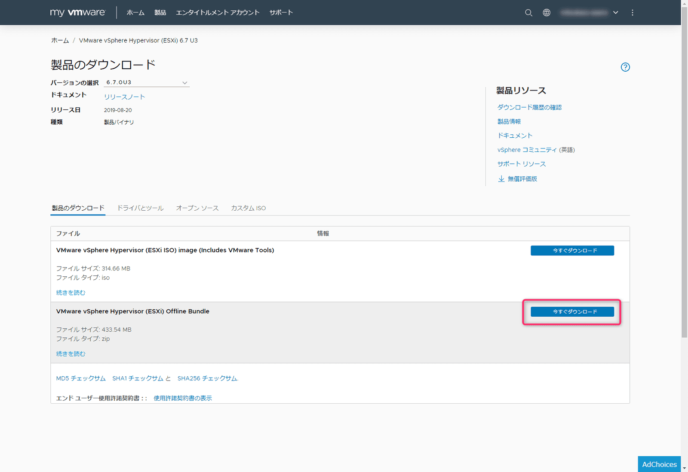

こんにちは、じんないです。

今回は **VMware ESXi を6.5 から6.7へアップデートし、最新のパッチを適用**する手順をご紹介します。

ESXi 6.5 のライセンスを持っている場合は、6.7 までサポートされるので、システムの安定稼働や CentOS 8 への対応も含めアップデートしておくことをおすすめします。

アップデートには仮想マシンの停止が必要になりますので、ミッションクリティカルな仮想マシンは vMotion 等で別のホストに移動しておきましょう。

## モデルケース

- アップデート前
ESXi 6.5 Releasebuild-5969303

- アップデート後
ESXi 6.7 Releasebuild-15018017

## 6.7へアップデートする
### 事前準備

[MyVMware](https://my.vmware.com/jp/web/vmware/login) へログインし、製品のダウンロードから **VMware vSphere Hypervisor (ESXi) Offline Bundle** をダウンロードしておきます。

<a href="images/update-from-esxi-6-5-to-6-7-and-apply-the-latest-patch-1.png"></a>

ダウンロードしたファイルは ESXi のデータストアへアップロードします。
今回は **depot** というフォルダを作成し、その中にアップロードしました。
※ ESXi に SCP で直接アップロードしてもよいです。お好きな方で。

<a href="images/update-from-esxi-6-5-to-6-7-and-apply-the-latest-patch-2.png"></a>

<a href="images/update-from-esxi-6-5-to-6-7-and-apply-the-latest-patch-3.png"></a>

アップデート対象の ESXi で稼働するすべての仮想マシンを停止します。
そのあと、メンテナンスモードへと切り替えておきます。

<a href="images/update-from-esxi-6-5-to-6-7-and-apply-the-latest-patch-4.png"></a>

<a href="images/update-from-esxi-6-5-to-6-7-and-apply-the-latest-patch-5.png"></a>

SSH 接続を行うので **SSH の有効化** と **コンソールシェルの有効化** をします。

<a href="images/update-from-esxi-6-5-to-6-7-and-apply-the-latest-patch-6.png"></a>

### アップデート

ESXi へ SSH 接続をします。ESXi はチャレンジレスポンス認証なので、お間違えのないように。
TeraTerm では**キーボードインタラクティブ認証**にチェックをいれます。

<a href="images/update-from-esxi-6-5-to-6-7-and-apply-the-latest-patch-7.png"></a>

ESXi にログインできたらまずは現在のビルド番号などを確認しておきます。

```bash
[root@jinna-i:~] esxcli system version get
   Product: VMware ESXi
   Version: 6.5.0
   Build: Releasebuild-5969303
   Update: 1
   Patch: 26
```

アップデートモジュール内のプロファイルを確認します。通常はこの中の **-standard** がつくものを使用します。
`esxcli software sources profile list --depot=/vmfs/volumes/<データストア名>/<フォルダ>/<アップデートモジュール>`

```bash
[root@jinna-i:~] esxcli software sources profile list --depot=/vmfs/volumes/datastore1/depot/update-from-esxi6.7-6.7_update03.zip
Name                              Vendor        Acceptance Level  Creation Time        Modification Time
--------------------------------  ------------  ----------------  -------------------  -------------------
ESXi-6.7.0-20190801001s-no-tools  VMware, Inc.  PartnerSupported  2019-08-08T09:57:28  2019-08-08T09:57:28
ESXi-6.7.0-20190802001-no-tools   VMware, Inc.  PartnerSupported  2019-08-08T09:57:28  2019-08-08T09:57:28
ESXi-6.7.0-20190802001-standard   VMware, Inc.  PartnerSupported  2019-08-08T09:57:28  2019-08-08T09:57:28
ESXi-6.7.0-20190801001s-standard  VMware, Inc.  PartnerSupported  2019-08-08T09:57:28  2019-08-08T09:57:28
```

各プロファイルの意味は下記のとおりです。

- 末尾が「-standard」
標準イメージプロファイル
- 末尾が「-no-toosl」
no-tools イメージプロファイル
- 末尾が「s-standard」
セキュリティ更新のみを含むイメージプロファイル
- 末尾が「s-no-tools」
セキュリティ更新のみのno-tools イメージプロファイル

プロファイルを選択してアップデートします。
`esxcli software profile update --depot=/vmfs/volumes/<データストア名>/<フォルダ>/<アップデートモジュール> --profile=<プロファイル> | more`

メッセージに **The update completed successfully** と表示されれば成功です。

```bash
[root@jinna-i:~] esxcli software profile update --depot=/vmfs/volumes/datastore1/depot/update-from-esxi6.7-6.7_update03.zip --profile=ESXi-6.7.0-20190802001-standard | more
Update Result
   Message: The update completed successfully, but the system needs to be rebooted for the changes to be effective.
   Reboot Required: true
   VIBs Installed: VMW_bootbank_ata-libata-92_3.00.9.2-16vmw.670.0.0.8169922, VMW_bootbank_ata-pata-amd_0.3.10-3vmw.670.0.0.8169922, VMW_bootbank_ata-pata-atiixp_0.4.6-4vmw.670.0.0.8169922, .....
```

適用が終わったら ESXi を再起動してビルド番号などを確認します。
再起動すると **SSH の有効化** と **コンソールシェルの有効化** がリセットされてしまうので注意です。

正常に ESXi 6.7 へアップデートされました。

```bash
[root@jinna-i:~] esxcli system version get
   Product: VMware ESXi
   Version: 6.7.0
   Build: Releasebuild-14320388
   Update: 3
   Patch: 73

```

## 最新のパッチを適用する
### パッチをダウンロード

[MyVMware Patch Downloads](https://my.vmware.com/group/vmware/patch#search) から製品を選びリストから最新のパッチをダウンロードします。

<a href="images/update-from-esxi-6-5-to-6-7-and-apply-the-latest-patch-8.png"></a>

こちらも ESXi のデータストアへアップロードしておきましょう。

### パッチの適用

パッチの適用方法は前述した 6.7 へのアップデート方法と同じなので割愛します。

適用後は ESXi のメンテナンスモードを解除することを忘れないようにしてください。
※メンテナンスモードにしていると仮想マシンが起動しません。

## 読者の方へ

今回は ESXi 6.7 へのアップデートと最新パッチの適用とを分けて実施しましたが、手順が同じなので最新パッチのみで 6.7 へのアップデートと最新化が同時にできたりするのでは？と思った部分もありました。
軽く調べた感じだとそのような情報は見当たりませんでしたので、もし何か知ってるよーって方がいらっしゃいましたらコメント残していただけると幸いです。
機会があればネスト環境等のつぶれてもいい ESXi で試してみようと考えています。

ではまた。