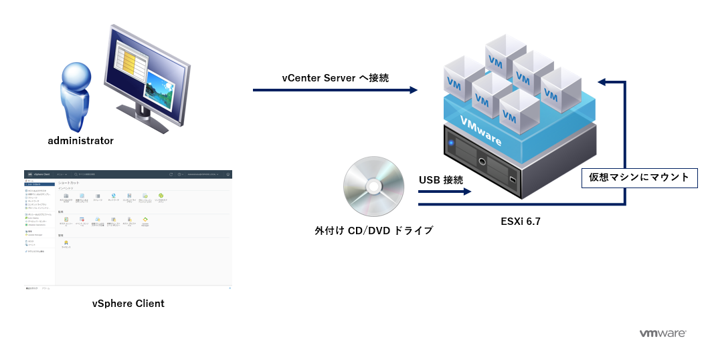
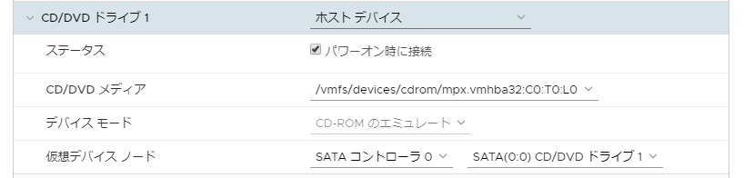
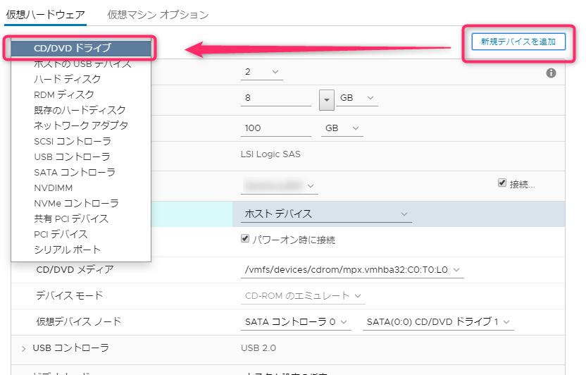
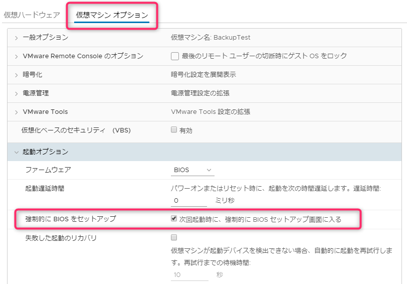
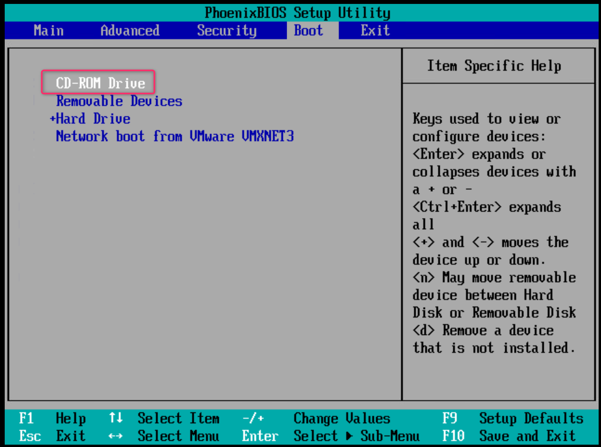
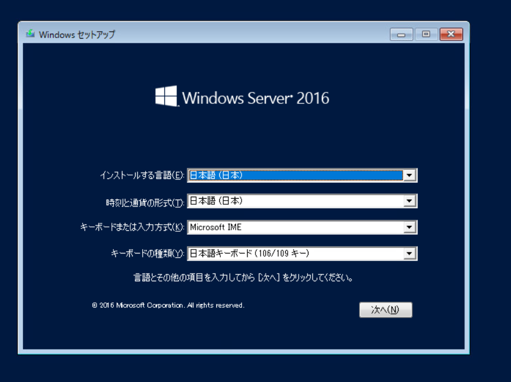
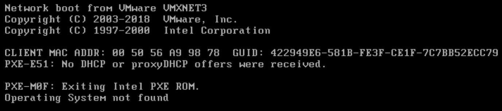

こんにちは、じんないです。

VMware ESXi 上の仮想マシンを展開する際、OS のインストールメディアをマウントする必要があります。たいていの場合は ISO イメージ等をデータストアにアップロードし、その ISO イメージから OS をインストールします。これが最も簡単な手順かと思います。

今回は VMware ESXi に接続した外付けの CD/DVD (光学)ドライブに Windows Server OS のインストールメディアをセットし、仮想マシンにマウントする手順を紹介します。

## 想定環境

- VMware vSphere 6.7 Update2

前提として、外付け CD/DVD ドライブが ESXi で認識されているものとします。
もし認識していない場合は、以下を参考にドライバを組み込んだカスタム ISO イメージを作成してください。
[VMware ESXi のカスタムインストールディスクの作成方法](https://mseeeen.msen.jp/how-to-make-vmware-esxi-install-disc/)

## 事前準備

外付けの CD/DVD ドライブに Windows Server OS のインストールメディアをセットし、ESXi に USB 接続します。

対象の仮想マシンが起動している場合は電源を落としておきましょう。

## 仮想マシン設定

vSphere Client から対象の仮想マシンを右クリックし「設定の編集」を開きます。

CD/DVD ドライブ1 の項目を以下のように変更します。

- **CD/DVD ドライブ1**: ホスト デバイス
- **ステータス**: パワーオン
- **デバイスノード**: CD-ROM のエミュレート
- **仮想デバイスノード**: SATA コントローラ0, SATA(0:0) CD/DVD ドライブ1

### デバイスモードを変更できない場合

**パススルー CD-ROM** から変更できない場合がありますが、そんなときは思い切ってデバイスを削除し、新たに CD/DVD ドライブを追加しましょう。

### ブート順位の変更

CD/DVD ドライブから起動するよう BIOS のブート順位を変更します。

「仮想マシン オプション」から「次回起動時に、強制的に BIOS セットアップ画面に入る」にチェックを入れ仮想マシンを起動します。

仮想マシンが起動すると BIOS 画面となるので「CD-ROM Drive」を一番上にもっていき、変更を保存します。

デバイスが認識され、Windows Server OS のインストーラが起動しました。

## 認識しない場合は

まれに上記手順を踏んでも認識してくれないときがあります。

※こんな感じで PXE 画面で止まる。

その時はもう一度以下の手順を実施してみてください。

1. 仮想マシンを停止する
1. インストールメディアを取り出す
1. 外付け CD/DVD ドライブを挿しなおす
1. インストールメディアをセットする
1. 仮想マシンの設定から CD/DVD ドライブを削除する
1. CD/DVD ドライブを再作成する

おそらくこれで認識してくれるようになるはずです。

ではまた。