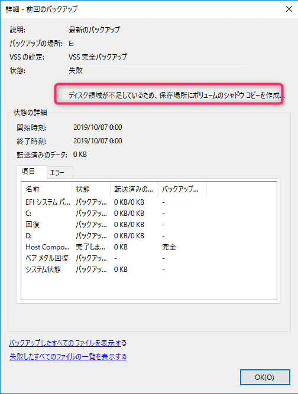
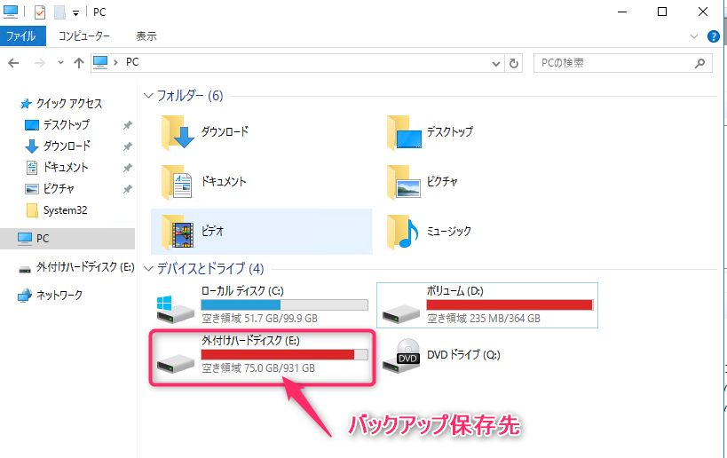
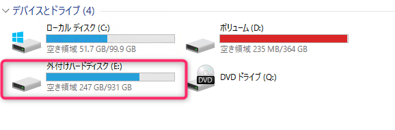
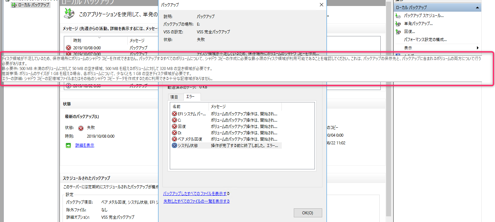
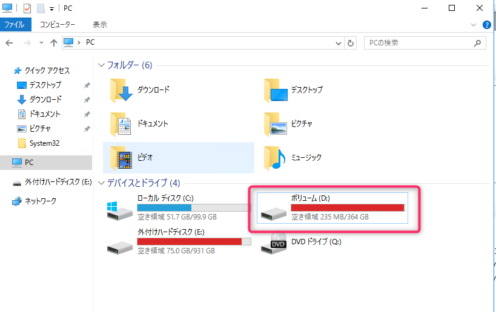
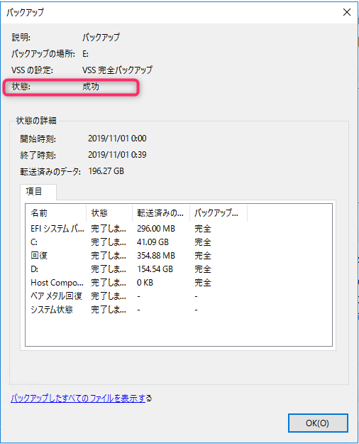

こんにちは、じんないです。

Windows Server では標準で Windows Server バックアップという機能が備えられており、役割と機能の追加からその機能を有効化することができます。

バックアップの保存先にネットワークドライブを指定する場合、有償のバックアップソフトウェアのように世代管理ができませんが、特に難しい設定が無く OS を丸ごとバックアップできるため利用されている方も多いのではないでしょうか。

バックアップ保存先の容量が枯渇している状態だとバックアップが失敗することは容易に想像できますが、今回は**バックアップの保存先の空き容量があるにもかかわらず**ディスク容量が不十分だとエラーになり、バックアップが失敗しました。

その調査記録をご紹介します。

## 環境
- Windows Server 2016
- Windows Server バックアップ
- バックアップ対象: C,D ドライブ
- バックアップ保存先: E ドライブ(外付け HDD)

## 調査

ある日突然、Windows Server バックアップが失敗し、確認してみると**ディスク領域が不足している**ためエラーが出ていることがわかりました。

ディスクの空き容量を見てみると、確かに**バックアップ保存先の E ドライブが枯渇気味**であることがわかりました。

空き容量が 75GB あるので大丈夫だと思っていましたが、不要なファイルを削除して十分な空き容量を確保しました。

しかしながらエラーが解消する兆しがなく、依然としてバックアップが失敗し続けます。

### 空き容量はバックアップ元にも必要

バックアップ失敗のメッセージにカーソルを合わせてみると、かなり長ったらしい文章が続いています。

> ディスク領域が不足しているため、保存場所にボリュームのシャドウ コピーを作成できません。バックアップするすべてのボリュームについて、シャドウ コピーの作成に必要な最小限のディスク領域が利用可能であることを確認してください。これはバックアップ保存先と、バックアップに含まれるボリュームの両方について行う必要があります。
> 最小要件: 500 MB 未満のボリュームに対して 50 MB の空き領域、500 MB を超えるボリュームに対して 320 MB の空き領域が必要です。
> 推奨事項: ボリュームのサイズが 1 GB を超える場合、各ボリュームについて、少なくとも 1 GB の空きディスク領域が必要です。
> エラーの詳細: シャドウ コピーの記憶域ファイルまたはその他のシャドウ コピー データを作成するために利用できる十分な記憶域がありません。

よく見ると 「**これはバックアップ保存先と、バックアップに含まれるボリュームの両方について行う必要があります。**」と書かれています。

つまり、**バックアップ対象のドライブにも空き領域が必要**であることを意味しています。
今回の場合だと C,D ドライブですね。

Windows Server バックアップでは VSS (ボリューム シャドウコピー サービス) を使ってバックアップをしていますが、その一時領域 (Diff Area) を作成するためにバックアップ元にも空き領域が必要になるようです。
VSS の仕組みについては下記の Technet で詳しく説明されています。

[ボリューム シャドウ コピー サービス (VSS) について | Ask CORE](https://blogs.technet.microsoft.com/askcorejp/2018/08/15/aboutvss/)

## 結果

バックアップ元 (D ドライブ) を確認すると空き領域は 235 MB となっていました。
最小要件に「**500 MB を超えるボリュームに対して 320 MB の空き領域が必要**」と書かれていましたので早速空き領域を確保します。

バックアップ元とバックアップ先で十分な空き領域が確保できたところで、もう一度 Windows Server バックアップを実行すると無事に成功しました。

意外な盲点でしたが、VSS を知る良い機会となりました。
何事にも**余裕が必要**ということですね。

ではまた。