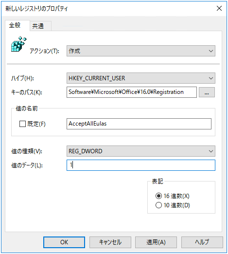

こんにちは、じんないです。

今や業務用 PC に [Microsoft Office](https://www.office.com/?omkt=ja-jp) はなくてはならない存在になっています。皆さんも Word や Excel, PowerPoint といった Microsoft Office 製品を使用したことはあるかと思います。

Microsoft Office Professional Plus 2019 (ビジネス用永続ライセンス版) では、初回の起動時に使用許諾契約書に同意する画面が表示されます。

通常使われている PC では、一度使用許諾契約書に同意すると次回以降は表示されませんが、**シンクライアントで固定プロファイル使っている場合や復元環境の端末ではプロファイルが初期化されてしまうためにこの使用許諾契約書の同意画面が毎回表示されてしまうことがあります**。

この画面はレジストリから非表示とすることができます。今回は**Microsoft Office の使用許諾契約書に同意するレジストリを作成する方法**をご紹介します。

## 環境

- Windows Server 2019 Standard
- Microsoft Office Professional Plus 2019 

## 使用許諾契約書に同意するレジストリ値

使用許諾契約書に同意する画面のレジストリはユーザー固有の設定となっているので、`HKEY_CURRENT_USER` に格納されています。

**`[HKEY_CURRENT_USER\SOFTWARE\Microsoft\Office\16.0\Common\General]`**

- `ShownFirstRunOptin=00000001 (REG_DWORD)`

**`[HKEY_CURRENT_USER\Software\Microsoft\Office\16.0\Registration]`**

- `AcceptAllEulas=00000001 (REG_DWORD)`

上記2つのキーと値を設定することで使用許諾契約書に同意することができます。

## グループポリシーから設定する

せっかくなのでグループポリシーから設定します。

ユーザーに対する設定なので、**適用したいユーザーが格納されている OU に対しグループポリシーオブジェクトを作成**します。

**`ユーザーの構成 > 基本設定 > Windows の設定 > レジストリ`**

レジストリ項目を新規作成します。

- アクション: 作成
- ハイブ: HKEY_CURRENT_USER
- キーのパス: Software\Microsoft\Office\16.0\Common\General
- 値の名前: ShownFirstRunOptin
- 値の種類: REG_DWORD
- 値のデータ: 1

同様に `AcceptAllEulas` を作成します。

- アクション: 作成
- ハイブ: HKEY_CURRENT_USER
- キーのパス: Software\Microsoft\Office\16.0\Registration
- 値の名前: AcceptAllEulas
- 値の種類: REG_DWORD
- 値のデータ: 1

グループポリシーを設定後、対象のユーザーでログオンすると、先ほど設定したレジストリが作成されていました。

適当な Microsoft Office 製品を起動すると、初回起動でも使用許諾契約書に同意する画面が表示されないことを確認しました。

## [おまけ] Microsoft Office の管理用テンプレートを読み込む

余談ですが、Microsoft Office にはグループポリシーの管理用テンプレートが用意されています。

このテンプレートを読み込めばグループポリシー側から設定ができるのではないかと思います。設定の幅も広がりますので下記のサイトを参考に管理用テンプレートのインポートをお勧めします。

> [Office の管理用テンプレートを使用してグループ ポリシー (GPO) で Office 365 ProPlus - マイクロソフト コミュニティ](https://answers.microsoft.com/ja-jp/msoffice/forum/all/office/3ec9d79c-44ec-4273-97e2-2a6f3a1fd8ef)

exe を実行すると管理用テンプレートのファイルが解凍されるので、`amdx` ファイルと ja-JP フォルダ配下の `amdl` ファイルをそれぞれを下記のディレクトリに格納します。

- *.admxファイル: `C:\Windows\PolicyDefinitions`
- *.admlファイル: `C:\Windows\PolicyDefinitions\ja-jp`

## 参考

[「最初に行う設定です」 ダイアログの制御 | Microsoft Docs](https://docs.microsoft.com/ja-jp/archive/blogs/officesupportjp/first_things_first)