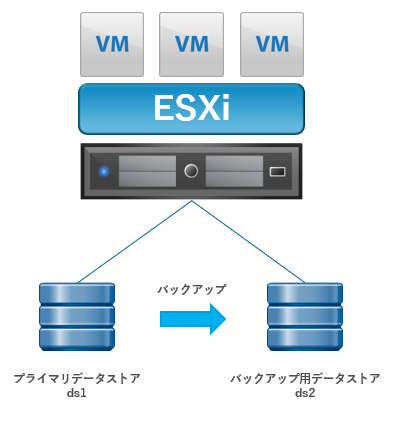
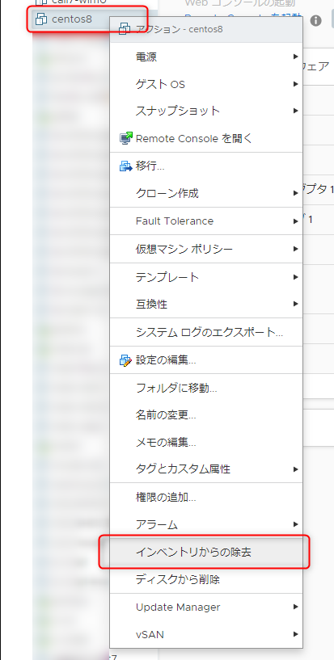
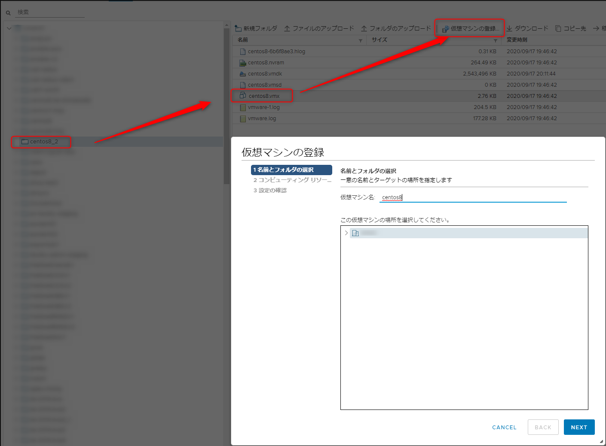
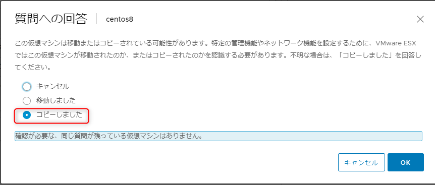

こんにちは、じんないです。

今回は **VMware ESXi 上で稼働している仮想マシンを `vim-cmd` コマンドでオンラインでバックアップし、リストアする方法**をご紹介します。

ESXi へ SSH ログインを実施しますので、事前に **`SSH`** と **`ESXi Shell`** のサービスを起動しておきましょう。


## 想定環境とシナリオ

<a href="images/back-up-and-restore-virtual-machines-with-commands-1.png"></a>

- 仮想化環境: VMware vSphere 6.7 u3
- データストアは下記の2つをマウント
  - ds1: 仮想マシンを格納するためのデータストア
  - ds2: バックアップデータを格納するためのデータストア
- モデルの仮想マシン名: centos8

前提としてスナップショットはないものとします。

**バックアップの流れ**

1. 仮想マシンスナップショットを取得
1. 元の仮想ディスク (vmdk) をバックアップ
1. スナップショットを削除 (ディスク統合)
1. 仮想マシンファイルのバックアップ

基本的に仮想ディスク (vmdk) と仮想マシンファイルをコピーすればよいのですが、起動中の仮想マシンでは仮想ディスクがロックされておりコピーすることができません。
そのため、**一度スナップショットを作成することで仮想ディスク (vmdk) のロックがはずれコピーできる状態となります** (スナップショットを作成すると差分ディスク側で稼働するため)。
コピーしたあとは、スナップショットを削除することでディスクが統合されます。

このような方法ととることで、仮想マシンを停止しなくてもバックアップを取得することができます。

## 事前準備

ESXi へ SSH 接続し、デプロイ直後の仮想マシンファイルを確認してみます。

仮想マシンを構成するファイルは `/vmfs/volumes/<データストア名>/<仮想マシン名>` に格納されています。

`ls -l /vmfs/volumes/ds1/centos8`

```
-rw-r--r--    1 root     root           316 Sep 17 09:56 centos8-6b6f8ae3.hlog
-rw-------    1 root     root     2147483648 Sep 17 10:03 centos8-9f48cfff.vswp
-rw-------    1 root     root     64424509440 Sep 17 10:04 centos8-flat.vmdk
-rw-------    1 root     root        270840 Sep 17 10:03 centos8.nvram
-rw-------    1 root     root           551 Sep 17 10:03 centos8.vmdk
-rw-r--r--    1 root     root             0 Sep 17 09:56 centos8.vmsd
-rwxr-xr-x    1 root     root          2829 Sep 17 10:03 centos8.vmx
-rw-------    1 root     root             0 Sep 17 10:03 centos8.vmx.lck
-rw-r--r--    1 root     root        209413 Sep 17 10:02 vmware-1.log
-rw-r--r--    1 root     root        181535 Sep 17 09:55 vmware.log
-rw-------    1 root     root      85983232 Sep 17 10:03 vmx-centos8-2672349183-1.vswp
```

続いてバックアップ格納先のディレクトリを別のデータストア (今回は `ds2`) へ作成します。

`mkdir /vmfs/volumes/ds2/centos8`

## バックアップ
### 仮想ディスク (vmdk) のバックアップ

仮想マシンのスナップショットを取得するために、仮想マシン ID (vmid) を確認します。パイプせずに一覧で確認しても大丈夫です。

`vim-cmd vmsvc/getallvms | awk '/<仮想マシン名>/ {print $1;}'`

確認した仮想マシン ID を指定し、スナップショットを作成します。スナップショット名は任意のもので問題ないです。

`vim-cmd vmsvc/snapshot.create <仮想マシン ID (vmid)> <スナップショット名>`

スナップショットを取得した時点での仮想マシンファイルを確認します。

`ls -l /vmfs/volumes/ds1/centos8`

`centos8-000001-delta.vmdk` と `centos8-000001.vmdk` が生成されていることがわかります。これらがスナップショットディスクとなり、仮想マシンは現在このディスクで稼働しています。これで仮想ディスクはロックが外れるのでコピーができる状態となります。

```
-rw-------    1 root     root        126976 Sep 17 10:22 centos8-000001-delta.vmdk　★
-rw-------    1 root     root           296 Sep 17 10:22 centos8-000001.vmdk　★
-rw-r--r--    1 root     root           316 Sep 17 09:56 centos8-6b6f8ae3.hlog
-rw-------    1 root     root     2147483648 Sep 17 10:03 centos8-9f48cfff.vswp
-rw-------    1 root     root        282014 Sep 17 10:22 centos8-Snapshot1.vmsn
-rw-------    1 root     root     64424509440 Sep 17 10:19 centos8-flat.vmdk
-rw-------    1 root     root        270840 Sep 17 10:03 centos8.nvram
-rw-------    1 root     root           551 Sep 17 10:03 centos8.vmdk
-rw-r--r--    1 root     root           379 Sep 17 10:22 centos8.vmsd
-rwxr-xr-x    1 root     root          2836 Sep 17 10:22 centos8.vmx
-rw-------    1 root     root             0 Sep 17 10:03 centos8.vmx.lck
-rw-r--r--    1 root     root        209413 Sep 17 10:02 vmware-1.log
-rw-r--r--    1 root     root        187840 Sep 17 10:22 vmware.log
-rw-------    1 root     root      85983232 Sep 17 10:03 vmx-centos8-2672349183-1.vswp
```

仮想ディスク (vmdk) をバックアップします。`-d thin` でシンプロビジョニングままコピーします。

`vmkfstools -i /vmfs/volumes/ds1/centos8/centos8.vmdk -d thin /vmfs/volumes/ds2/centos8/centos8.vmdk`

詳しい内容は下記の記事をご参照ください
[コマンドでシンプロビジョニングの仮想マシンを別のデータストアへ移行する](https://mseeeen.msen.jp/migration-to-another-data-store-with-thin-provisioning/)

バックアップが完了したらスナップショットは不要になるので、スナップショットを削除し、仮想ディスクを統合します。

スナップショットを削除するためにスナップショット ID を確認します。

`vim-cmd vmsvc/snapshot.get <仮想マシン ID (vmid)>`

```
Get Snapshot:
|-ROOT
--Snapshot Name        : centos8-snapshot
--Snapshot Id        : 1　★これ
--Snapshot Desciption  :
--Snapshot Created On  : 9/17/2020 10:13:4
--Snapshot State       : powered off
```

確認したスナップショット ID を指定し、スナップショットを削除します。

`vim-cmd vmsvc/snapshot.remove <仮想マシン ID (vmid)> <スナップショット ID>`

再度仮想マシンファイルを確認すると、先ほどあったスナップショットが削除されていることを確認できます。

`ls -l /vmfs/volumes/ds1/centos8`

```
-rw-r--r--    1 root     root           316 Sep 17 09:56 centos8-6b6f8ae3.hlog
-rw-------    1 root     root     2147483648 Sep 17 10:03 centos8-9f48cfff.vswp
-rw-------    1 root     root     64424509440 Sep 17 10:38 centos8-flat.vmdk
-rw-------    1 root     root        270840 Sep 17 10:03 centos8.nvram
-rw-------    1 root     root           551 Sep 17 10:38 centos8.vmdk
-rw-r--r--    1 root     root            43 Sep 17 10:38 centos8.vmsd
-rwxr-xr-x    1 root     root          2829 Sep 17 10:38 centos8.vmx
-rw-------    1 root     root             0 Sep 17 10:03 centos8.vmx.lck
-rw-r--r--    1 root     root        209413 Sep 17 10:02 vmware-1.log
-rw-r--r--    1 root     root        199445 Sep 17 10:38 vmware.log
-rw-------    1 root     root      85983232 Sep 17 10:03 vmx-centos8-2672349183-1.vswp
```

### 仮想ディスク以外のファイルのバックアップ

先ほど、仮想ディスク本体のバックアップが完了したので、仮想マシンファイルのバックアップを行います。

`find /vmfs/volumes/ds1/centos8/* -not -name "*.vmdk" -exec cp {} /vmfs/volumes/ds2/centos8/ \;`

スワップファイル (vswp) やロックファイル (vmx.lck) などがコピーできませんが、リストア時に再作成されるため問題ありません。


バックアップされたファイル全体は下記のとおりです。

```
-rw-r--r--    1 root     root           316 Sep 17 10:20 centos8-6b6f8ae3.hlog
-rw-------    1 root     root     64424509440 Sep 17 10:34 centos8-flat.vmdk
-rw-------    1 root     root        270840 Sep 17 10:20 centos8.nvram
-rw-------    1 root     root           551 Sep 17 10:34 centos8.vmdk
-rw-r--r--    1 root     root             0 Sep 17 10:20 centos8.vmsd
-rwxr-xr-x    1 root     root          2829 Sep 17 10:20 centos8.vmx
-rw-r--r--    1 root     root        209413 Sep 17 10:20 vmware-1.log
-rw-r--r--    1 root     root        181535 Sep 17 10:20 vmware.log
```

## リストア

基本的には、vShere Client などでバックアップしたファイルから仮想マシンを再登録すれば問題なく起動できるでしょう。

データストアがバックアップ専用となっている場合は、プライマリ側のディレクトリにバックアップしたファイルをコピーすればよいです。

まずはリストア先のディレクトリを作成します。ここでは例として `centos8_2` にしました。

`mkdir /vmfs/volumes/ds1/centos8_2`

バックアップとは逆向きに仮想ディスク (vmdk) と仮想マシンファイルをコピーします。

仮想ディスクのコピー

`vmkfstools -i /vmfs/volumes/ds2/centos8/centos8.vmdk -d thin /vmfs/volumes/ds1/centos8_2/centos8.vmdk`

仮想マシンファイルのコピー

`find /vmfs/volumes/ds2/centos8/* -not -name "*.vmdk" -exec cp {} /vmfs/volumes/ds1/centos8_2/ \;`

同じ名前で仮想マシンを登録する場合は、一度インベントリーから削除しておきましょう。

<a href="images/back-up-and-restore-virtual-machines-with-commands-2.png"></a>

データストアブラウザから仮想マシンを再登録します。

<a href="images/back-up-and-restore-virtual-machines-with-commands-3.png"></a>

仮想マシンを起動すると質問が聞かれますので、「コピーしました」を選択すれば OK です。

<a href="images/back-up-and-restore-virtual-machines-with-commands-4.png"></a>

以上でリストアは完了です。

仮想ディスクの欠損や不整合が起こると仮想マシンが起動できなくなるので、使われる場合は十分に評価をお願いします。
本番環境で使用を想定している場合はバックアップソフトなどの利用をおすすめいたします。

ではまた。

## 参考

[WMwareESXiでvmdkファイルのバックアップしてみた - Qiita](https://qiita.com/Dace_K/items/687732cd9d767143c156)