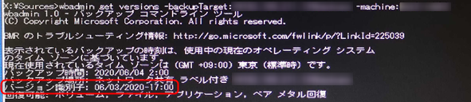

こんにちは、じんないです。

Windows Server 2019 で Windows Server バックアップを構成しています。

**バックアップの構成にベアメタル回復を含むことで HDD などが故障した際も、OS を復元することができます**。

先日、**共有フォルダー上に保存しているバックアップデータからベアメタル回復(リストア)**を行おうとしたところ、下記のエラーとなりバックアップデータが参照できませんでした。

> 内部エラーが発生しました。エラーの解決に次の情報が役立つ可能性があります。:
> システムに接続されたデバイスが機能していません。 (0x8007001F)

※ モアレがひどくて恐縮です。

これは、バックアップデータを保存している共有フォルダーを参照したときに表示されたエラーメッセージです。

## Windows Server 2019 の既知の問題

**この現象は Windows 10 および Windows Server 2019 における既知の問題**のようです。

> [Windows10における共有フォルダを使用したイメージ復元の問題について | Microsoft Docs](https://docs.microsoft.com/ja-jp/archive/blogs/askcorejp/image-restore-using-share-folder-on-windows10)

これらを回避するには、下記の手順でコマンドから共有フォルダーをマウントする必要があります。

## コマンドから共有フォルダーをマウントするリストア手順

共有フォルダー上のバックアップデータを参照する場合は、事前にコマンドから共有フォルダーをマウントします。

リストア中に以下の画面が表示されたら、**`<shift>キー + <F10>キー`** を押下してコマンドプロンプトを起動します。

以下のコマンドで、接続されているネットワークインターフェースの **Idx 番号を確認**します。

`netsh interface ipv4 show interface`

Idx 番号を確認後、接続されているインターフェースに IP アドレスを割り当てます。

`netsh interface ipv4 set address [Idx番号] static [IPアドレス] [サブネットッマスク] [デフォルトゲートウェイ]`

IP アドレスが正常に割り当てられたことを確認します。念のため**デフォルトゲートウェイなどに Ping を送信し、ネットワークの疎通があることを確認しておく**とよいでしょう。

`ipconfig /all`

`ping [デフォルトゲートウェイ]`

ネットワークの疎通が問題ないことを確認したら、バックアップが格納されている共有フォルダーへ接続します。

`net use \\ファイルサーバーのIPアドレス\共有フォルダー名`

もういちど `net use` コマンドを実行し、共有フォルダーがマウントされていることを確認します。

リストアするバックアップデータのバージョン情報を確認します。

`wbadmin get versions -backupTarget:\\ファイルサーバーのIPアドレス\共有フォルダー名 -machine:[サーバー名]`

バージョン識別子を指定し、リストアを実行します。[続行しますか?] には **y** 入力し応答します。

`wbadmin start sysrecovery -version:[バージョン識別子] -backuptarget:\\ファイルサーバーのIPアドレス\共有フォルダー名 -machine:[サーバー名] -restoreAllVolumes`

リストアが正常に完了したことを確認したら、`exit` を入力し、コマンド プロンプトを閉じます。

以上で、ベアメタル回復は完了です。

Windows Server 2019 および Windows 10 で同じ現象が発生している場合は、お試しください。

ではまた。