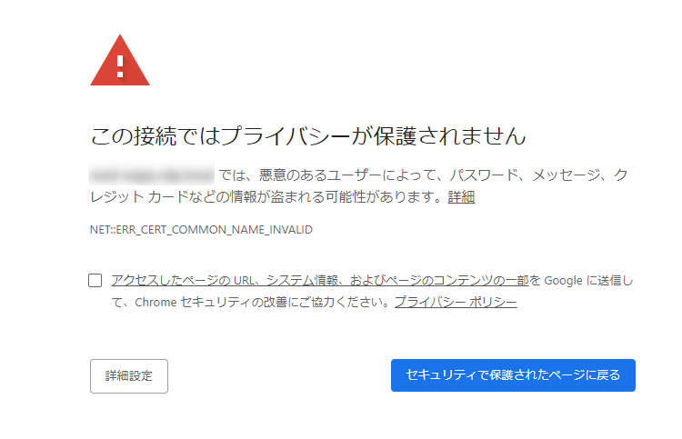
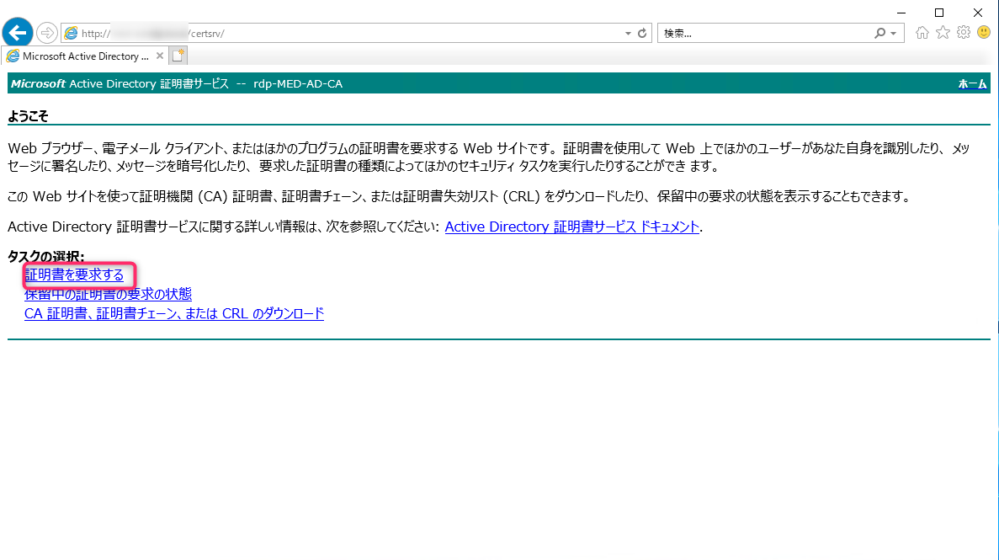
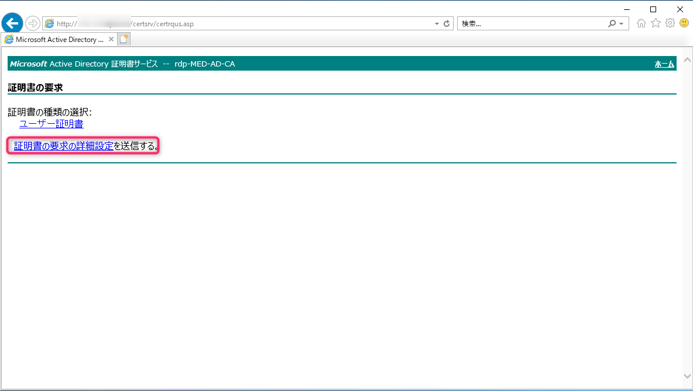
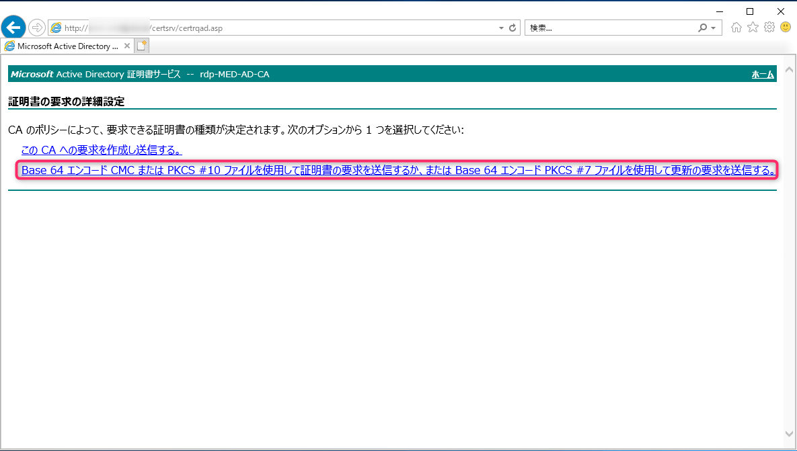
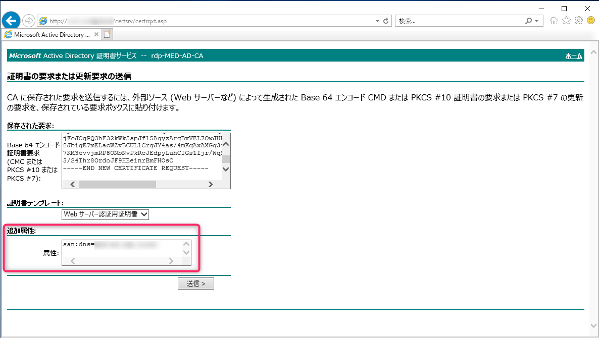
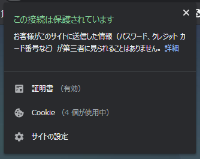
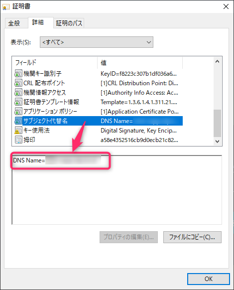

こんにちは、じんないです。

HTTP 通信を暗号化するために、Active Directory 証明書サービスでサーバー証明書を発行し、Web サーバーに割り当てたのですが Google Chrome でアクセスしたときだけ証明書エラーとなりました。

Internet Explorer や Edge で接続したときはまったく問題ありませんでした。

## 環境
- Active Directory 証明書サービス: Windows Server 2012 R2
  - エンタープライズ CA
  - ルート CA
- Web サーバー: Windows Server 2019 (IIS 10)
- クライアント: Windows 10 (1809)
  - Chrome: 80.0.3987.163

クライアントにはルート CA の証明書を、Web サーバーにはルート CA が発行した証明書をそれぞれインポートしています。

## エラー内容

目的の URL にアクセスすると、**この接続ではプライバシーが保護されません** と表示され証明書エラーになります。

<a href="images/certificate-issued-by-active-directory-certificate-services-fails-only-in-chrome-1.png"></a>

そして、エラーメッセージには **`NET::ERR_CERT_COMMON_NAME_INVALID`** と表示されています。

下記のサイトによると **Chrome では SAN (Subject Alternative Name) 属性の値とアクセス先のドメインを検証し、一致していない場合はエラー**となるようです。

実際に証明書を確認すると SAN 属性はありませんでした。

[Google Chrome で自組織のCAで署名したSSL証明書のサイトにアクセスすると NET::ERR_CERT_COMMON_NAME_INVALID エラーメッセージが表示される](https://www.ipentec.com/document/windows-chrime-error-net-err-cert-common-name-invalid-using-ssl-certificate-signed-with-local-ca) 

## SAN 属性を持った証明書の発行手順
### 証明書要求から SAN 属性を受け付けるようにする

デフォルトの設定では SAN 属性が付与されないので、CA の設定を変更します。仮に証明書要求に SAN 属性が含まれていても、除外されるようです。

コマンドプロンプトで以下のコマンドを実行します。

```shell
certutil -setreg policy\EditFlags +EDITF_ATTRIBUTESUBJECTALTNAME2

net stop certsvc

net start certsvc
```

### 証明書を要求する

Active Directory 証明書サービスにアクセスし、[証明書を要求する] をクリックします。

※ CSR の作成は済んでいるものとして割愛します。

<a href="images/certificate-issued-by-active-directory-certificate-services-fails-only-in-chrome-2.png"></a>

[証明書の要求の詳細設定] をクリックします。

<a href="images/certificate-issued-by-active-directory-certificate-services-fails-only-in-chrome-3.png"></a>

下側の長い名前の方をクリックします。

<a href="images/certificate-issued-by-active-directory-certificate-services-fails-only-in-chrome-4.png"></a>

作成した CSR の内容を張り付けて、**追加属性のところに `san:dns=<web サーバーの FQDN>`** を指定します。

複数の DNS 名やエイリアスがある場合は `&` でつなげて指定します。
`san:dns=<web サーバーの FQDN>&dns=<web サーバーの FQDN>`

<a href="images/certificate-issued-by-active-directory-certificate-services-fails-only-in-chrome-5.png"></a>

あとは発行された証明書を Web サーバーにインポートし、バインドすれば OK です。

これで Chrome に怒られなくなりました。

<a href="images/certificate-issued-by-active-directory-certificate-services-fails-only-in-chrome-6.png"></a>

証明書のプロパティを見てみると `サブジェクト属性` という項目があり `DNS Name` がはまっていることが確認できます。

<a href="images/certificate-issued-by-active-directory-certificate-services-fails-only-in-chrome-7.png"></a>

Active Directory 証明書サービスを使って証明書を発行する際は気を付けないといけませんね。

ではまた。

## 参考
[セキュリティで保護された LDAP 証明書にサブジェクトの別名を追加する方法](https://support.microsoft.com/ja-jp/help/931351/how-to-add-a-subject-alternative-name-to-a-secure-ldap-certificate)

[Google Chrome で自組織のCAで署名したSSL証明書のサイトにアクセスすると NET::ERR_CERT_COMMON_NAME_INVALID エラーメッセージが表示される](https://www.ipentec.com/document/windows-chrime-error-net-err-cert-common-name-invalid-using-ssl-certificate-signed-with-local-ca)

[Windows Serverの認証局でSAN属性を持たせたマルチドメイン証明書を認証する](https://qiita.com/shadowhat/items/f71b2564dfed0319fbac)