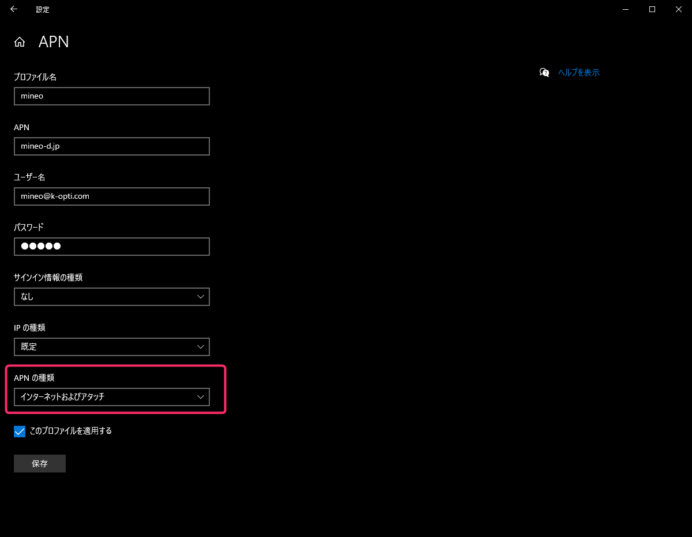
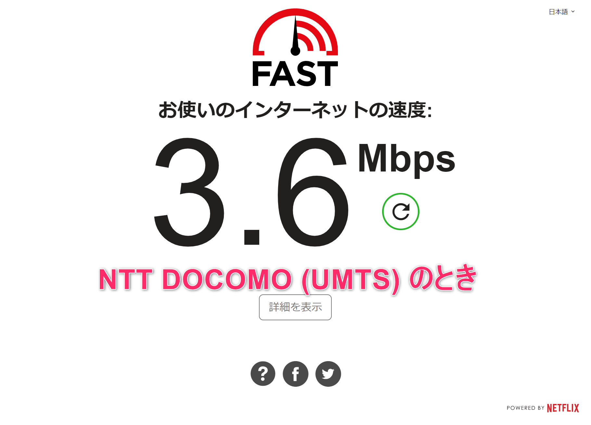
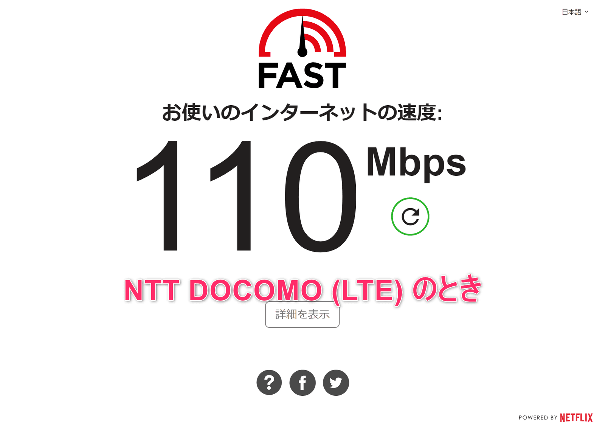

こんにちは、じんないです。

最近、第5世代 ThinkPad X1 Carbon から第8世代の ThinkPad X1 Carbon に乗り換えました。

以前からワイヤレスWAN アダプターに mineo D プランのデータ SIM を挿してモバイルネットワークを使っているのですが、新しい機種に乗り換えたあとネットワークの通信がものすごく遅かったので調べてみました。

## 環境

- Lenovo ThinkPad X1 Carbon 8Gen (20U9)
- Windows 10 Pro (1909)
- mineo (D) Micro SIM

## ネットワークが遅い理由

APN 設定を行うと、モバイルネットワークには接続できるのですが、何やら見慣れない表示が・・・

`NTT DOCOMO (UMTS)` となっています。少し調べたところ**いわゆる 3G 回線**ということだそうです。

お使いの環境によっては `NTT DOCOMO (HSDPA)` となることがあると思いますが、大きくは同じで 3G 回線のようです。

以前は 4G (LTE) 回線につながっていたのでずいぶんと快適だったのですが、3G 回線だと最近の Web ページを見るだけでももっさりしています。

## 原因は APN 設定にあった

第5世代 ThinkPad X1 Carbon と同じように mineo の APN 設定を行っていたのですが、どうも設定を一部変える必要があったみたいです。
※ mineo の APN 設定はこちらを参照
[第5世代 ThinkPad X1 Carbon でワイヤレス WAN 接続 (mineo LTE SIM の APN 設定)](/5th-gen-thinkpad-x1-carbon-wireless-wan/)

[Windows の設定] > [ネットワークとインターネット] > [携帯電話] > [詳細オプション] から APN を削除し、新しく作り直します。
※あとから変更できないパラメータのようです。

変更する箇所は **APN の種類**を**「インターネットおよびアタッチ」**にするだけです。
※ もともとは「インターネット」でした

この「アタッチ」というのが 4G (LTE) をつかまえるためのプロファイルのようです。

参考までにその他の項目の設定値を載せておきます。

項目 | 設定値 | 備考
-- | -- | --
プロファイル名 | mineo | 任意でよいです
APN | mineo-d.jp |  
ユーザー名 | mineo@k-opti.com |  
パスワード | mineo |  
サインイン情報の種類 | なし |  
IP の種類 | 既定 |  
APN の種類 | インターネットおよびアタッチ |  

これで、携帯ネットワークを ON/OFF すると 4G LTE 回線につながると思います。

## 3G 回線と 4G (LTE) 回線の比較

4G (LTE) 回線になったことで、回線速度もですが**携帯ネットワーク ON から実際に接続状態になる時間がものすごく早く**なりました。

現場などでスリープを解除してからネットワークにつながるまで少しもたつきを感じていたので、これはかなりうれしいです。

分類 | 回線 | 接続までの時間 | 回線速度
-- | -- | -- | --
3G 回線 | NTT DOCOMO (UMTS) | 36秒 | 3.6Mbps
4G 回線 | NTT DOCOMO (LTE) | 6秒 | 110Mbps

**NTT DOCOMO (UMTS) の時の回線速度**

**NTT DOCOMO (LTE) の時の回線速度**

平日 13:30ごろでほぼ同じ時刻に測定しています。

同じ現象でお困りの方はぜひ試してみてください。

ではまた。

## 参考

[ThinkPad X1 Carbon Yoga 2019 LTEが遅い（3G固定） つながるまでに時間がかかる対処法 | ThinkPad X240sを使い倒す シンクパッドのレビュー・カスタマイズ](https://korya-sugoi.com/thinkpad_faq/lte_delay_x1yoga_x1carbon_x390/)
