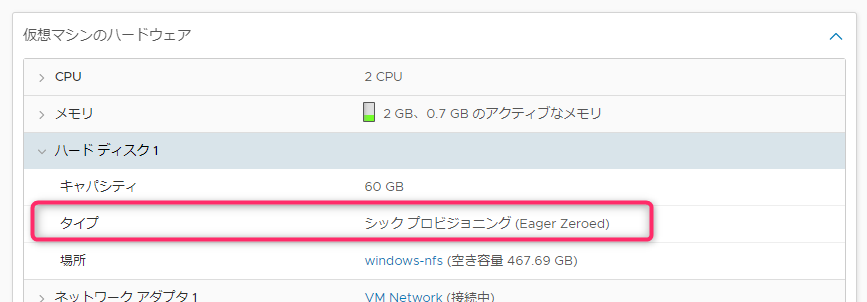

こんにちは、じんないです。

今回は **Windows Server 2016 で NFS サーバーを構成し、VMware Hypervisor (ESXi) からデータストアとしてマウント**してみます。

複数の ESXi から共有ディスクとして NAS などを NFS マウントすることはよくあると思いますが、Windows Server でやってみるとどうなるのかと思い、実際にやってみました。

## 環境

- NFS サーバー
Windows Server 2016 Standard

- NFS クライアント
VMware Hypervisor (ESXi) 6.7 u3

## Windows Server に NFS サーバーを構成する
### NFS サーバーの役割を追加する

NFS サーバーは Windows Server の標準機能として提供されています。

サーバーマネージャーから **役割と機能の追加ウィザード** を起動し **NFS サーバー** にチェックを入れてインストールします。

`[ファイルサービスと記憶域サービス] > [ファイルサービスおよび iSCSI サービス] > [NFS サーバー]`

### NFS 共有を作成する

役割が追加できたら、NFS 共有するフォルダーを作成します。今回は例として `C:\export` を共有します。

サーバーマネージャーから新しい共有ウィザードを起動し、**[NFS 共有 - 簡易]** を選択して [次へ] をクリックします。

`[サーバーマネージャー] > [ファイルサービスと記憶域サービス] > [共有]`

カスタムパスに `C:\export` を入力し、[次へ] をクリックします。

共有名を指定し [次へ] をクリックします。**ここで表示されている [共有するリモートパス] は後で使用しますので、メモしておいてください**。

認証方法を下記のとおり設定し、[次へ] をクリックします。

NFS 共有を許可するホストを追加します。ESXi の IP アドレスを入力し、共有アクセス許可は **[読み取り/書き込み]** を選択します。
マウントする ESXi が複数ある場合は同様の手順で追加します。なお、**vCenter Server が存在する環境でも vCenter Server のアクセスを追加する必要はありません**。

内容を確認し [次へ] をクリックします。あとはウェイザードに従い、共有を作成します。

## ESXi からマウントする
### 新しいデータストアを追加する
vSphere Client から新しいデータストアを追加します。[NFS] を選択し、[NEXT] をクリックします。

[NFS 3] を選択し [NEXT] をクリックします。

NFS シェアの詳細を設定し、[NEXT] をクリックします。
※ パラメーターを抜粋していますので、表現の揺らぎはご容赦ください。

- **データストア名**: 任意のデータストア名
- **フォルダ**: 先の手順で確認した [共有するリモートパス] の`:` 以降を指定
- **サーバ**: NFS サーバーの IP アドレスを指定

マウントする ESXi を選択し [NEXT] をクリックします。

[FINISH] をクリックして完了します。この時正常にマウントできなかった場合は、これまでの手順を確認してみてください。

空き容量などストレージの情報も正常に取得できていました。

### ディスクタイプはシックプロビジョニングになる

マウントしたデータストアに **シンプロビジョニング** の仮想マシンを移行したところ、ディスクタイプが **シックプロビジョニング (Eager Zeroed)** になっていることがわかりました。

NAS などで NFS マウントしているデータストア間で仮想マシンを移行したり、新しい仮想マシン作成してもシンプロビジョニングのままとなりますが、**Windows Server の NFS サーバーのデータストアに仮想マシンを移行したり新しい仮想マシンを作成すると シックプロビジョニング (Eager Zeroed) になってしまいます**。

すでに NTFS フォーマットしている領域を NFS として共有しているため、このような動作となっているのかもしれませんが、詳細がわかりましたら追記したいと思います。

最後になりましたが、Windows Server 版 NFS サーバーのデータストア上で仮想マシンを起動させても何ら問題はありませんでした。

ではまた。
