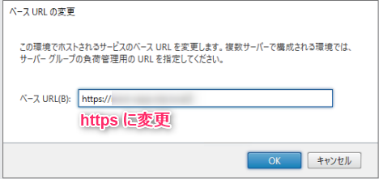

こんにちは、じんないです。

今回は **[Citrix Virtual Apps](https://www.citrix.com/ja-jp/products/citrix-virtual-apps-and-desktops/) (旧:Citrix XenApp) で Receiver for HTML5 (Chrome) を使用して HTTPS 接続する方法**を紹介します。

読者対象は Citrix の設計・構築に携わる方としていますので、用語説明などは割愛させていただきます。

## 概要

Citrix Virtual Apps や Desktops はクライアント端末に [Citrix Workspace App](https://www.citrix.com/ja-jp/downloads/workspace-app/) (旧：Citrix Receiver) アプリケーションを導入しサーバーと通信を行いますが、このようなアプリケーションをインストールできない環境向けに HTML5 ベースの Receiver も用意されています。

**Citrix Workspace の場合は StoreFront で SSL を有効にし、デリバリーグループの設定から SecureICA を有効化することで通信を暗号化することができますが、Receiver for HTML5 (Chrome) を使う場合は Virtual Delivery Agent (以下、VDA と記載)も SSL を有効化しなければいけません。**ここが少しはまりました。そのあたりも含めて紹介できればと思います。

## 環境

- Citrix Virtual Apps 7.15 LTSR
- Windows Server 2019 Standard

想定している環境は下図のとおりです。Citrix サーバーに必要なコンポーネントを構成し、あとは VDA を App サーバーに構成したシンプルな環境です。

前提として証明書認証局で SSL サーバー証明書が発行できる環境があるものとします。今回は Active Directory 証明書サービスを使いました。


## Receiver for HTML5 の有効化

まず、Receiver for HTML5 からの接続を許可するためにポリシーを設定する必要があります。

Citrix Studio から [ポリシー] を開き、デフォルトの [unfiltered] を選択し、ポリシーを編集します。


[ICA] > [WebSocket] から [WebSocket 接続] のポリシーを **許可** に設定しておきます。


## StoreFront の SSL 化
### 証明書のバインド

StoreFront の SSL 化は IIS から証明書要求を行い、SSL サーバー証明書をバインドするだけなので細かい説明は割愛します。

参考手順: [IISでhttpsのサイトを作成する - SSLサイトの構成 - Windows Server Tips](https://www.ipentec.com/document/windows-windows-server-iis-setup-https-site)


### ベース URL の変更

Citrix Studio からベース URL を変更します。


http を https に変更するだけで OK です。



これでクライアント端末にルート CA の証明書がインポートされていれば、クライアント端末と StoreFront 間の HTTPS 通信は可能となります。

ルート CA の証明書のインポート手順は下記のサイトを参考にしてください。

[ルートCA(証明機関)の証明書をインポートする - Windows Tips](https://www.ipentec.com/document/windows-import-root-ca-certification)

## Virtual Delivery Agent (VDA) の SSL 化

### 証明書のインポート

各 VDA から証明書発行要求を行い、証明書をインポートします。

**この時の注意点ですが、ワイルドカード証明書ではなく必ずホスト毎に証明書を発行します。また、必ず秘密鍵付きでインポートしてください。**

> The important part here is the Subject, where you should replace the CN (Common Name) with the fully-qualified domain name of your VDA
> [How To Secure ICA Connections in XenApp and XenDesktop 7.6 using SSL | Citrix Blogs](https://www.citrix.com/blogs/2014/12/11/how-to-secure-ica-connections-in-xenapp-and-xendesktop-7-6-using-ssl/)


インポート先は個人ストアで問題ありません。

**インポートした証明書のプロパティを参照し、拇印をコピーしておきます**。

### SSL の有効化

VDA の SSL の有効化は **Citix が用意してくれた PowerShell スクリプトを使用**します。

PowerShell スクリプトは Citrix Virtual Apps のインストールメディアの `Support > Tools > SslSupport` 配下にある `Enable-VdaSSL.ps1` を使用します。任意の場所にコピーしておきましょう。

そして PowerShell を起動し、`Enable-VdaSSL.ps1 -Enable -CertificateThumbPrint "<インポートした証明書の拇印>"` を実行します。

対話形式となるので、2回ほど `Y` を入力すれば完了となります。

全文

```shell
PS C:\Users\administrator.jinna-i\Desktop> .\Enable-VdaSSL.ps1 -Enable -CertificateThumbPrint "<インポートした証明書の拇印>"
Enable TLS/DTLS to the VDA
Running command Enable-VdaSSL to enable or disable TLS/DTLS to the VDA.
This includes:
        a.Disable TLS/DTLS to VDA or
        b.Enable TLS/DTLS to VDA
                1.Setting ACLs
                2.Setting registry keys
                3.Configuring Firewall

Configure ACLs
Are you sure you want to perform this action?
This will grant TermService read access to the certificate.
[Y] はい(Y)  [A] すべて続行(A)  [N] いいえ(N)  [L] すべて無視(L)  [S] 中断(S)  [?] ヘルプ (既定値は "Y"): Y
ACLs set.

Configure Firewall
Are you sure you want to perform this action?
This will delete any existing firewall rules for port 443 and disable rules for ICA, CGP and Websocket services.
[Y] はい(Y)  [A] すべて続行(A)  [N] いいえ(N)  [L] すべて無視(L)  [S] 中断(S)  [?] ヘルプ (既定値は "Y"): Y
Firewall configured.
Setting registry keys...
Registry keys set.

SSL to VDA enabled.
```

このとき、下記のエラーが出た場合は適切な証明書がインポートされていないので先に書いた注意点を確認してください。

- > Verification of the certificate failed. Please install a valid certificate and try again.


- > Unable to access the Private Key of the Certificate or one of its fields.

## デリバリーグループの SSL 化

最後はデリバリーグループの SSL 化です。**Delivery Controller がインストールされたサーバーで PowerShell を起動**し下記のコマンドを順番に実行していきます。

`asnp Citrix.*`

`Get-BrokerAccessPolicyRule -DesktopGroupName '<デリバリーグループの名前>' | Set-BrokerAccessPolicyRule -HdxSslEnabled $true`

`Set-BrokerSite -DnsResolutionEnabled $true`

以上で Receiver for HTML5 から HTTPS 接続する設定は完了です。

## エラー関連

### CTX134123 を参照してくださいとなる場合


> この Web ブラウザー内にセキュリティで保護された接続を作成できません。Citrix Knowledge Center の技術文書 CTX134123 を参照してください。

このエラーが出た場合は **VDA の SSL 化ができていない**可能性があります。VDA の SSL 化の設定に間違いがないか確認してください。

### サーバーに接続できませんとなる場合


> サーバーに接続できません。HTML5 のローカルアクセスを構成する場合は、Citrix Knowledge Center の技術文書を参照してください。

このエラーが出た場合は **VDA に適切な SSL サーバー証明書がインポートされていない**可能性があります。**ワイルドカード証明書を使用したときにこのエラーに遭遇しました**。適切な証明書がインポートされているか確認してください。

## 参考

[Transport Layer Security（TLS）](https://docs.citrix.com/ja-jp/xenapp-and-xendesktop/7-15-ltsr/secure/tls.html#configure-tls-on-delivery-groups)

[Receiver for HTML5 - Unable to Launch Apps Using HTTPS URL](https://support.citrix.com/article/CTX134123)

[How To Secure ICA Connections in XenApp and XenDesktop 7.6 using SSL | Citrix Blogs](https://www.citrix.com/blogs/2014/12/11/how-to-secure-ica-connections-in-xenapp-and-xendesktop-7-6-using-ssl/)

