こんにちは、じんないです。

今回は **Citrix Virtual Apps 1912 LTSR で StoreFront の [統合エクスペリエンス](https://docs.citrix.com/ja-jp/storefront/current-release/manage-citrix-receiver-for-web-site/unified-receiver-experience.html) を有効化する方法**を紹介します。

7.15 LTSR までは StoreFront の [統合エクスペリエンスの構成] からチェックボックスをオンにすることで統合エクスペリエンスを有効化することができました。

しかしながら、**1912 LTSR からは下記のとおりチェックボックスが無くなっており、有効化することができなくなっています**。

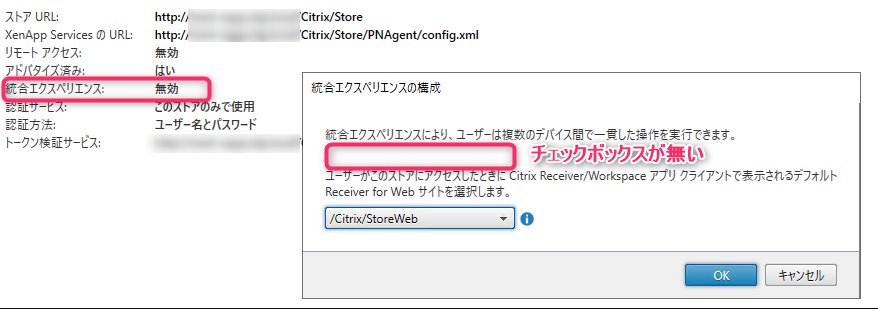

## 統合エクスペリエンスとは

統合エクスペリエンスを有効化すると Citrix Workspace のインターフェースを Citrix Receiver for Web サイトのインターフェースと同様の設定を適用することができます。

これにより、複数のデバイスから使用する際に一貫した操作が可能となり、ユーザーエクスペリエンスが向上します。何より見やすいのがいいと思います。

統合エクスペリエンスを有効化していない場合、**Citrix Receiver for Web サイト** と **Citrix Workspace** でそれぞれ下記のようなインターフェースになります。

**Citrix Receiver for Web サイト**

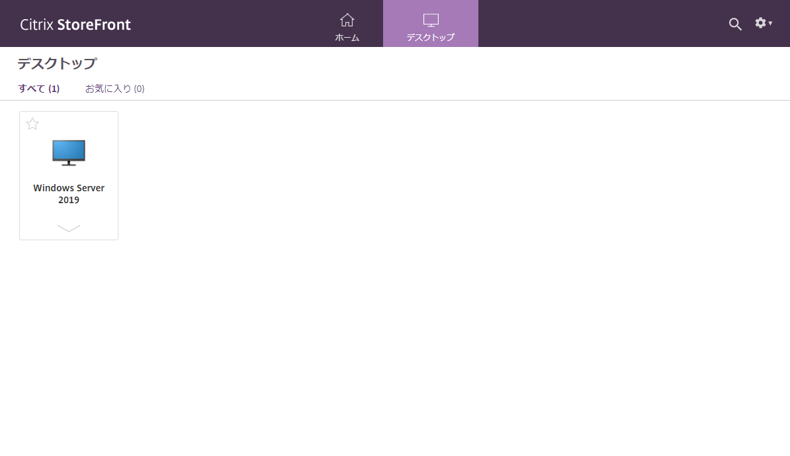

**Citrix Workspace**

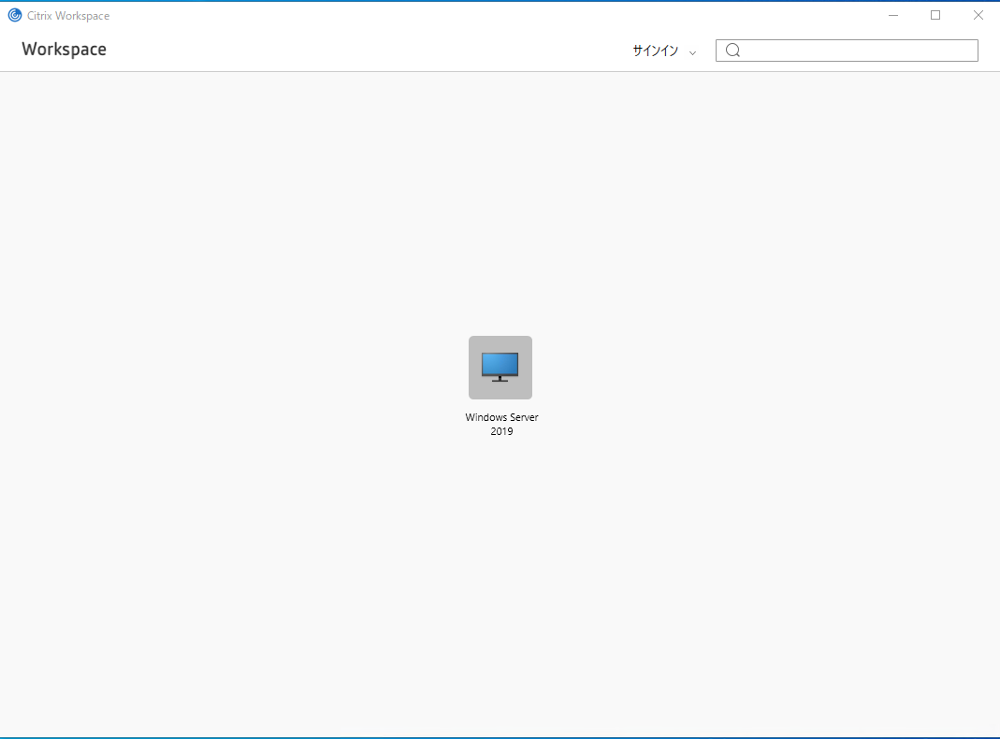

## 有効化するためにはストアの再作成が必要

この件について Citrix のテクニカルサポートに確認しましたが、**Citrix Virtual Apss 1912 LTSR で統合エクスペリエンスを有効化するにはストアを再度作成する必要がある**ようです。

Delivery Controller を設定した際にサイトが作成されますが、このサイトではデフォルトで **無効** に設定されています。

1903 以降で「クラシックユーザーエクスペリエンス」が廃止になったことが背景にあるようです。

## ストアの再作成手順

**ストアを再作成することで StoreFront の設定が消えてしまいますので、まずは現在の設定を確認しておきましょう**。

ストアを右クリックし、[ストアの削除] を選択します。

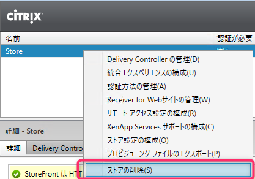

ストアが削除されるので、右ペインから [ストアの作成] をクリックします。

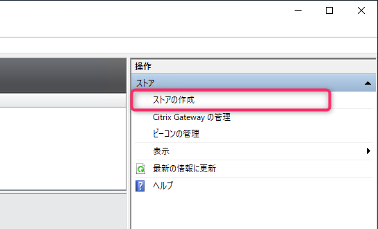

[次へ] をクリックします。

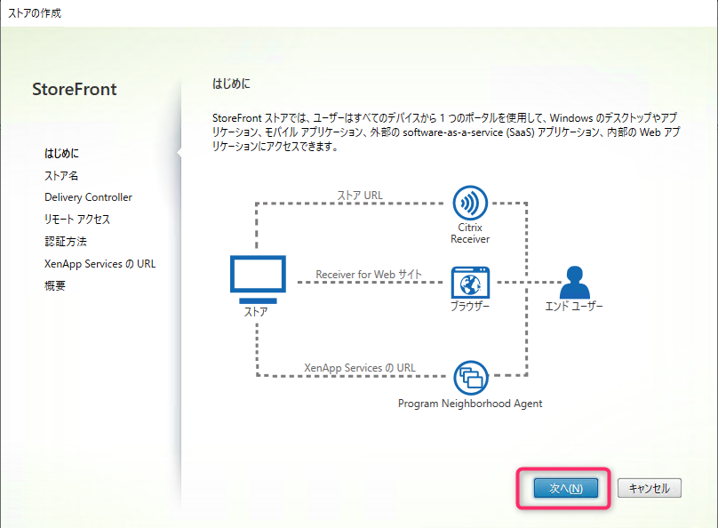

ストア名を入力し、[次へ] をクリックします。
**デフォルトと同じサイト URL にしたい場合は `Store` を設定**してください。
また、ベース URL を FQDN 等に設定している場合は `この Receiver for Web サイトを IIS のデフォルトサイトとして設定する` にチェックを入れます。

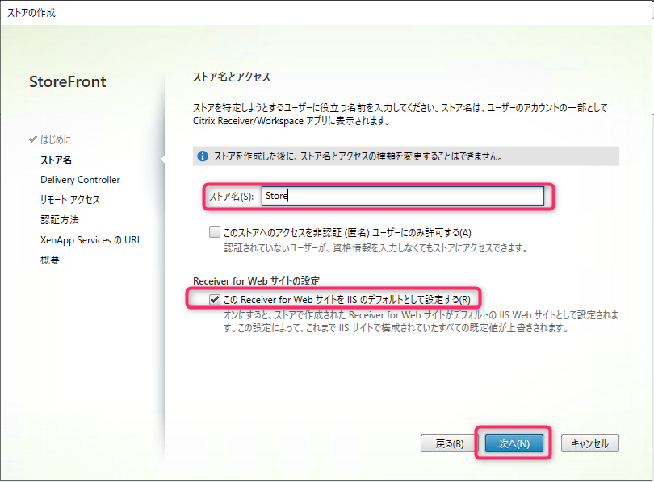

Delivery Controller を追加して [次へ] をクリックします。

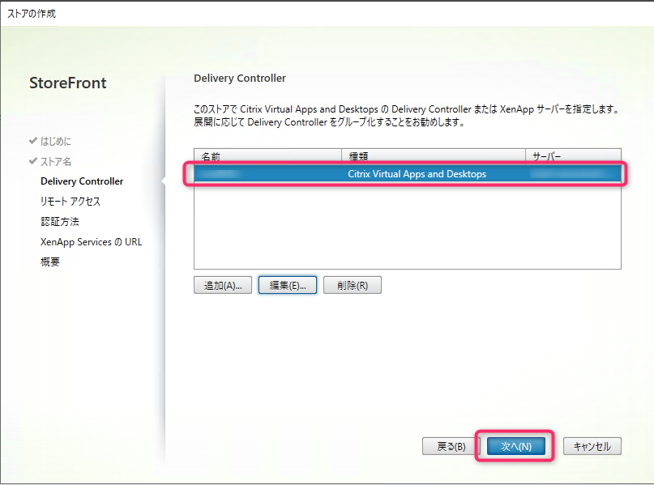

あとは、ウィザードに従いお使いの環境に合わせてセットアップを行えば完了です。

Citrix Workspace からアクセスすると Citrix Receiver for Web サイトと同様のインターフェースが表示されると思います。
※**Citrix Workspace に登録したアカウント情報を再設定する必要があります**。

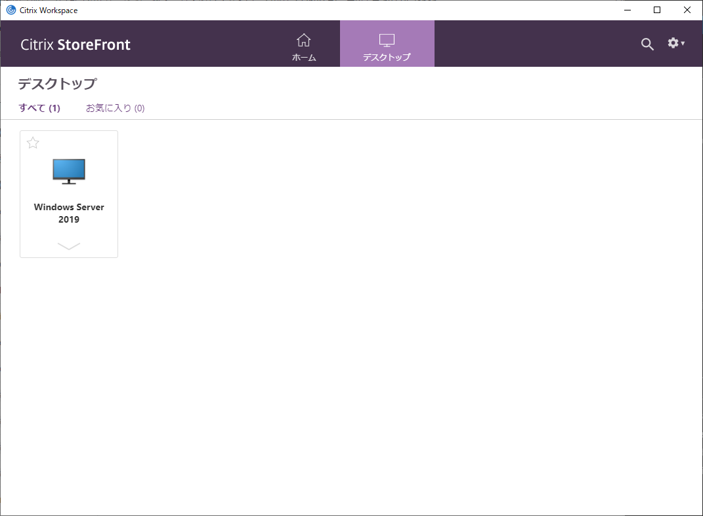

## 【おまけ】StoreFront の UI をカスタマイズ

本来は Receiver for Web サイトの設定ですが、統合エクスペリエンスを有効化することで StoreFront の外観をカスタマイズすることができます

右ペインから [Receiver for Web サイトの管理] をクリックし、[外観のカスタマイズ] を設定します。

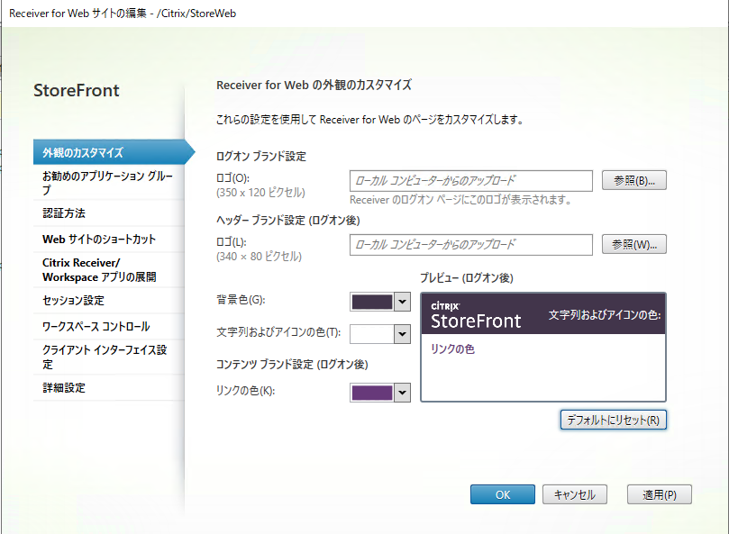

すると下記のような感じでユーザー環境にあったインターフェースを設定することができます。

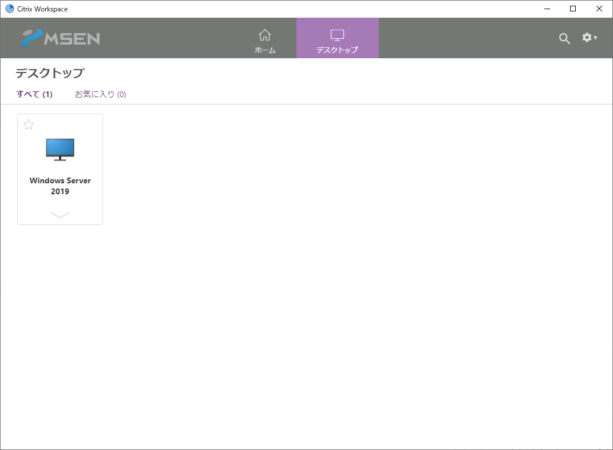

みなさんもいい感じにカスタムしてみてください。

ではまた。
