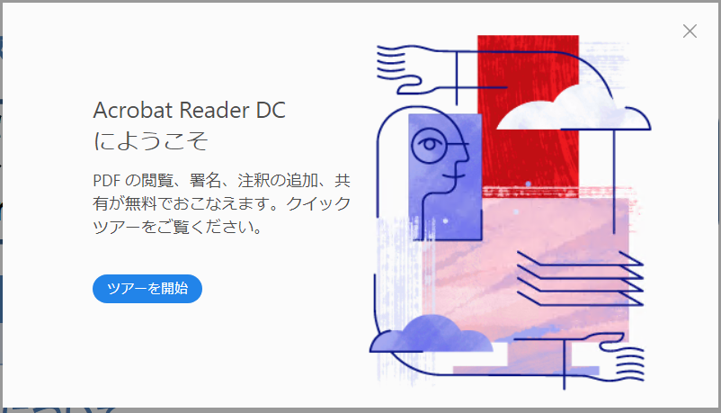
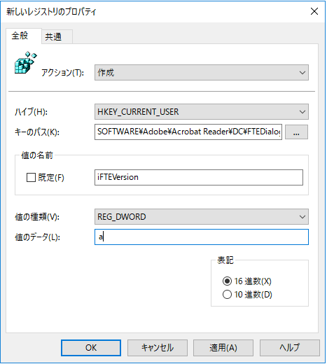
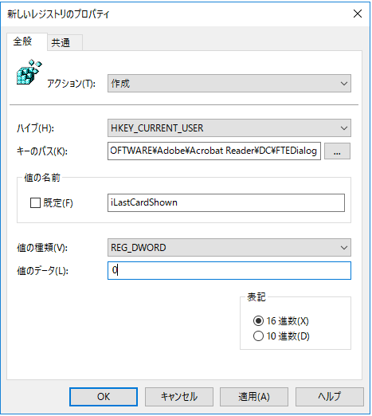
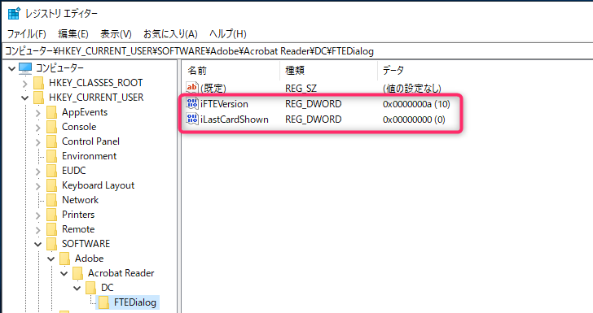

こんにちは、じんないです。

PDF ファイルの閲覧に [Adobe Acrobat Reader](https://get.adobe.com/jp/reader/) を使われている方は多いかと思います。

Adobe Acrobat Reader DC では、初回の起動時に `Acrobat Reader DC にようこそ` というツアー画面が表示されます。

通常使われている PC では、一度ツアーを開始すると次回以降は表示されませんが、**シンクライアントで固定プロファイル使っている場合や復元環境の端末ではプロファイルが初期化されてしまうためにこのツアー画面が毎回表示されてしまうことがあります**。

このツアー画面はレジストリから非表示とすることができます。今回は**グループポリシーからツアー画面を非表示にするレジストリを作成する方法**をご紹介します。

## 環境
- Windows Server 2019 Standard
- Adobe Acrobat Reader DC (2020.009.20063)

## ツアー画面を非表示とするレジストリ値

このツアー画面のレジストリはユーザー固有の設定となっているので、`HKEY_CURRENT_USER` に格納されています。

**`[HKEY_CURRENT_USER\SOFTWARE\Adobe\Acrobat Reader\DC\FTEDialog]`**

- `iFTEVersion=0000000a (REG_DWORD)`
- `iLastCardShown=00000000 (REG_DWORD)`

上記のキーと値を設定することでツアー画面が非表示になります。

## グループポリシーから設定する

せっかくなのでグループポリシーから設定します。

ユーザーに対する設定なので、**適用したいユーザーが格納されている OU に対しグループポリシーオブジェクトを作成**します。

**`ユーザーの構成 > 基本設定 > Windows の設定 > レジストリ`**

レジストリ項目を新規作成します。

- アクション: 作成
- ハイブ: HKEY_CURRENT_USER
- キーのパス: SOFTWARE\Adobe\Acrobat Reader\DC\FTEDialog
- 値の名前: iFTEVersion
- 値の種類: REG_DWORD
- 値のデータ: a

同様に `iLastCardShown` も作成します。

グループポリシーを設定後、対象のユーザーでログオンすると、先ほど設定したレジストリが作成されていました。また、この状態で PDF ファイルを開くとツアー画面が表示されないことも確認しました。

プロファイルのカスタマイズが必要になった場合も、このように設定項目さえ分かればグループポリシーから設定することも可能です。

ご参考にしていただければ幸いです。

ではまた。

## 参考

[解決済み: PDFを開こうとすると「看看全新的」と表示されて困ります。 - Adobe Support Community - 10129255](https://community.adobe.com/t5/acrobat-reader-acrobat-dc-for/pdf%E3%82%92%E9%96%8B%E3%81%93%E3%81%86%E3%81%A8%E3%81%99%E3%82%8B%E3%81%A8-%E7%9C%8B%E7%9C%8B%E5%85%A8%E6%96%B0%E7%9A%84-%E3%81%A8%E8%A1%A8%E7%A4%BA%E3%81%95%E3%82%8C%E3%81%A6%E5%9B%B0%E3%82%8A%E3%81%BE%E3%81%99/td-p/10129255?profile.language=ja&page=1)
