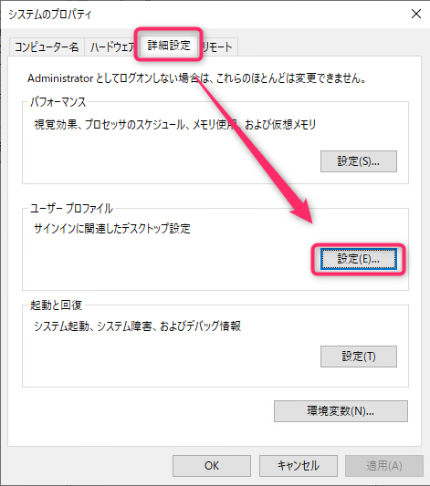
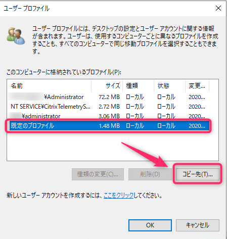
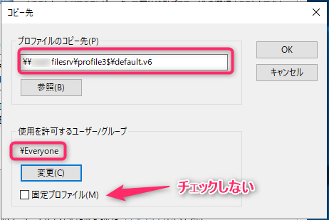
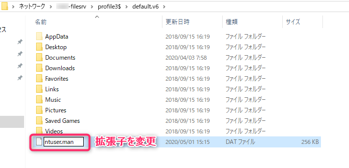
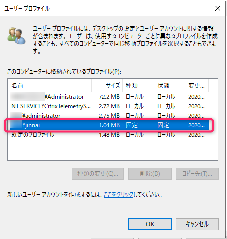
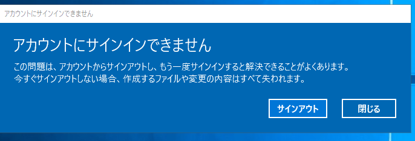

こんにちは、じんないです。

今回はリモートデスクトップサービス (RDS) 環境で**グループポリシーから固定ユーザープロファイルを構成する方法**を紹介します。

**固定ユーザープロファイルとは、ログオンするすべてのユーザーが同じデスクトップ環境になるプロファイル形式**です。

テンプレートとなるプロファイルを用意しておき、ユーザーがログオンしたときにテンプレートからプロファイルをコピーし、**ログオフ時にユーザーによるプロファイルの変更を破棄します**。ですので、ログオン後に壁紙を変えたり、デスクトップにファイルを置いたりしてもログオフするとすべて元に戻ってしまいます。

学校の PC 教室や図書館にあるクライアント端末など不特定多数のユーザーがログオンする環境に適しているプロファイル形式です。

移動ユーザープロファイルが多いのか、あまり例が無かったので記事にしておきます。

デフォルトプロファイルのチューニングについては触れませんのでご了承ください。

## 環境

- リモートデスクトップセッションホスト: Windows Server 2019

デフォルトのプロファイルはファイルサーバー上の共有フォルダに配置する想定です。
事前に共有フォルダを構成しておいてください。

## テンプレートプロファイルの作成

リモートデスクトップセッションホストに Administrator 権限をもつユーザーでログオンします。

[システムのプロパティ] > [詳細設定] からユーザープロファイルの [設定] を開きます。

今回は既定のプロファイルをテンプレートに設定します。[既定のプロファイル]を選択し、[コピー先]をクリックします。

下記のとおり設定し、[OK] をクリックします。

- プロファイルのコピー先
**`\\<共有パス>\<任意のテンプレート名前>.v6`** 
今回の例では `default.v6` としていますが、Windows Server 2016 以降では必ず末尾を **`.v6`** 形式としてください。
- 使用を許可するグループ
`Everyone`
- 固定プロファイル
**チェックを入れない**

これで共有フォルダ上にテンプレート用のプロファイルがコピーされました。
続いて `ntuser.dat` の拡張子を `ntuser.man` に変更します。man は mandatory の略称で、必須のプロファイルを意味します。`.man` 形式とすることで読み取り専用のプロファイルとなります。

## グループポリシーの設定

リモートデスクトップセッションホストに適用されるようにグループポリシーオブジェクト (GPO) を作成し、下記のとおり設定します。

**[コンピューターの構成] > [ポリシー] > [管理用テンプレート] > [Windows コンポーネント] > [リモートデスクトップサービス] > [リモートデスクトップセッションホスト] > [プロファイル]**

- **RD セッション ホスト サーバー上の固定プロファイルを使用する: 有効**
- **リモート デスクトップ サービス移動ユーザー プロファイルのパスを指定する: 有効**
プロファイルパス: `\\<共有パス>\<テンプレート名>`
ここでの注意点ですが、**プロファイルパスでは `.v6` は省略します**。
今回の例だと `\\共有パス\default` となります。  

[RD セッション ホスト サーバー上の固定プロファイルを使用する] を有効にした場合は、[リモート デスクトップ サービス移動ユーザー プロファイルのパスを指定する] で指定したパスが固定プロファイルのルートフォルダとなります。

管理上下記のポリシーも設定しておきます。

**[コンピューターの構成] > [ポリシー] > [管理用テンプレート] > [システム] > [ユーザープロファイル]**

- **Administrators セキュリティ グループを移動ユーザー プロファイルに追加する: 有効**
- **移動プロファイル フォルダーのユーザー所有権を確認しない: 有効**
- **一時記憶された移動プロファイルのコピーを削除する: 有効**

## 動作確認

リモートデスクトップセッションホストにリモートデスクトップ接続してみます。

別のセッションで Administrator 権限をもつユーザーでログオンしプロファイルの状態を確認します。

プロファイルの状態と種類が **固定** となっていれば成功です。

デスクトップに何かファイルを作成し、ログオフ → ログオンしてみると作成したファイルが消えていることを確認できると思います。

### 「アカウントにサインインできません」となった場合

リモートデスクトップ接続したあと、「アカウントにサインインできません」とダイアログが表示された場合は一時プロファイル `C:\users\temp` でログオンしている状態です。
こちらも固定ユーザープロファイルと同様にログオフすると中身が破棄されますが、テンプレートで設定した内容は反映されていないので正しく固定ユーザープロファイルが設定できていないことを表しています。
作成したテンプレートにログオンしているユーザーの権限でアクセスができるか、パスが間違っていないかなどを確認してみてください。

## 参考

[必須のユーザープロファイルを作成する (Windows 10) - Windows Client Management | Microsoft Docs](https://docs.microsoft.com/ja-jp/windows/client-management/mandatory-user-profile)

[固定ユーザープロファイルを作成する方法（Windows10 1703対応） - Qiita](https://qiita.com/mkht/items/23bfc6cb7e9644960730)