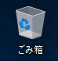
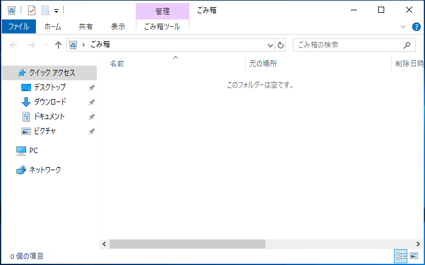
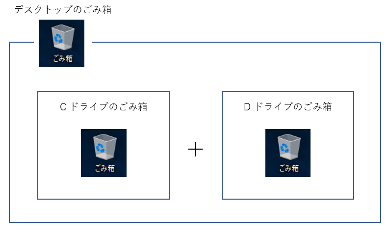
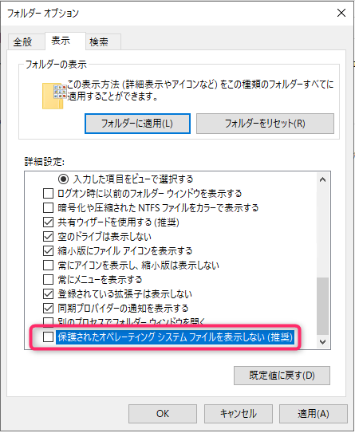
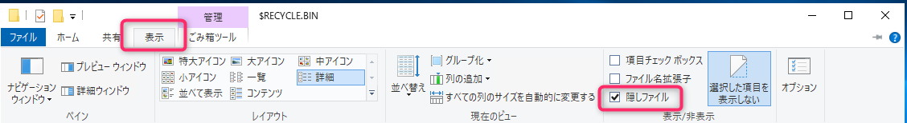
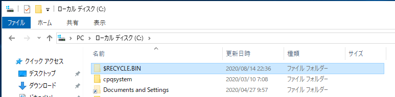
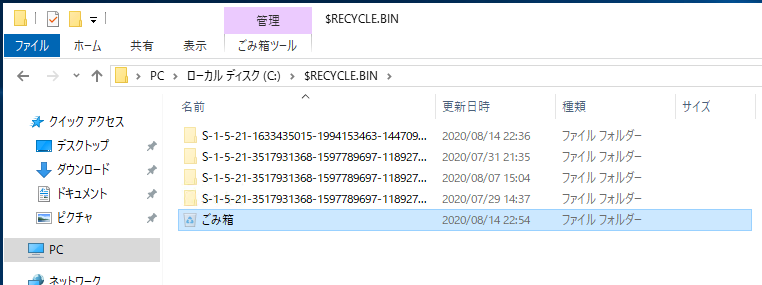
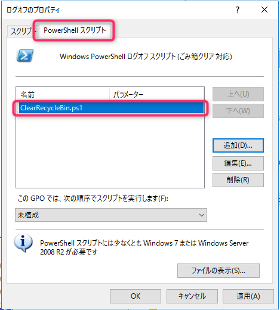

こんにちは、じんないです。

今回は **PowerShell の Clear-RecycleBin コマンドレットを使って、ごみ箱内のファイルを削除する方法**を紹介します。

## 環境

- Windows Server 2019 
- PowerShell 5.1

## ごみ箱の実体

今回のテーマは知らない人はいないくらい、いつもデスクトップの左上に鎮座している例のごみ箱です。



ファイルを削除したり、ドラッグ&ドロップでごみ箱にファイルを投げ入れたりすると一時的に格納しておくことができる便利な**仮想ディレクトリ**です。

ごみ箱をエクスプローラーで開いてみても、パスは [ごみ箱] となっているだけで実際はどこにあるのかわかりません。正確には知る必要がないと言った方がよいかもしれないです。



ごみ箱の物理パスは `<drive>\$Recycle.Bin\<SID>` です。**ごみ箱はドライブごとに用意されており、そのドライブごとのごみ箱を結合したものがデスクトップの左上に鎮座している例のごみ箱となるわけです**。先に仮想ディレクトリと述べた理由がこれにあたります。



ごみ箱の実体はデフォルトでは表示されないようになっているので、表示させたい場合は下記の手順を実施してください。

エクスプローラーを起動し、フォルダーオプションから [保護されたオペレーティングシステムファイルを表示しない(推奨)] のチェックを外します。



[表示] タブから [隠しファイル] のチェックを入れます。



C ドライブにアクセスするとごみ箱が表示されていること確認できます。



`s-15-21-***` と始まるのが SID と呼ばれ、ここでは他のユーザーのごみ箱がそのように表示されています。基本的には他のユーザーのごみ箱にはアクセスできないようになっています。



**ここで重要なのはごみ箱はユーザープロファイルに依存しないということです**。本来、ユーザー個人の領域は `C:\users\<ユーザー名>` 配下に格納されますが、ごみ箱に関してはドライブごとに保持されるため、ユーザープロファイルには依存しません。

そのため、**固定ユーザープロファイルを採用している場合などには注意が必要**となります。

**※固定ユーザープロファイルの場合、サインアウトするとプロファイル領域は削除されるが、ごみ箱内のファイルは削除されない動作となる。**

## PowerShell コマンドからごみ箱をクリアする

PowerShell 5.1 では `Clear-RecycleBin` コマンドレットが用意されており、ごみ箱内のファイルを削除することができます。

下記は C ドライブのごみ箱を削除する例です。

`Clear-RecycleBin -DriveLetter C`

`-DriveLetter <drive>` で指定したドライブのごみ箱をクリアすることができます。指定しない場合はすべてのごみ箱をクリアします。

またデフォルトでは下記のように本当に削除するのか確認が求められるので、強制する場合は `-Force` オプションを追加します。

```shell
Confirm
Are you sure you want to perform this action?
Performing the operation "Clear-RecycleBin" on target "All of the contents of the Recycle Bin".
[Y] Yes  [A] Yes to All  [N] No  [L] No to All  [S] Suspend  [?] Help (default is "Y"):
```

ログオフスクリプト等に組み込めばサインアウトする際にごみ箱をクリアするなのど動作が実現できます。

ごみ箱のクリアは、`rd` コマンドレットを使ってでも実現できますが、自身のごみ箱だけを削除する場合は SID を確認し物理パスを指定した上で削除する必要があります。

※ SID を指定せずに `rd /s /q c:\$Recycle.Bin` 等でクリアした場合は**すべてのユーザーのごみ箱を削除する動作**となります。

対して `Clear-RecycleBin` コマンドレットでは**自身のごみ箱のみを削除する動作**となるため他のユーザーに影響を及ぼしません。これが `Clear-RecycleBin` のイケてるポイントだと思います。

固定ユーザープロファイルを構成しており、サインアウト時にごみ箱をクリアしたいという場合には `Clear-RecycleBin` コマンドレット活用されてみてはいかがでしょうか。

## 【おまけ】グループポリシーからログオフスクリプトとしてごみ箱を削除する例

先ほどの `Clear-RecycleBin` コマンドレットで PowerShell スクリプトを作成し、グループポリシーからログオフスクリプトとして設定する例をご紹介します。

まずは下記のようなスクリプトを作成します。

- ClearRecycleBin.ps1

```
Clear-RecycleBin -Force
```

バックグラウンドで実行するため、必ず `-Force` オプションを指定します。

作成したスクリプトをグループポリシーに設定します。

`[ユーザーの構成] > [ポリシー] > [Windows の設定] > [スクリプト] > [ログオフ]`

[PowerShell スクリプト] タブを選択し、作成したスクリプト `ClearRecycleBin.ps1` を追加します。



これでユーザーがログオフしたときにごみ箱が削除される動作となります。

## 参考

[Clear-RecycleBin (Microsoft.PowerShell.Management) - PowerShell | Microsoft Docs](https://docs.microsoft.com/en-us/powershell/module/microsoft.powershell.management/clear-recyclebin?view=powershell-5.1)

[Windowsの「ごみ箱」の中身はどこに保存されている？ - 道すがら講堂](https://michisugara.jp/archives/2013/trash_can.html)
