こんにちは、じんないです。

Active Directory にはごみ箱機能があり、その機能を有効化することで**ユーザーやセキュリティグループ、コンピューターなどのオブジェクトを削除した場合でも一定期間復元することができます**。

今回は Active Directory ごみ箱機能を有効化する方法と削除されたオブジェクトの方法など実際の動きをご紹介します。

## 環境

- Windows Server 2012 R2

## Active Directory ごみ箱機能

オブジェクトは削除されると、**2つのフェーズに移行したあと Active Directory 上から完全に削除**されます。このフェーズによって、復元できる内容が異なるので注意が必要です。

削除されたオブジェクトは、まず、**削除されたオブジェクトの有効期間** というフェーズに移行します。この期間はデフォルトで180日です。この期間内であれば、オブジェクトは **SID や属性を含め完全に復元**することができます。
そのあと、**Tombstone 有効期間** というフェーズに移行します。この期間もデフォルトは180日です。この期間に突入する際に**多くの属性が削除され、SID のみが復元**できる状態となります。

<a href="images/how-to-enable-the-active-directory-recycle-bin-1.png">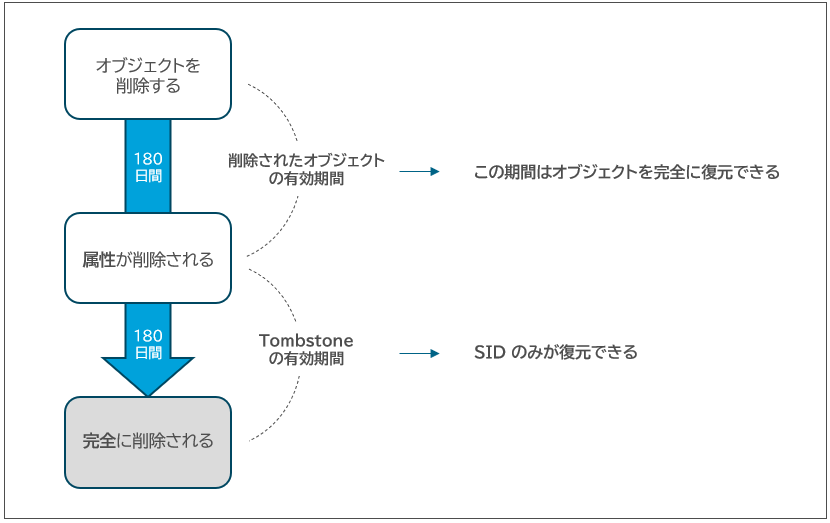</a>

**Active Directory ごみ箱機能はデフォルトでは無効**となっているため、有効化しなければなりません。

### ごみ箱機能の有効化による影響

調査した限り致命的な影響は見つかりませんでしたが、**Active Directory ごみ箱機能は一度有効化すると無効化することはできません**。どうしても無効化する場合は Active Directory のフォレスト全体のリストアが必要となります。

すべてのドメインコントローラーで完全にバックアップ (Windows Server バックアップ などで) を取得しておくことをおすすめします。

[AD フォレストの回復 - 手順 | Microsoft Docs](https://docs.microsoft.com/ja-jp/windows-server/identity/ad-ds/manage/ad-forest-recovery-procedures)

[AD フォレストの回復-サーバーの完全回復の実行 | Microsoft Docs](https://docs.microsoft.com/ja-jp/windows-server/identity/ad-ds/manage/ad-forest-recovery-perform-a-full-recovery)

## ごみ箱機能の有効化

Active Directory ごみ箱機能は Active Directory 管理センターから有効化します。

Active Directory 管理センターを起動し、右ペインにある [ごみ箱の有効化...] をクリックします。

<a href="images/how-to-enable-the-active-directory-recycle-bin-2.png">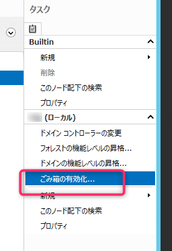</a>

[OK] をクリックします。

<a href="images/how-to-enable-the-active-directory-recycle-bin-3.png">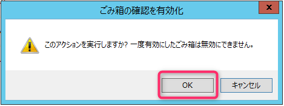</a>

[OK] をクリックします。Active Directory ドメインコントローラーが複数ある場合は、すべてのドメインコントローラーで複製が完了するまでしばらく待ちましょう。

<a href="images/how-to-enable-the-active-directory-recycle-bin-4.png">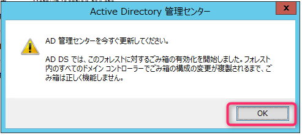</a>

Active Directory 管理センター上に `Deleted Objects` というコンテナーが出現していると思います。これがいわゆるごみ箱です。

<a href="images/how-to-enable-the-active-directory-recycle-bin-5.png">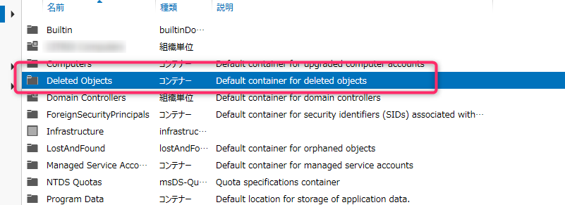</a>

## オブジェクトを削除してみる

試しに、ユーザー `jinna-i` を削除してみます。復元の確認しやすいよう、事前に所属しているセキュリティグループや SID を確認しておきます。

セキュリティグループは **`Domain Users`** と **`jinna-i-group`** に所属しています。

<a href="images/how-to-enable-the-active-directory-recycle-bin-6.png">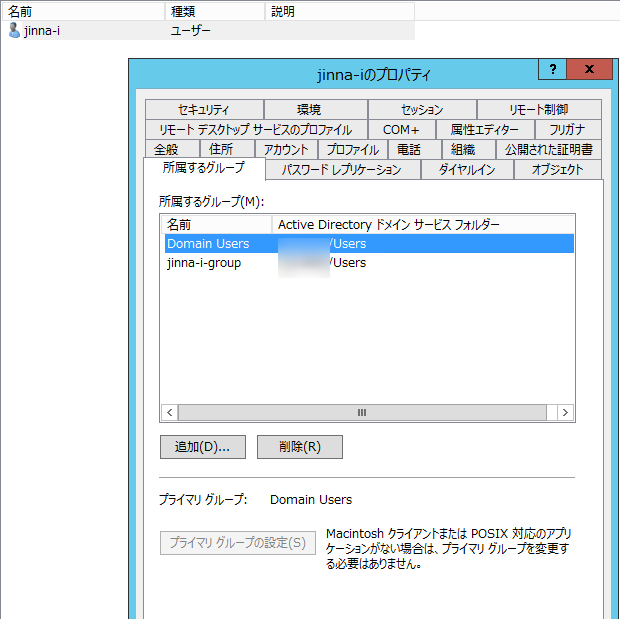</a>

属性エディタータブから `objectSid` を確認します。**属性エディタータブが無い場合は、Active Diretory ユーザーとコンピューターの [表示] > [拡張機能] を有効化すると表示される**ようになります。

見切れていて恐縮ですが SID は `S-1-5-21-386949308-3539448719-3028307002-1127` であることがわかりました。

<a href="images/how-to-enable-the-active-directory-recycle-bin-7.png">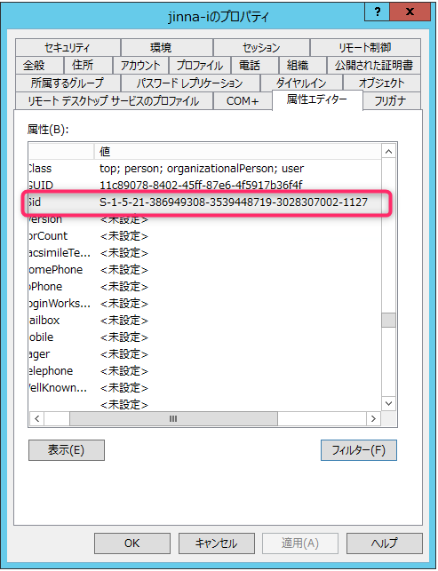</a>

では早速、ユーザーを削除します。

<a href="images/how-to-enable-the-active-directory-recycle-bin-8.png">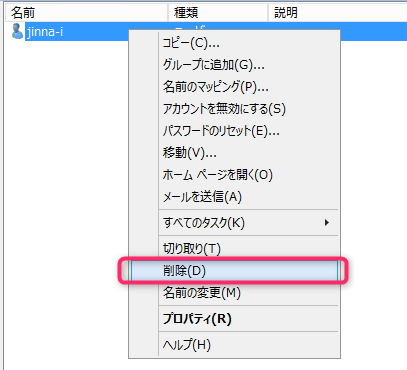</a>

Active Directory 管理センターに戻り、`Deleted Objects` コンテナーを確認します。削除したユーザー `jinna-i` が格納されています。

<a href="images/how-to-enable-the-active-directory-recycle-bin-9.png">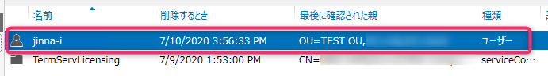</a>

## オブジェクトの復元方法
### GUI による復元

削除されたオブジェクトは **Active Directory 管理センターから GUI で復元が可能**です。

`Deleted Objects` コンテナーから復元したいオブジェクトを選択し、右ペインの [復元] をクリックします。いたって簡単です。

<a href="images/how-to-enable-the-active-directory-recycle-bin-10.png">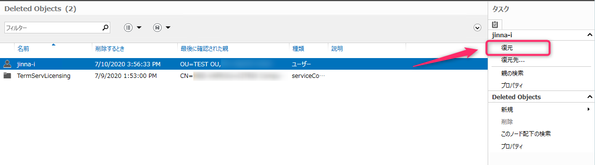</a>

Active Directory ユーザーとコンピューターに戻ると、先ほど復元したユーザー `jinna-i` が元の場所に格納されています。

<a href="images/how-to-enable-the-active-directory-recycle-bin-11.png">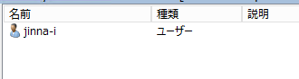</a>

所属するセキュリティグループもそのまま復元できており、SID も同じ番号となっていました。つまり同一のオブジェクトであると言えます。

<a href="images/how-to-enable-the-active-directory-recycle-bin-12.png"></a>

<a href="images/how-to-enable-the-active-directory-recycle-bin-13.png">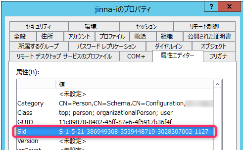</a>

パスワードの有効期限が切れていなければこの状態でログオンできます。

### PowerShell による復元

**PowerShell コマンドでも復元が可能**です。

まずは削除されたオブジェクトを確認します。ドメイン名は `jinna-i.local` になりますので、適宜読み替えてください。

```cmd
PS C:\Users\Administrator> Get-ADObject -LDAPFilter "(Name=*)" -SearchBase "cn=Deleted　Objects,DC=jinna-i,DC=local" -Includ
eDeletedObjects

Deleted           : True
DistinguishedName : CN=jinna-i\0ADEL:11c89078-8402-45ff-87e6-4f5917b36f4f,CN=Deleted Objects,DC=jinna-i,DC=local
Name              : jinna-i
                    DEL:11c89078-8402-45ff-87e6-4f5917b36f4f
ObjectClass       : user
ObjectGUID        : 11c89078-8402-45ff-87e6-4f5917b36f4f
```

ユーザー名 `jinna-i` を指定して復元します。

```cmd
PS C:\Users\Administrator> Get-ADObject -Filter {displayName -eq "jinna-i"} -IncludeDeletedObjects | Restore-ADObject
```

復元したいオブジェクトが多数ある場合は PowerShell コマンドの方が楽かもしれませんね。


## あとがき

ユーザーやセキュリティグループを誤って削除してしまうと、共有フォルダーのアクセス権などにも影響が出てしまいます。

同じ名前のユーザーやセキュリティグループを作り直しても、SID が異なるため元通りになることはありません。

Active Directory ごみ箱機能を有効化しておけば、万が一の時に役立つことがあるかもしれません。

ではまた。