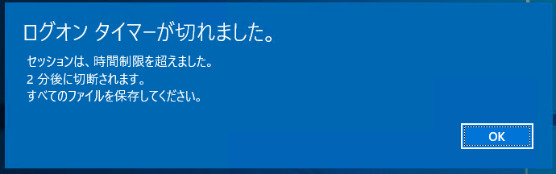
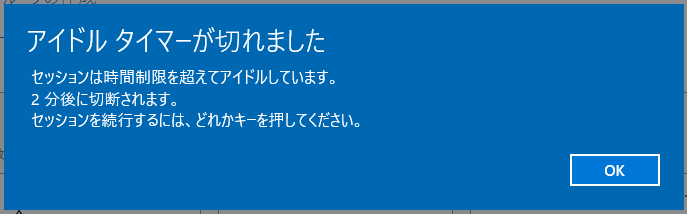

こんにちは、じんないです。

今回はリモートデスクトップサービス (RDS) を使っている場合において、**リモートデスクトップのセッション時間 (タイムアウト) をグループポリシーから制限する方法**を紹介します。

例えば、リモートデスクトップが利用可能なユーザーの総数が100名で、そのうち同時接続数が50名と想定される場合、100名分のリソースが用意されていることは少く、たいていは常時接続が見込まれる分のリソースであることが多いかと思います。

セッションの制限を設けていない場合、使用したいユーザーがいるにもかかわらずアイドル状態など使用していないユーザーの影響で、使いたいときに使えないといった問題が生じてしまう可能性があります。そのような事態を避け、限られたリソースを効率よく使用するために、セッション時間の制限を設けることをおすすめします。

## 環境

- リモートデスクトップサービス環境: Windows Server 2019

## セッション時間を制限する

グループポリシーから設定可能なセッションタイムアウトは下記の3種類です。
これらのタイムアウトを組み合わせてお使いの環境にあったものを採用してください。

なお、各ポリシーのパスは `[コンピューターの構成]-[ポリシー]-[管理用テンプレート]-[Windows コンポーネント]-[リモートデスクトップサービス]-[リモートデスクトップサービスセッションホスト]-[セッション時間の制限]` です。

タイムアウトの種類 | タイムアウト後の動作 | 内容 | ポリシー名
-- | -- | -- | --
接続タイムアウト | 切断 | セッション開始から設定時間経過後にセッションを切断する | アクティブなリモートデスクトップサービスセッションの制限時間を設定する
アイドルタイムアウト | 切断 | アイドル状態になってから設定時間経過後にセッションを切断する | アクティブでアイドル状態になっているリモートデスクトップサービスセッションの制限時間を設定する
切断タイムアウト | 終了 (ログオフ) | セッションが切断されてから設定時間経過後に終了 (ログオフ) する | 切断されたセッションの制限時間を設定する

各タイムアウトで設定できる時間は下記のとおりです。

単位 | 時間
-- | --
- | なし
分 | 1分、5分、10分、15分、30分
時間 | 1時間、2時間、3時間、6時間、8時間、12時間、16時間、18時間
日 | 1日、2日、3日、4日、5日

また、**接続タイムアウト**および**アイドルタイムアウト**については、**下記のポリシーを有効化することで設定時間経過後に切断する代わりに終了 (ログオフ) することができます**。
タイムアウト後のセッションを残しておきたくない場合は併せて有効化しておきましょう。

- `制限時間に達したらセッションを終了する`

それでは各タイムアウトの動作を見ていきます。

### 接続タイムアウト

**接続タイムアウトは使用中であろうがなかろうが、設定した時間が経過すると切断されます**。

- 設定するポリシー
`アクティブなリモートデスクトップサービスセッションの制限時間を設定する`

設定時間が経過すると下記のダイアログが表示され、2分後に切断されます。無慈悲にも延長の余地はありません。

### アイドルタイムアウト

**アイドルタイムアウトは、文字通りキーボードやマウスの入力が無くなった場合 (アイドル状態になった) に設定した時間が経過すると切断されます**。

- 設定するポリシー
`アクティブでアイドル状態になっているリモートデスクトップサービスセッションの制限時間を設定する`

設定時間が経過すると下記のダイアログが表示されます。しかし、先ほどの接続タイムアウトと異なり、操作を続けるとタイムアウトは免れることができます。

### 切断タイムアウト

先に記載したとおり、接続タイムアウトとアイドルタイムアウトは設定時間が経過後、切断される動作となりますので、再度接続するとセッションを再開することができます。

**その「切断されたセッションをいつまで残しておくのか」というのがこの切断タイムアウトです**。このタイムアウトを設定すると、設定時間経過後に切断されたセッションが終了 (ログオフ) します。

- 設定するポリシー
`切断されたセッションの制限時間を設定する`

例えば、この**切断タイムアウトを1分に設定**したと仮定します。セッションを切断後、**1分以内に再度ログオンすれば切断されたセッションに再接続できますが、1分を超えてしまうと切断されたセッションが破棄される**ので新規のセッションとなってしまいます。

## 設定例

> 「リモートデスクトップの使用中はタイムアウトさせたくないが、アイドル状態になった場合は他のユーザーのこともあるので15分で切断させたい。そして1分後には切断されたセッションは破棄してもいいかな。」

上記のような場合は下記のポリシーを設定することで実現できます。

ポリシー名 | 設定値
-- | --
アクティブなリモートデスクトップサービスセッションの制限時間を設定する | 無効
アクティブでアイドル状態になっているリモートデスクトップサービスセッションの制限時間を設定する | 15分
切断されたセッションの制限時間を設定する | 1分
制限時間に達したらセッションを終了する | 無効

その他、お使いの環境に合わせてポリシーを設定してみてください。

ではまた。