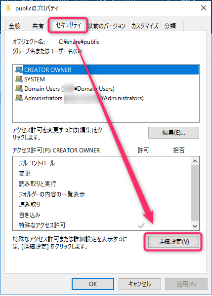
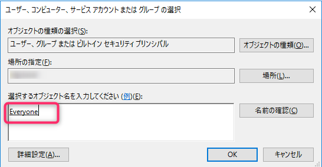

こんにちは、じんないです。

昨今、不正アクセスや悪意のあるユーザーによる業務ファイルの情報漏洩が問題となっています。

ファイルサーバーの共有フォルダーに適切なアクセス権限を設定することはもちろんですが、アクセスが許可されたユーザーによるファイル操作は防ぐことはできません。

そこで、**「誰が」「いつ」「どのファイルにアクセスしたのか」というファイルのアクセスログ**を取得しておくことは、万が一インシデントが発生した際にとても重要になってきます。

市販のソフトウェアを使用することでファイルアクセスログを取得・閲覧することが容易になりますが、**監査設定を有効化することで Windows Server 標準の機能でもある程度のログを取得することが可能**になります。

今回は **Windows Server 2016 に構成した共有フォルダーに監査を有効化し、「誰が」「いつ」「どのファイルにアクセスしたのか」をセキュリティログに出力させる方法**を紹介します。

※ファイルアクセスログの解析や監査内容のチューニングについては触れませんのでご了承ください。

## 想定環境
- ファイルサーバー: Windows Server 2016 Standard
- 共有フォルダー: `C:\share\public`

## 監査ポリシーの設定
### 監査ポリシーのバックアップ

まずは監査ポリシーをバックアップします。バックアップしておくことで、後から一括で復元することができます。

コマンドプロンプトを管理者権限で起動し、下記のコマンドを実行します。

`auditpol /backup /file:C:\auditpol_backup.csv`

`/file:` 以降はバックアップファイルの出力先となりますので任意のパスで OK です。

### 監査ポリシーの有効化

ファイルアクセスの監査を行うには **"ファイル システム" と "ハンドル操作" のポリシーを有効化**する必要があります。

まずは現在の管理ポリシーを下記のコマンドで確認します。

`auditpol /get /category:*`

デフォルトでは "ファイル システム" と "ハンドル操作" のポリシーは **`監査なし`** に設定されています。

監査を有効化するために下記の2つのコマンドを実行します。

`auditpol /set /subcategory:"ファイル システム" /success:enable /failure:enable`
`auditpol /set /subcategory:"ハンドル操作" /success:enable /failure:enable`

再度ポリシーを確認すると "ファイル システム" と "ハンドル操作" のポリシーは **`成功および失敗`** に変更されていることがわかります。

## システムアクセス制御リスト (SACL) の作成

ファイルアクセスの監視には前項のポリシーの有効化に加え、監視対象の共有フォルダーに対してシステムアクセス制御リスト (SACL) を作成する必要があります。

今回は例として共有フォルダー `C:\share\public` に対して実施します。

フォルダーのプロパティから [セキュリティ] タブを参照し、[詳細設定] をクリックします。

[監査] タブから [追加] をクリックします。

プリンシパルを選択します。

監査対象のユーザーやセキュリティグループを指定します。今回は Everyone を対象としました。
※ Everyone とすることで Administrator も監査対象となります。

種類は "成功" を指定し、[高度なアクセス許可を表示] をクリックします。

記録したい監査項目を選択します。ここは**読み取り系や書き込み系など監査したい系統に応じてチューニングが必要**となる部分です。
今回はすべての監査を有効化しています。出力されるログが大量になるので注意が必要です。
`このコンテナー内のオブジェクトまたはコンテナーのみにこれらの監査設定を適用する` にチェックを入れると、直下のフォルダやファイルのみに監査設定が適用されます。下位フォルダーへ継承したい場合はこのチェックは入れないことをお勧めします。

他にも監査対象の共有フォルダーがある場合は、これらの操作を繰り返してください。

## イベントログの設定変更

監査を有効化することで、セキュリティログが大量に記録されます。デフォルトの設定ではログが上書きされてしまうので、アーカイブするように変更します。

イベントログ (Security) のプロパティから "最大ログサイズ" や "イベントログサイズが最大値に達したとき" の動作を設定します。
※ 環境に応じて設定を変更してください。

生ログはサイズも大きいので、下記の記事を参考に圧縮しておくことをおすすめします。

[\[PowerShell\] Windows のイベントログを7zで圧縮してローテーションする方法](https://mseeeen.msen.jp/how-to-rotate-windows-event-log/)

## 監査ログの参照

簡単にではありますが、ファイルアクセスログを確認方法を動作確認も兼ねて記載しておきます。

まずは下記の動作を行います。

2020/05/20 17:01:10 にユーザー:`user1` が共有フォルダー:`C:\share\public` にあるファイル:`testfile.txt` を開きます。

セキュリティログにファイルオープンを示す `イベント4656` が記録されました。必要な情報が記載されていることが分かります。

続いて下記の動作を行います。

2020/05/20 17:02:30 にユーザー:`user1` が共有フォルダー:`C:\share\public` にあるファイル:`testfile.txt` を編集し保存します。

セキュリティログにファイルアクセス(Read/Write/削除など)を示す `イベント4656` が記録されました。
先ほどの情報に加えアクセス情報に `WriteData(または AddFile)` が記録されていることが分かります。

完全に操作ログを解析するのは大変な作業になりますが、**「誰が」「いつ」「どのファイルにアクセスしたのか」** の情報はこれらのログで確認することが可能です。