こんにちは、じんないです。

Windows Server 2016 で Hyper-V を有効にし仮想マシンを稼働させていたのですが、ある日 Hyper-V ホストのディスクが枯渇していることに気づきました。

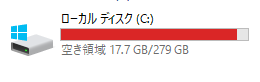

ディスク容量が増えている箇所を確認すると、Hyper-V の仮想マシンのチェックポイント (スナップショット) が肥大化していることが分かりました。

仮想マシンのディスクサイズは 100GB ですが、早い段階でチェックポイントを取得していたため、チェックポイント側のディスク容量がどんどん膨れ上がっていました。 

`.vhdx` が仮想マシン本体の親ディスクであり、`.avhdx` が仮想マシンチェックポイントの差分ディスクです。

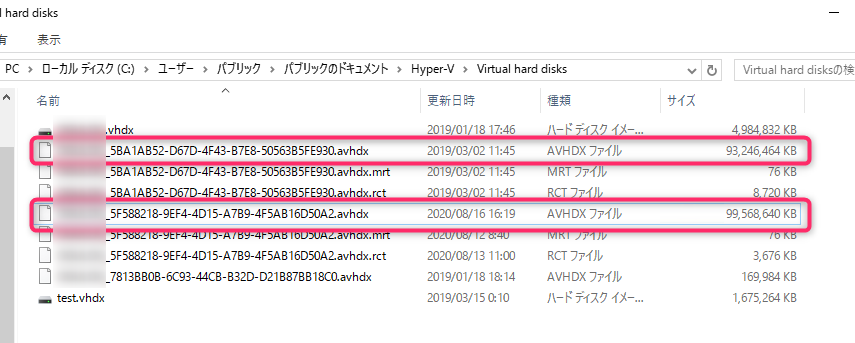

Hyper-V マネージャーから仮想マシンのチェックポイントを確認すると、3つほどチェックポイントがあることが分かりました。しかも1年以上も経過しています・・・

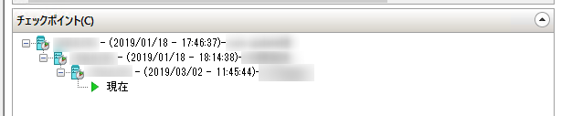

このチェックポイントを削除すればディスク枯渇は解消されるのですが、ここで一点 **問題** があります。

Hyper-V のチェックポイントを削除した際には差分ディスク(チェックポイント取得時に作成された .avhdx ファイル)の結合処理が行われます。

**ディスクの結合処理は、差分ディスクの内容を親ディスクに結合した後に差分ハードディスクが削除される動作となるため、Hyper-V ホストのディスクの空き容量が一時的に必要**となります。

つまり、Hyper-V ホストの空き容量が少ない環境では**チェックポイントの削除に失敗する**可能性があるわけです。

チェックポイントの削除に失敗するとディスクの不整合が発生し、最悪の場合仮想マシンが起動しなくなる恐れがあります。

今回はこのような場合に、**仮想マシンのチェックポイントを無停止でかつ安全に削除し、Hyper-V ホストサーバーのディスク枯渇を解消する方法**を紹介します。

具体的には下記のような流れです。

1. **退避場所を準備する**
1. **仮想ディスクを移行する (退避)**
1. **チェックポイントを削除し結合する**
1. **仮想ディスクを移行する (戻す)**

## 準備するもの

- **十分な空き容量がある外付け HDD**

なお、SMB3.0 をサポートしている場合、共有フォルダ上に移動することも可能なようです。

PowerShell から `get-smbconnection` を実行すると共有フォルダの SMB のバージョンを確認できます。

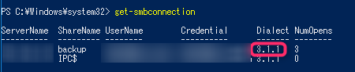

詳しくは下記を参照してください

[Windows Server の SMB 3 プロトコルを使用したファイル共有の概要 | Microsoft Docs](https://docs.microsoft.com/ja-jp/windows-server/storage/file-server/file-server-smb-overview)

[Deploy Hyper-V over SMB | Microsoft Docs](https://docs.microsoft.com/en-us/previous-versions/windows/it-pro/windows-server-2012-R2-and-2012/jj134187(v=ws.11))

## チェックポイントの削除手順
### 仮想ディスクの移行 (退避)

まずは、十分な空き容量のある外付け HDD などに仮想ディスクを移行します。

Hyper-V マネージャーを起動し、仮想マシン右クリック > [移動] をクリックします。

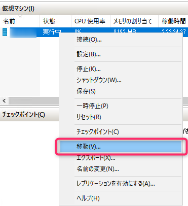

[次へ] をクリックします。
 
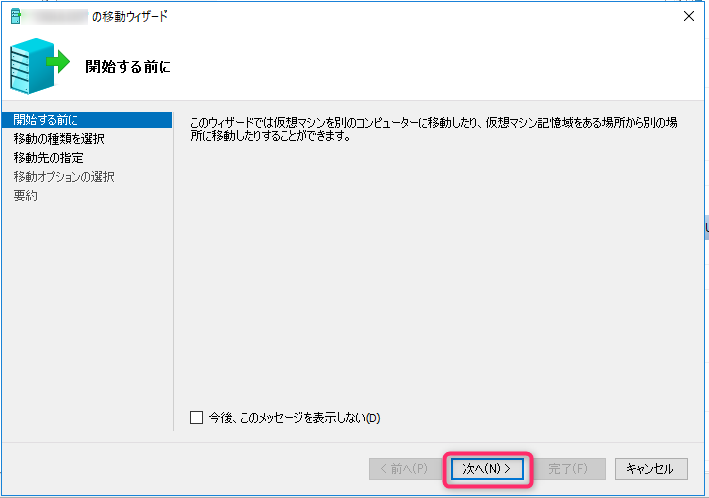

[仮想マシンの記憶域を移動する] を選択し [次へ] をクリックします。

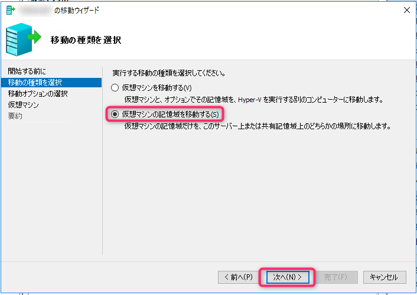

[仮想マシンの仮想ハードディスクを移動する] を選択し [次へ] をクリックします。

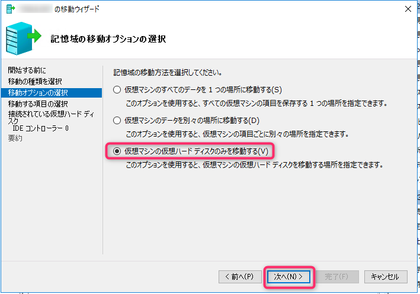

[次へ] をクリックします。

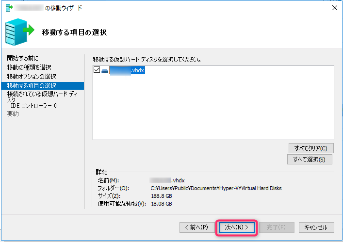

移行先のパスを指定し [次へ] をクリックします。例として `E:\Hyper-V\` を指定しています。

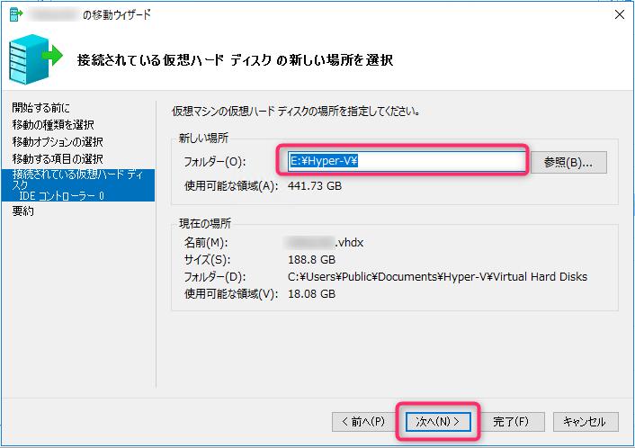

[完了] をクリックすると移行が開始します。ディスクサイズにもよりますが、数十分～数時間かかるので気長に待ちましょう。

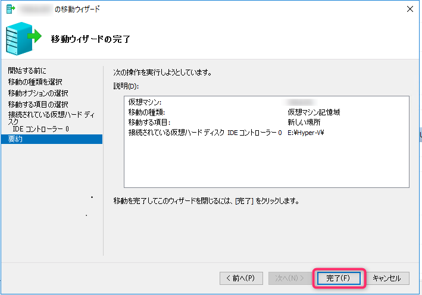

### チェックポイントの削除と結合

仮想ディスクの移動が完了したら、 チェックポイントを削除します。

チェックポイントのツリートップを右クリックし [チェックポイントのサブツリーを削除] をクリックします。

この [チェックポイントのサブツリーを削除] はチェックポイントをすべて削除する動作となります。どうしても残しておきたいチェックポイントがある場合は [チェックポイントの削除] で個別に削除します。

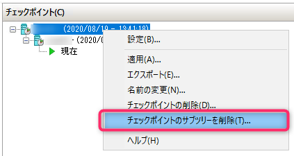

こちらも、ディスクサイズにより数十分～数時間かかるので気長に待ちましょう。

チェックポイントを削除することで、仮想ディスクが自動的に結合されます。

結合が完了したらあれだけあったファイルが無くなり、きれいになりました。

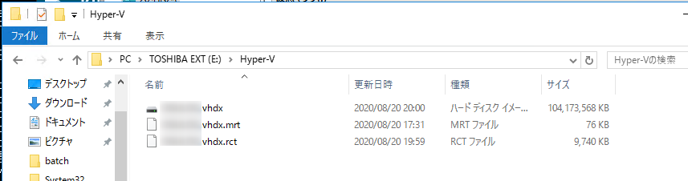

### 仮想ディスクの移行 (戻す)

チェックポイントの削除と結合が完了したら、[仮想ディスクの移行 (退避)] と同様の手順で元の場所に戻します。

以上ですべての工程が完了です。

C ドライブを確認すると枯渇が解消し平和が訪れていました。

めでたしめでたし。

## あとがき

Hyper-V のチェックポイントや VMware のスナップショットは以上に便利な機能ですが、放っておくと大変なことになることもあります。

設定変更前の一時的なバックアップとして使用し、不要になった時点で戻すということを心掛けておきましょう。
※前に同じようなことを自分に書いた気がします。

今回はオンライン (無停止) で実施できることから非常に助かりましたが、念のため負荷の低い夜間等に実施することをおすすめします。

ではまた。