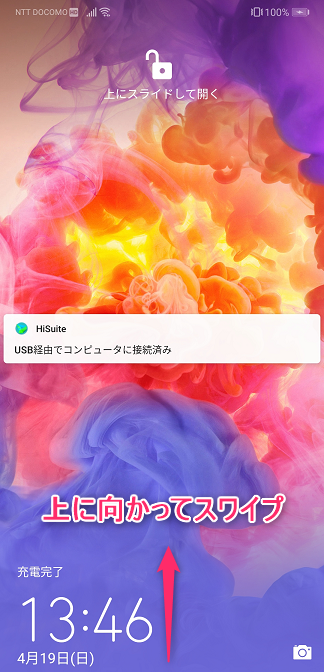
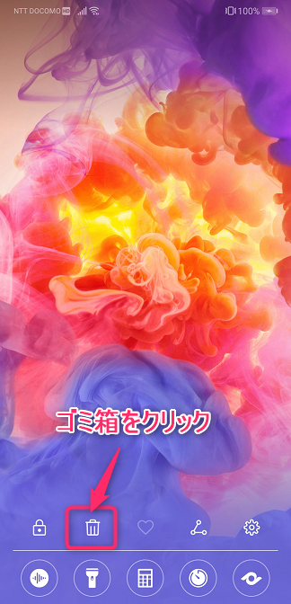
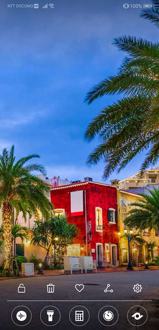

こんにちは、じんないです。

HUAWEI P20 Pro にはマガジンロックと言って、ロック画面を毎回違う写真を表示してくれる機能があります。綺麗な風景写真が多く、毎回違う画像なので飽きないし結構気に入ってたのですが、一回ロック画面の写真を変えてから戻し方が分からなくなってしまいました・・・

かれこれ1年半くらい悩んでて半ば諦めていたのですが、先日やっと戻し方がわかり感動しました。うれしくて仕方ないので皆さんに紹介したいと思います。

## 環境
- HUAWEI P20 Pro
- Android バージョン 9
- EMUI バージョン 9.1.0

## マガジンロックへの戻し方

マガジンロックへの戻し方はいたってシンプルです。

まずはロック画面で画面下側から上に向かってスワイプします。

メニューが表示されるので、ゴミ箱アイコンをクリックします。**これだけです!!**

するとあのランダムな写真のロック画面が戻ってきました!

うれしくて10回くらいロック画面を行ったり来たりしてました。なんてったって1年半越しの思いですからね。

## あとがき

今思うとこのスマホに変えてから間もなく2年経とうとしています。

少し前なら2年も使うとずいぶんとレガシーな感じが漂っていたのですが、最近のスマホは全体的に見劣りしない感じがしますね。デザインも洗練されていますし。

見た目もそうですが、何よりも気に入ったものを使うということが一番大事なことなのかもしれませんね。

この記事が同じように困っている方に感動を与えられることができれば幸いです。

ではまた。
